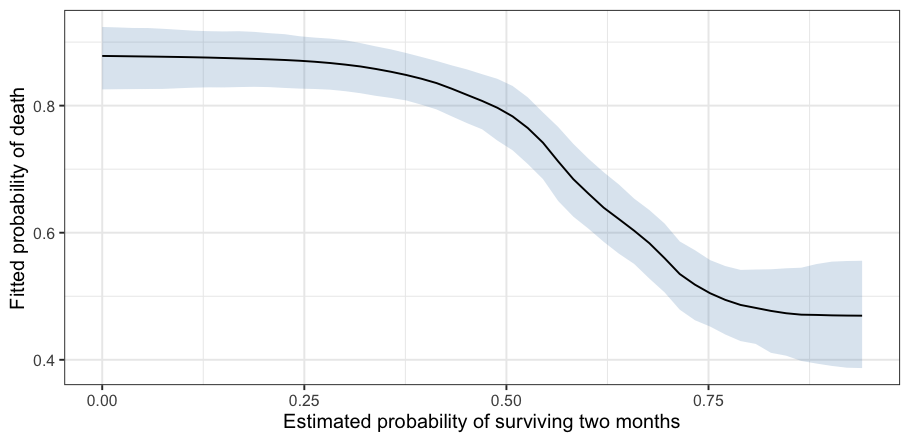

<!-- README.md is generated from README.Rmd. Please edit that file -->

# *bartisan*: Generalized Bayesian Additive Regression Trees

<!-- badges: start -->

<!-- badges: end -->

## Overview

Bayesian additive regression trees (BART) estimate a regression function
as a sum of small trees, so nonlinearity and interactions are found
rather than specified. *bartisan* does that for response distributions
that standard BART cannot reach, using the Laplace-approximation
reversible-jump sampler of Linero ([2025](#ref-linero2025)), which
relaxes the requirement that the leaf parameters be integrable in closed
form. That requirement is what ties standard BART to a Gaussian
likelihood, and lifting it is the sense in which the model here is
*generalized*: the same sense a generalized linear model is, in which
the response distribution is a choice the analyst makes rather than an
assumption the sampler imposes.

A model is written the way it is in `glm()`, with a formula, a data
frame, and a family, and the `stats::family` objects `glm()` takes are
accepted unchanged. Beyond them come the families that have no `glm()`
counterpart: negative binomial, ordinal, multinomial, beta and ordered
beta, zero-inflated counts, a Tweedie compound Poisson, accelerated
failure time and proportional hazards models for right-censored times,
location-scale regression, a Dirichlet process mixture for the error
distribution, and a log density written as an R function. Decision rules
are smooth by default, in the manner of Linero and Yang
([2018](#ref-linero2018)), which fits a smoother function than the step
functions of standard BART.

*bartisan* supports varying-coefficient models, where the effect of a
predictor receives its own forest, a special case of which is the
Bayesian causal forest (BCF) model for estimating treatment effects.
Along with this is an interface for estimating average treatment effects
from BART and BCF models. In addition, *bartisan* supports random
intercepts BART models.

Integration is provided with the
[*future*](https://CRAN.R-project.org/package=future) and
[*progressr*](https://CRAN.R-project.org/package=progressr) packages for
parallel processing and progress bars.

## Installation

*bartisan* is not yet on CRAN. You can install the development version
from [GitHub](https://github.com/ngreifer/bartisan) with:

``` r
# install.packages("pak")
pak::pak("ngreifer/bartisan")
```

Installation compiles C++, so it needs a C++17 toolchain.

## Example

`rhc` holds 1500 critically ill patients from the SUPPORT study,
recording whether each was given right heart catheterization on
admission to intensive care, whether they died during follow-up, and
thirteen covariates measured beforehand ([Connors et al.
1996](#ref-connors1996)). Fitting a model to it takes one call, and the
family is the one `glm()` would be given:

``` r
library(bartisan)

data("rhc")
set.seed(123)

fit <- bartisan(death ~ rhc + age + sex + race + edu + pafi + 
                  paco2 + crea + surv2m + card,
                data = rhc, family = binomial())

fit
#> Generalized BART
#> 
#> Call:
#> bartisan(formula = death ~ rhc + age + sex + race + edu + pafi + 
#>     paco2 + crea + surv2m + card, data = rhc, family = binomial())
#> 
#> Family: "binomial" with the "logit" link
#> Observations: 1500
#> Structure: 1 forest of 50 trees, soft decision rules
#> Draws: 800 kept after 200 warmup
```

Nothing had to be said about which predictors matter, which are curved,
or which interact. `plot()` shows what the model made of one of them,
here the study’s own estimate of each patient’s chance of surviving two
months:

``` r
plot(fit, ~ surv2m) +
  ggplot2::labs(x = "Estimated probability of surviving two months",
                y = "Fitted probability of death")
```



A forest has no coefficients, so an effect is a contrast between what
the model predicts under one value of a predictor and under another,
averaged over the sample. Every posterior draw goes through that
contrast, so what comes back is a credible interval rather than a
standard error:

``` r
estimate_effect(fit, treat = "rhc")
#> Average treatment effect (difference)
#> 
#> Treatment: "rhc"
#> Averaged over 1500 units
#> 
#>     contrast estimate lower upper    n
#>  Y[1] - Y[0]   0.0568     0 0.107 1500
#> 
#> Average potential outcomes
#> 
#>  quantity estimate lower upper
#>      Y[0]    0.633 0.605 0.664
#>      Y[1]    0.690 0.649 0.725
#> 
#> ℹ estimate is the posterior mean; lower and upper bound the 95% equal-tailed
#>   credible interval.
#> ℹ Y[a] is the average response with "rhc" set to a.
```

## Learning More

`vignette("bartisan")` is the place to start. It carries one analysis
from the formula through to the estimates, and each of its sections
points at the guide that takes that step further:

| Topic                                        | Vignette                     |
|----------------------------------------------|------------------------------|
| Choosing a response family                   | `vignette("families")`       |
| Censored and survival outcomes               | `vignette("survival")`       |
| Effects, curves, and interactions            | `vignette("effects")`        |
| Which predictors the model uses              | `vignette("importance")`     |
| Convergence and model fit                    | `vignette("diagnostics")`    |
| Comparing and selecting models               | `vignette("comparison")`     |
| Causal inference and Bayesian causal forests | `vignette("causal")`         |
| What the model is and how it is fitted       | `vignette("implementation")` |
| Short answers to common questions            | `vignette("faq")`            |

A fitted model also works with the packages that already read Bayesian
fits:
[*marginaleffects*](https://CRAN.R-project.org/package=marginaleffects)
for a wider range of estimands,
[*loo*](https://CRAN.R-project.org/package=loo) for model comparison,
[*bayesplot*](https://CRAN.R-project.org/package=bayesplot) and
[*posterior*](https://CRAN.R-project.org/package=posterior) for the
draws themselves, and
[*performance*](https://CRAN.R-project.org/package=performance) for fit
statistics. Load one and call its functions on the fit; there is nothing
to set up.

## Citing *bartisan*

*bartisan* implements the sampler of Linero ([2025](#ref-linero2025)),
and its MCMC engine is adapted from that paper’s `FlexBart` reference
implementation. Please cite the method and the package both, the latter
with its version number, which `citation("bartisan")` supplies. The
smooth decision rules are those of Linero and Yang
([2018](#ref-linero2018)). Both papers are listed under References
below.

## Questions and Bug Reports

Please file an issue at <https://github.com/ngreifer/bartisan/issues>,
with a reproducible example where the report concerns a fit.

## References

<div id="refs" class="references csl-bib-body hanging-indent">

<div id="ref-connors1996" class="csl-entry">

Connors, Alfred F., Theodore Speroff, Neal V. Dawson, et al. 1996. “The
Effectiveness of Right Heart Catheterization in the Initial Care of
Critically Ill Patients.” *JAMA* 276 (11): 889–97.
<https://doi.org/10.1001/jama.1996.03540110043030>.

</div>

<div id="ref-linero2025" class="csl-entry">

Linero, Antonio R. 2025. “Generalized Bayesian Additive Regression Trees
Models: Beyond Conditional Conjugacy.” *Journal of the American
Statistical Association* 120 (549): 356–69.
<https://doi.org/10.1080/01621459.2024.2337156>.

</div>

<div id="ref-linero2018" class="csl-entry">

Linero, Antonio R., and Yun Yang. 2018. “Bayesian Regression Tree
Ensembles That Adapt to Smoothness and Sparsity.” *Journal of the Royal
Statistical Society Series B: Statistical Methodology* 80 (5): 1087–110.
<https://doi.org/10.1111/rssb.12293>.

</div>

</div>
