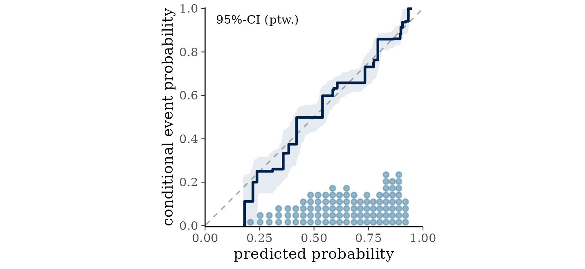

# Getting started with bartisan

## Introduction

*bartisan* fits Bayesian additive regression trees (BART) using the same
interface as [`glm()`](https://rdrr.io/r/stats/glm.html). You supply a
formula, a data frame, and a family, and the model estimates the
relationship between the predictors and the outcome without you having
to say what shape that relationship takes. Nonlinearity and interactions
are found rather than specified.

This vignette walks through a complete analysis: fitting a model,
checking that it worked, seeing which predictors it uses, reading off
the effects, predicting for new observations, and comparing models. It
assumes you are comfortable with regression but does not assume
familiarity with machine learning or Bayesian methods.

The main thing to take from it is that the defaults are meant to be
used. The priors, the number of trees, and the sampler settings are
chosen to work across a wide range of problems, and tuning them is
rarely where the gains are. Almost everything below is a single function
call with no arguments beyond the formula and the data.

Each section ends with a pointer to a vignette that covers the same
ground in more depth.

``` r

library(bartisan)
```

## The data

`rhc` records 1500 critically ill patients from the SUPPORT study and
whether each received right heart catheterization, a monitoring
procedure, within a day of arriving in intensive care ([Connors et al.
1996](#ref-connors1996)). The question the study asked is whether the
procedure helps or harms.

``` r

data(rhc)

str(rhc)
#> 'data.frame':    1500 obs. of  16 variables:
#>  $ rhc   : int  0 0 0 0 0 1 0 0 0 1 ...
#>  $ death : int  1 0 0 1 0 0 1 1 0 1 ...
#>  $ days  : int  37 235 189 13 202 203 663 15 239 22 ...
#>  $ age   : num  75.3 55 34.4 42.2 41.4 ...
#>  $ sex   : Factor w/ 2 levels "female","male": 1 2 2 1 2 2 2 2 2 2 ...
#>  $ race  : Factor w/ 3 levels "white","black",..: 1 1 1 1 2 1 1 1 1 1 ...
#>  $ edu   : num  9 14 15 16 11 ...
#>  $ aps   : int  48 29 21 55 60 68 26 89 59 105 ...
#>  $ meanbp: num  55 67 66 77 53 47 63 44 50 33 ...
#>  $ resp  : num  26 10 30 40 12 40 22 0 33 44 ...
#>  $ hema  : num  26.3 29 23.8 53 31 ...
#>  $ pafi  : num  157 149 202 171 390 ...
#>  $ paco2 : num  30 45 37 25 31 28 40 39 36 31 ...
#>  $ crea  : num  1.7 1 0.5 1.9 15 ...
#>  $ surv2m: num  0.441 0.339 0.846 0.672 0.777 ...
#>  $ card  : Factor w/ 2 levels "no","yes": 1 1 1 1 1 1 2 2 1 1 ...
```

The outcome comes in two forms. `death` is whether the patient died
during follow-up, and `days` is how long that took. This vignette uses
the binary form;
[`vignette("survival")`](https://ngreifer.github.io/bartisan/articles/survival.md)
uses the other.

The remaining variables are the patient’s age, sex, race and years of
education, seven physiological measurements taken on the first day,
whether cardiovascular disease was among the diagnoses, and `surv2m`,
the study’s own estimate of the patient’s chance of surviving two
months. All were recorded before catheterization.

## Fitting the model

``` r

set.seed(2026)

# For parallelization; optional
if (rlang::is_installed("future")) {
  future::plan(future::multisession)
}

fit <- bartisan(
  death ~ rhc + age + sex + race + edu + aps + meanbp + resp + hema +
    pafi + paco2 + crea + surv2m + card,
  data = rhc, family = binomial(), chains = 4
)

fit
#> Generalized BART
#> 
#> Call:
#> bartisan(formula = death ~ rhc + age + sex + race + edu + aps + 
#>     meanbp + resp + hema + pafi + paco2 + crea + surv2m + card, 
#>     data = rhc, family = binomial(), chains = 4)
#> 
#> Family: "binomial" with the "logit" link
#> Observations: 1500
#> Structure: 1 forest of 50 trees, soft decision rules
#> Draws: 3200 kept across 4 chains after 200 warmup
```

That is the whole call. `family = binomial()` says the outcome is
binary, exactly as in [`glm()`](https://rdrr.io/r/stats/glm.html). The
family may be omitted, in which case it is read off the outcome and
reported; naming it is clearer and silences the message.

`chains = 4` runs the sampler four times from different starting points.
The default is one chain, which is enough to get estimates, but running
several is what makes the convergence diagnostics in the next section
available.

Choosing a family is the one modeling decision that usually matters more
than any sampler setting.
[`vignette("families")`](https://ngreifer.github.io/bartisan/articles/families.md)
covers the choice, and
[`vignette("survival")`](https://ngreifer.github.io/bartisan/articles/survival.md)
covers censored outcomes such as this one’s `days`.

## Checking the model

Two questions are worth separating: whether the sampler converged, and
whether the model fits.

### Convergence

[`diagnose()`](https://ngreifer.github.io/bartisan/reference/diagnose.md)
computes the convergence and mixing statistics, applies the conventional
thresholds, and says what to change about whichever of them fall short.

``` r

diagnose(fit)
#> Convergence and mixing
#> 
#>                             quantity  rhat rhat_late ess_bulk ess_tail
#>                               loglik 1.125     1.036       23      234
#>                           splits.eta 1.014     1.039      264      731
#>  eta.eta (average over observations) 1.004     0.999     1610     2278
#>   eta.eta (worst 5% of observations) 1.045     1.073       80      305
#> 
#> ✔ 4 chains, 3200 draws kept in total
#> ✖ R-hat is above 1.01 for loglik
#> ✖ That R-hat rests on only 23 effective draws, where 4 chains average 1.171
#>   even when they agree
#> ℹ A longer warmup is not the fix: R-hat stays high on the second half of the
#>   draws alone as well
#> ✖ The chains disagree about how many splitting rules the forest has (R-hat
#>   1.01)
#> ✖ Bulk ESS is 23 for loglik, below 400
#> ✖ Tail ESS is 234 for loglik, below 400
#> ℹ The chains disagree about individual observations and agree about their
#>   average (R-hat 1.00, 1610 effective draws)
#> ℹ Per-draw efficiency is lowest for loglik, which carries 0.7 effective draws
#>   per hundred kept
#> 
#> What to do
#> 
#> • Raise `num_draws`, which was `800`. R-hat is above the threshold for a
#>   quantity that carries too few effective draws for the threshold to mean
#>   anything: with this many chains it would sit about where it does even if the
#>   chains agreed exactly, as the check above reports. Effective sample size is
#>   what makes it readable, and that grows with the total number of draws; using
#>   fewer chains lowers the bar as well, since R-hat's null rises with the number
#>   of chains being compared.
#> • If that does not settle it, reduce `num_trees`. A smaller forest has fewer
#>   ways to represent the same fit, so the sampler has less room to move between
#>   them.
#> • Then check the family. A likelihood that fits the data badly can give a
#>   posterior with no single place to be; `bayesplot::pp_check()` is the
#>   diagnostic.
#> • Note that the chains disagree about the fitted values of individual
#>   observations and not about their average, which is the usual shape of this in
#>   a forest. What that means for an estimand cannot be read off this table
#>   either way, since an estimand is a contrast and a contrast can mix badly
#>   where the function it contrasts mixes well. Compute it: `diagnose()` takes
#>   the output of `estimate_effect()`, and `posterior::as_draws()` hands the
#>   draws to `posterior::summarise_draws()` for anything else.
```

`rhat` compares variation between chains to variation within them;
values near 1 indicate the chains have settled on the same answer.
`rhat_late` is the same statistic on the second half of the draws alone,
which is what distinguishes a warmup that ended too early from chains
that have each settled somewhere different. `ess_bulk` and `ess_tail`
are effective sample sizes, and count how many independent draws the
correlated ones are worth, in the middle of the distribution and in the
tails.

Read the rows that correspond to quantities you will report. `eta.eta`
is the fitted function and appears twice, once averaged over the
observations and once over the worst 5% of them; the second is what
governs a prediction for one observation. Forests mix slowly on their
fitted values, so a figure above 1.01 on the worst-5% row is ordinary
rather than alarming;
[`vignette("diagnostics")`](https://ngreifer.github.io/bartisan/articles/diagnostics.md)
explains what to do about it and when to worry.

No row here governs an effect, though, and the average row in particular
should not be read as if it did. An effect is a contrast, and a contrast
can mix badly where the function it is a contrast of mixes well.
[`diagnose()`](https://ngreifer.github.io/bartisan/reference/diagnose.md)
takes the estimand itself when there is one to take:

``` r

diagnose(estimate_effect(fit, treat = "rhc"))
#> Convergence and mixing
#> 
#>     quantity  rhat rhat_late ess_bulk ess_tail
#>  Y[1] - Y[0] 1.035     1.105      117       64
#>         Y[0] 1.019     1.059      190      388
#>         Y[1] 1.028     1.083      148      221
#> 
#> ✔ 4 chains, 3200 draws kept in total
#> ✖ R-hat is above 1.01 for Y[1] - Y[0]
#> ✖ That R-hat rests on only 117 effective draws, where 4 chains average 1.034
#>   even when they agree
#> ℹ A longer warmup is not the fix: R-hat stays high on the second half of the
#>   draws alone as well
#> ✖ Bulk ESS is 117 for Y[1] - Y[0], below 400
#> ✖ Tail ESS is 64 for Y[1] - Y[0], below 400
#> ℹ Per-draw efficiency is lowest for Y[1] - Y[0], which carries 3.7 effective
#>   draws per hundred kept
#> ℹ 10% of draws put the contrast at exactly zero, which is the splitting prior
#>   dropping the treatment
#> 
#> What to do
#> 
#> • Raise `num_draws`, which was `800`. R-hat is above the threshold for a
#>   quantity that carries too few effective draws for the threshold to mean
#>   anything: with this many chains it would sit about where it does even if the
#>   chains agreed exactly, as the check above reports. Effective sample size is
#>   what makes it readable, and that grows with the total number of draws; using
#>   fewer chains lowers the bar as well, since R-hat's null rises with the number
#>   of chains being compared.
#> • If that does not settle it, reduce `num_trees`. A smaller forest has fewer
#>   ways to represent the same fit, so the sampler has less room to move between
#>   them.
#> • Then check the family. A likelihood that fits the data badly can give a
#>   posterior with no single place to be; `bayesplot::pp_check()` is the
#>   diagnostic.
#> • Note the atom at zero. The splitting prior drops the treatment in some draws,
#>   and the sampler can stay there for a long run, which costs effective draws
#>   here without costing them in the fit. If the effect is the quantity being
#>   reported, `sparsity = FALSE` removes the atom, and `bcf()` gives the
#>   treatment a forest the prior cannot take it out of; `vignette("causal")`
#>   covers both.
```

Far fewer effective draws than the table above would suggest, and the
last check says why: the splitting prior gives `rhc` no rule in some
draws, which puts the contrast at exactly zero and can hold it there for
a long run. Nothing in the fit’s own table shows it, because the other
predictors keep the fitted function moving the whole time.
[`vignette("causal")`](https://ngreifer.github.io/bartisan/articles/causal.md)
covers the settings that remove the atom when an effect is what is being
reported.

The table is in `diagnose(fit)$table` if what you want is the numbers
rather than the report.

### Fit

The question worth asking of a binary outcome is whether the predicted
probabilities mean what they say: among the patients the model gave a
30% chance of dying, did about 30% die? A calibration plot answers it.

``` r

bayesplot::pp_check(fit, type = "loo_calibration")
```



The line should follow the diagonal, and here it does across the whole
range. Each patient is judged against a probability estimated without
them, so this is not the optimistic in-sample reading.

The default `pp_check()` compares the distribution of simulated outcomes
with the observed distribution, which is the check to reach for when the
outcome is continuous; with two values to get right it finds nothing
here.
[`vignette("diagnostics")`](https://ngreifer.github.io/bartisan/articles/diagnostics.md)
covers what a departure from the diagonal looks like and what else to
check.

## Which predictors the model uses

``` r

variable_importance(fit)
#> Variable importance
#> 
#>  variable prop_used prop_splits splits
#>    surv2m     1.000       0.265   20.2
#>       age     1.000       0.196   15.0
#>     paco2     0.971       0.113    8.6
#>      pafi     0.928       0.070    5.4
#>       rhc     0.905       0.076    5.7
#>       aps     0.871       0.069    5.3
#>       edu     0.657       0.042    3.2
#>      crea     0.577       0.030    2.3
#>      card     0.524       0.024    1.8
#>      hema     0.505       0.026    2.0
#>    meanbp     0.490       0.020    1.5
#>      race     0.462       0.021    1.5
#>      resp     0.453       0.027    2.0
#>       sex     0.410       0.020    1.5
#> 
#> ℹ splits_lower and splits_upper hold the 95% interval, not shown above.
```

`splits` is the average number of splitting rules the forest spends on
each predictor per draw, and `prop_used` is the proportion of draws in
which the predictor received any rule at all.

`surv2m` takes the most rules, which is unsurprising: it is a prognostic
score built to predict survival. Age follows. At the bottom, race and
sex are used in about half the draws, which says the model can often do
without them.

Two cautions. Usage is not effect size: a predictor can be split on
constantly and still move the prediction very little, and
[`estimate_effect()`](https://ngreifer.github.io/bartisan/reference/estimate_effect.md)
in the next section is the better guide to that. And, when predictors
are correlated, the usage distributes among them more or less
arbitrarily.

[`vignette("importance")`](https://ngreifer.github.io/bartisan/articles/importance.md)
covers variable importance and selection, including how to tell whether
a difference in this table means anything.

## Interpreting the fit

A forest has no coefficients, so there is no table of slopes to read.
The question “what is the effect of catheterization” is answered by
asking the fitted model what it predicts when every patient receives it,
asking again when none does, and taking the difference.
[`estimate_effect()`](https://ngreifer.github.io/bartisan/reference/estimate_effect.md)
does this, and needs only to be told which predictor is the treatment:

``` r

eff <- estimate_effect(fit, treat = "rhc")

eff
#> Average treatment effect (difference)
#> 
#> Treatment: "rhc"
#> Averaged over 1500 units
#> 
#>     contrast estimate lower upper    n
#>  Y[1] - Y[0]   0.0568     0 0.111 1500
#> 
#> Average potential outcomes
#> 
#>  quantity estimate lower upper
#>      Y[0]    0.633 0.601 0.666
#>      Y[1]    0.690 0.646 0.729
#> 
#> ℹ estimate is the posterior mean; lower and upper bound the 95% equal-tailed
#>   credible interval.
#> ℹ Y[a] is the average response with "rhc" set to a.
```

Catheterization is associated with an increase of about six percentage
points in the probability of death. The interval runs from roughly zero
to eleven points, so the direction is reasonably clear and the size is
not.

The lower bound is exactly zero rather than merely close to it, and that
is worth knowing about. The default splitting prior can drop a predictor
from the forest entirely, and in a draw where it drops `rhc` the
contrast is exactly zero, so the posterior has a point mass there. The
default settings are not necessarily the best ones to use for causal
effect estimation; more specialized methods, like Bayesian causal
forests (BCF) and BART without sparsity-inducing priors, are described
at
[`vignette("causal")`](https://ngreifer.github.io/bartisan/articles/causal.md).

Because the outcome is binary, this is a difference in probability,
which is interpretable without reference to the model. That is usually
the number to report.

The two probabilities it is a difference of are printed below it, since
the difference was computed from them: about 63% of patients would be
expected to die without catheterization and 69% with it, averaging over
the covariates as they actually occur in this sample.

### Looking at a relationship

Effects averaged over the sample hide the shape of the relationship. To
see the shape, plot the model’s predictions against one predictor.

``` r

plot(fit, ~ surv2m) +
  ggplot2::labs(x = "estimated probability of surviving two months",
                y = "fitted probability of death")
```


The fitted probability of death falls from about 0.88 to about 0.45 as
the prognostic score rises, and the fall is not a straight line. A
logistic regression reports one slope on the log-odds scale for the
whole range. Nothing had to be specified to find the shape.

The band is a credible interval on the *average* prediction at each
value, not on any one patient’s, and it widens at the top where few
patients were that healthy.
[`partial_dependence()`](https://ngreifer.github.io/bartisan/reference/partial_dependence.md)
returns the same numbers without drawing them, and
[`marginaleffects::plot_predictions()`](https://rdrr.io/pkg/marginaleffects/man/plot_predictions.html)
is the one to reach for when the grid or what is conditioned on needs
more control.

[`vignette("effects")`](https://ngreifer.github.io/bartisan/articles/effects.md)
covers effects, curves, and interactions.

## Predicting new observations

[`predict()`](https://rdrr.io/r/stats/predict.html) returns the
posterior mean prediction.

``` r

new_patient <- rhc[1, ]
new_patient$rhc <- 1

predict(fit, newdata = new_patient)
#> [1] 0.8346
```

For a prediction with an interval, use
[`marginaleffects::predictions()`](https://rdrr.io/pkg/marginaleffects/man/predictions.html)[^1]:

``` r

marginaleffects::predictions(fit, newdata = new_patient)
#> 
#>  Estimate 2.5 % 97.5 %
#>     0.839 0.739  0.908
#> 
#> Type: response
```

This describes the probability that a patient with these characteristics
dies. It is an interval for that probability, not a statement about
which way any individual patient will go: the outcome itself is either 0
or 1, and a probability of 0.7 is entirely compatible with survival.

## Comparing models

Approximate leave-one-out cross-validation estimates how well a model
predicts data it has not seen.

``` r

library(loo)

loo(fit)
#> 
#> Computed from 3200 by 1500 log-likelihood matrix.
#> 
#>          Estimate   SE
#> elpd_loo   -848.6 17.4
#> p_loo        33.1  1.0
#> looic      1697.3 34.8
#> ------
#> MCSE of elpd_loo is 0.5.
#> MCSE and ESS estimates assume MCMC draws (r_eff in [0.0, 0.2]).
#> 
#> All Pareto k estimates are good (k < 0.7).
#> See help('pareto-k-diagnostic') for details.
```

`elpd_loo` is the estimated log predictive density on held-out data,
where higher is better. `p_loo` is the effective number of parameters,
which is a measure of how much of the data the forest is actually using.
The Pareto k diagnostics are all good, meaning the approximation is
trustworthy for this fit.

Two models can be compared directly. Here we ask whether the
physiological measurements earn their keep over knowing the patient’s
demographics alone:

``` r

set.seed(2026)
demographics <- bartisan(death ~ rhc + age + sex + race + edu, data = rhc,
                         family = binomial(), chains = 4)

loo_compare(list(full = loo(fit),
                 demographics = loo(demographics)))
#>         model elpd_diff se_diff p_worse diag_diff diag_elpd
#>          full       0.0     0.0      NA                    
#>  demographics     -68.2    11.2    1.00
```

The full model predicts better by around six times the standard error of
the difference, which is what you would expect: how sick a patient is on
arrival is the main thing that predicts whether they die.

[`vignette("comparison")`](https://ngreifer.github.io/bartisan/articles/comparison.md)
covers model comparison, and the cases where leave-one-out fails.

## What to be careful about

The model is flexible about the shape of the relationship and nothing
else.

It does not make an association causal. Patients were not randomized to
catheterization; sicker patients were more likely to receive it, which
is exactly the kind of confounding that can produce an apparent harm.
Whether the estimate above can be read as the effect of the procedure
depends on whether the covariates account for that selection, which is a
question about the study and not about the fit.
[`vignette("causal")`](https://ngreifer.github.io/bartisan/articles/causal.md)
covers what is required, using this same data.

It does not extrapolate reliably. Predictions for predictor values
outside the range of the training data are shrunk toward the overall
mean rather than continuing any trend.

It does not fix a badly chosen family. Getting the outcome distribution
wrong matters more than any sampler setting.

## Where to go next

| Topic | Vignette |
|----|----|
| How BART works, and the sampler | [`vignette("implementation")`](https://ngreifer.github.io/bartisan/articles/implementation.md) |
| Choosing a family | [`vignette("families")`](https://ngreifer.github.io/bartisan/articles/families.md) |
| Convergence and fit | [`vignette("diagnostics")`](https://ngreifer.github.io/bartisan/articles/diagnostics.md) |
| Variable importance and selection | [`vignette("importance")`](https://ngreifer.github.io/bartisan/articles/importance.md) |
| Effects, curves, and interactions | [`vignette("effects")`](https://ngreifer.github.io/bartisan/articles/effects.md) |
| Model comparison | [`vignette("comparison")`](https://ngreifer.github.io/bartisan/articles/comparison.md) |
| Causal inference | [`vignette("causal")`](https://ngreifer.github.io/bartisan/articles/causal.md) |
| Censored and survival outcomes | [`vignette("survival")`](https://ngreifer.github.io/bartisan/articles/survival.md) |
| Frequently asked questions | [`vignette("faq")`](https://ngreifer.github.io/bartisan/articles/faq.md) |

`?bartisan-package` has a shorter version of the same map, organized by
task.

## References

Connors, Alfred F., Theodore Speroff, Neal V. Dawson, et al. 1996. “The
Effectiveness of Right Heart Catheterization in the Initial Care of
Critically Ill Patients.” *JAMA* 276 (11): 889–97.
<https://doi.org/10.1001/jama.1996.03540110043030>.

[^1]: Note that by default, *marginaleffects* uses the posterior median
    as the point estimate, whereas
    [`predict()`](https://rdrr.io/r/stats/predict.html) uses the
    posterior mean, so these values may differ slightly. Use
    `options("marginaleffects_posterior_center" = "mean")` prior to
    running `predictions()` to produce the posterior mean. We do this in
    [`vignette("causal")`](https://ngreifer.github.io/bartisan/articles/causal.md).
