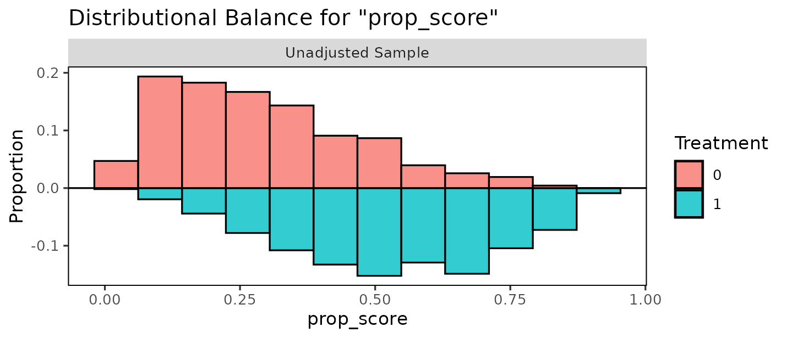

# Causal inference with BART

## Introduction

BART is a popular choice for causal inference because it allows one to
fit the nuisance functionals required for effect estimation (the
relationships among the outcome, the treatment, and the potential
confounders) in a flexible manner ([Hill 2011](#ref-hill2011)). BART has
repeatedly been shown to outperform other effect estimation methods in
competitions ([Dorie et al. 2019](#ref-dorie2019)). In this vignette, we
demonstrate how to use BART implemented in *bartisan* to estimate
treatment effects. This includes both standard BART as well as Bayesian
causal forests (BCF), which is an improvement on traditional BART that
works by fitting separate BART models for the outcome under control and
for the treatment effect itself.

However, it’s important to remember that BART is not a “causal inference
method”; it is just a method of estimating certain quantities, which
often are interpretable as associations. The assumptions that turn an
association into a causal effect are assumptions about the design, and
no model supplies them.

The example is the one the data were collected for: whether right heart
catheterization helps or harms critically ill patients ([Connors et al.
1996](#ref-connors1996)).

``` r

library(bartisan)
library(cobalt)
library(marginaleffects)

data(rhc)
```

## Confounding is the whole problem

Catheterization was not randomized. Doctors chose it, and they chose it
more often for patients who were already doing badly. Those patients
were also more likely to die. We can use
[`cobalt::bal.tab()`](https://ngreifer.github.io/cobalt/reference/bal.tab.html)
to see how the patients differ between groups:

``` r

bal.tab(rhc ~ age + sex + race + edu + aps + meanbp + resp +
          hema + pafi + paco2 + crea + surv2m + card,
        data = rhc, stats = c("m", "ovl"), disp = "m")
#> Balance Measures
#>               Type  M.0.Un  M.1.Un Diff.Un OVL.Un
#> age        Contin.  61.816  60.756  -0.065  0.101
#> sex_male    Binary   0.524   0.591   0.067  0.067
#> race_white  Binary   0.793   0.768  -0.024  0.024
#> race_black  Binary   0.157   0.168   0.011  0.011
#> race_other  Binary   0.050   0.064   0.013  0.013
#> edu        Contin.  11.568  11.767   0.061  0.048
#> aps        Contin.  51.369  62.099   0.530  0.223
#> meanbp     Contin.  85.302  66.871  -0.505  0.231
#> resp       Contin.  28.841  27.465  -0.097  0.055
#> hema       Contin.  32.545  30.237  -0.290  0.159
#> pafi       Contin. 238.232 182.995  -0.504  0.208
#> paco2      Contin.  40.045  36.871  -0.262  0.096
#> crea       Contin.   1.905   2.506   0.292  0.179
#> surv2m     Contin.   0.604   0.559  -0.229  0.105
#> card_yes    Binary   0.299   0.405   0.106  0.106
#> 
#> Sample sizes
#>     Control Treated
#> All     935     565
```

The `M.0.Un` column indicates the mean for each variable in control
group and the `M.1.Un` column indicates the mean for each variable in
treated group. `Diff.Un` and `OVL.Un` are measures of the distributional
difference between the groups for each covariate; values far from 0
indicate imbalance due to differential selection into treatment. In
particular, we can see that patients with higher values of `aps` and
`crea` and lower values of `meanbp, hema`, `pafi`, `paco2`, and `surv2m`
are overrepresented among treated units.

Given that sicker patients are both more likely to die and more likely
to receive RHC, it would not be unexpected to see that patients who
receive RHC are more likely to die, and we do see that:

``` r

with(rhc, tapply(death, rhc, mean))
#>      0      1 
#> 0.6193 0.7115
```

However, that doesn’t mean RHC causes death; to distangle the effects of
RHC from the confounding effects of pateitns characteristics, we need to
adjust for them.

## What has to be true

Several assumptions are required to interpret an adjusted effect
estimate as causal, none of which the fit can check.

**No unmeasured confounding.** Every common cause of catheterization and
death is in the model. Here that is the crux: the covariates include a
physiological profile and the study’s own prognostic score, which is a
serious attempt, but a doctor’s judgment at the bedside may not be fully
captured by these fourteen variables.

**Positivity.** Every kind of patient could have received the procedure
or not. This one is partly checkable and is checked below.

**Consistency.** “Catheterization” names a single well defined
intervention.

**No interference.** One patient’s treatment does not affect another’s
outcome.

The first is the one that usually fails and the one to be explicit
about. State it as an assumption in what you write, rather than letting
the interval imply it has been handled.

### Checking positivity

Positivity fails when some combination of covariates makes the treatment
nearly certain. To look for that, model the treatment and inspect the
fitted probabilities in both groups. BART is a good choice for this
model too, for the same reason it is a good choice for the outcome: the
functional form is not known.

``` r

set.seed(2026)

ps_fit <- bartisan(
  rhc ~ age + sex + race + edu + aps + meanbp + resp + hema + pafi +
    paco2 + crea + surv2m + card,
  data = rhc, family = binomial(), chains = 4
)

prop_score <- fitted(ps_fit)
```

We can use
[`cobalt::bal.plot()`](https://ngreifer.github.io/cobalt/reference/bal.plot.html)
to examine the overlap of the propensity score distribution between the
groups:

``` r

bal.plot(rhc ~ prop_score, data = rhc, type = "hist", mirror = TRUE)
```



What matters for positivity is that the two groups overlap over most of
their range, and they do. Distributions pushed against zero and one with
little overlap are what failure looks like, and the honest response then
is to restrict the analysis to the region of overlap rather than let the
model extrapolate into a part of the covariate space where one treatment
was never observed.

This check belongs before the outcome model, not after. A flexible
outcome model will happily produce an estimate in a region with no data,
and the interval will not tell you that is what happened.

## The estimator: g-computation

To estimate the average treatment effect \\\tau\_{\text{ATE}} =
E\[Y(1)\] - E\[Y(0)\]\\, which is a function of the unoabsevred
potential outcoem \\Y(1)\\ and \\Y(0)\\, we can use the assumptions
above to express it as a function of observed quantities:

\\ E\[Y(1)\] - E\[Y(0)\] = E \left\[ E\[Y \| X, A = 1\] \right\] - E
\left\[ E\[Y \| X, A = 0\] \right\] \\ To estimate \\E \left\[ E\[Y \|
X, A = a\] \right\] = \theta_a\\, we use g-computation:

\\ \hat{\theta}\_a = \frac{1}{n}\sum\_{i=1}^n {\mu(a, x_i)} \\

where \\\mu(a, x_i)\\ is the predicted value from a regression of \\Y\\
on \\A\\ and \\X\\ for a unit with covariate profile \\X=x_i\\ and
treatment \\A\\ set to \\a\\. This estimator is sometimes also known as
the “regression estimator” or the “plug-in estimator”.

Here, we use traditional BART and BCF to model \\\mu(A, X)\\. The rest
of the analysis comes from the definitions above.

### One setting to change first

Before we fit the outcome model, we need to change one setting to make
traditional BART suitable for estimating the ATE. The default splitting
prior is a variable-selection prior. It can drop a predictor from every
tree in the forest at once, which is what makes it worth having when the
goal is prediction, and exactly what you do not want when the estimand
is a contrast on one particular predictor. Every outcome model below is
fitted with `sparsity = FALSE`, which weights the predictors equally and
cannot drop any of them.

The propensity score model above keeps the default, and should:
predicting who was treated is a prediction problem, and no contrast is
read off it.
[`?bartisan_control`](https://ngreifer.github.io/bartisan/reference/bartisan_control.md)
has the measurements behind both halves of this, and `split_prior` is
the alternative when there are enough covariates that weighting them all
alike is wasteful.

## The outcome model

We can fit the outcome model as follows:

``` r

set.seed(2026)

fit <- bartisan(death ~ rhc + age + sex + race + edu + aps + meanbp + resp +
                  hema + pafi + paco2 + crea + surv2m + card,
                data = rhc, family = binomial(), chains = 4, sparsity = FALSE)
```

We include both the treatment and covariate in the formula’s right-hand
side, set `family = binomial()` to model the binary outcome with
logistic regression, and `sparsity = FALSE` to remove the
sparsity-inducing prior. Normally, we would examine convergence
diagnostics for this model to make sure it was fit correctly; see
[`vignette("diagnostics")`](https://ngreifer.github.io/bartisan/articles/diagnostics.md)
for more information on how to do that.

## Potential outcomes

The quantities underlying every effect below are the two average
potential outcomes: the proportion who would die if every patient were
catheterized, and if none were.
[`marginaleffects::avg_predictions()`](https://rdrr.io/pkg/marginaleffects/man/predictions.html)
reports them directly.

``` r

avg_predictions(fit, variables = "rhc")
#> 
#>  rhc Estimate 2.5 % 97.5 %
#>    0    0.631 0.602  0.660
#>    1    0.694 0.654  0.729
#> 
#> Type: response
```

The two rows are the estimates of \\E\[Y(0)\]\\ and \\E\[Y(1)\]\\, each
averaged over the observed covariate distribution. Reporting both is
often more informative than reporting their difference alone, because a
difference of six percentage points means something different against a
baseline of 63% than it would against 5%.

## The average treatment effect

The effect is the contrast between those two quantities, which can be
requested using
[`marginaleffects::avg_comparisons()`](https://rdrr.io/pkg/marginaleffects/man/comparisons.html)[^1]:

``` r

ate <- avg_comparisons(fit, variables = "rhc")

ate
#> 
#>  Estimate  2.5 % 97.5 %
#>    0.0629 0.0109  0.109
#> 
#> Term: rhc
#> Type: response
#> Comparison: 1 - 0
```

Under the assumptions above this is the average treatment effect:
catheterization raises the probability of death by about 6 percentage
points, with an interval running from roughly 1 to 11.

## Using Bayesian causal forests

Traditional BART shrinks the fitted function toward a constant; that
shrinkage applies to everything the forest fits, including the part of
the outcome that depends on the exposure. When the exposure is strongly
predicted by the covariates, the forest can explain the outcome using
the covariates alone, leave little for the exposure to explain, and
shrink the estimated effect toward zero. The interval shrinks with it,
so the result is a confident estimate biased toward no effect.

Hahn et al. ([2020](#ref-hahn2020)) identified this mechanism. Their
remedy is to give the treatment effect its own forest with its own
prior, so that shrinking the confounding part does not shrink the
effect, which is the Bayesian causal forest (BCF) model, a special case
of the varying coefficients BART model.
[`bcf()`](https://ngreifer.github.io/bartisan/reference/bcf.md) fits it.

One specifies the control function in the model formula and identifies
the treatment in the `treatment` argument.
[`bcf()`](https://ngreifer.github.io/bartisan/reference/bcf.md) then
fits a varying coefficient BART model, the BCF.

``` r

set.seed(2026)

fit_bcf <- bcf(death ~ age + sex + race + edu + aps + meanbp + resp + hema +
                 pafi + paco2 + crea + surv2m + card,
               treatment = ~ rhc, data = rhc,
               family = binomial(), chains = 4)

fit_bcf
#> Generalized BART
#> 
#> Call:
#> bcf(formula = death ~ age + sex + race + edu + aps + meanbp + 
#>     resp + hema + pafi + paco2 + crea + surv2m + card, treatment = ~rhc, 
#>     data = rhc, family = binomial(), chains = 4)
#> 
#> Family: "binomial" with the "logit" link
#> Observations: 1500
#> Structure: 2 forests of 50 and 25 trees, soft decision rules
#> Draws: 2000 kept across 4 chains after 500 warmup
#> 
#> Posterior means: b.rhc.0 = -0.229, b.rhc.1 = -0.173
```

Using [`bcf()`](https://ngreifer.github.io/bartisan/reference/bcf.md)
rather than writing the varying coefficient BART model by hand sets five
settings to improve effect estimation: the effect gets a forest of its
own, the estimated propensity score goes into the control function and
not into the effect forest, the effect forest gets fewer trees because
effect heterogeneity is usually simpler than a prognostic surface,
`sparsity = FALSE` for the reason in the section above, and a binary
treatment’s coding is drawn rather than fixed, so the answer does not
depend on which arm was written as 1.

The output is just like a regular BART model, so we can use
[`avg_comparisons()`](https://rdrr.io/pkg/marginaleffects/man/comparisons.html)
to extract the average treatment effect estimate.

``` r

avg_comparisons(fit_bcf, variables = "rhc")
#> 
#>  Estimate   2.5 % 97.5 %
#>   0.00995 -0.0105 0.0397
#> 
#> Term: rhc
#> Type: response
#> Comparison: 1 - 0
```

Because the effect is a parameter of the model rather than a difference
of predictions, it can be read off directly, one value per patient:

``` r

coef(fit_bcf)[, "rhc"] |>
  quantile(probs = c(0, .25, .5, .75, 1)) |>
  round(3)
#>    0%   25%   50%   75%  100% 
#> 0.017 0.038 0.046 0.055 0.072
```

That column is the conditional effect for each patient, **on the link
scale** – here a difference in log odds, because the outcome is binary.
It is not the same number as the contrast above, which is on the
probability scale, and for a binary outcome the probability scale is the
one to report. [`coef()`](https://rdrr.io/r/stats/coef.html) is for
looking at how the effect varies from patient to patient, not for
reporting its size.

For a family whose link is the identity, the two coincide exactly: the
coefficient *is* the contrast, and averaging it gives the average
treatment effect with nothing lost in between.

None of this changes what has to be true for the number to be causal. It
changes how the prior treats the effect, not whether the covariates
account for selection.

## A second example: a continuous outcome, and the ATT

The catheterization question is about a whole population, so the ATE is
the estimand. Many questions are not. When a program is offered to a
particular group and the question is whether it helped *them*, the ATT
is what to report, and the outcome is often continuous rather than
binary.

`lalonde`, from *cobalt*, is the standard example: a job training
program, with earnings in 1978 as the outcome.

``` r

data("lalonde", package = "cobalt")

with(lalonde, tapply(re78, treat, mean))
#>    0    1 
#> 6984 6349
```

Participants earned less than non-participants. Taken at face value the
program looks harmful, and it is not: participants were selected for
being out of work, so they would have earned less anyway. This is
confounding in the opposite direction to the catheterization example,
and it is why the raw comparison is worth showing before the adjusted
one.

``` r

set.seed(2026)

fit_earn <- bartisan(
  re78 ~ treat + age + educ + race + married + nodegree + re74 + re75,
  data = lalonde, family = dpm(), chains = 4, sparsity = FALSE
)

avg_comparisons(fit_earn, variables = "treat",
                newdata = subset(treat == 1))
#> 
#>  Estimate 2.5 % 97.5 %
#>       327  -242   1037
#> 
#> Term: treat
#> Type: response
#> Comparison: 1 - 0
```

`newdata = subset(treat == 1)` is what makes this the ATT: the
individual contrasts are averaged over the participants alone rather
than over everyone. The adjusted estimate is positive where the raw
difference was negative, though its interval is wide enough that the
size is not settled.

`family = dpm()` is the default for a numeric outcome and the right
choice here. Earnings are heavily skewed with a spike at zero, which a
single normal describes badly; the Dirichlet process mixture estimates
the shape instead of assuming it, and costs almost nothing when a normal
would have done. See
[`vignette("families")`](https://ngreifer.github.io/bartisan/articles/families.md).

The two potential outcomes are worth reporting alongside the difference,
since a few hundred dollars means something different against a baseline
of six thousand than it would against six hundred:

``` r

avg_predictions(fit_earn, variables = "treat",
                newdata = subset(treat == 1))
#> 
#>  treat Estimate 2.5 % 97.5 %
#>      0     6309  5658   6824
#>      1     6637  6186   7075
#> 
#> Type: response
```

Everything said above about identification applies here unchanged. The
observational Lalonde sample is famous precisely because its covariates
are *not* enough to recover the experimental benchmark, which is a
caution rather than a counterexample: it is what the assumption failing
looks like.

## Moderation

A forest is free to fit a different effect for every covariate pattern,
so asking whether the effect differs across groups needs no interaction
term and no refit. `by` splits the average.

``` r

avg_comparisons(fit, variables = "rhc", by = "card")
#> 
#>  card Estimate   2.5 % 97.5 %
#>   no    0.0644 0.00944  0.114
#>   yes   0.0596 0.00299  0.108
#> 
#> Term: rhc
#> Type: response
#> Comparison: 1 - 0
```

The estimates differ a little between patients with and without
cardiovascular disease. It is tempting to read a difference like that as
moderation, and more tempting still when the two intervals do not
overlap equally or when one covers zero and the other does not. Neither
reading is a test. Comparing two intervals says nothing about whether
the quantities they cover differ, because the comparison that matters
has an uncertainty of its own that neither interval reports.

The question is whether they differ from each other, which needs the
difference itself:

``` r

avg_comparisons(fit, variables = "rhc", by = "card",
                hypothesis = ~pairwise)
#> 
#>    Hypothesis Estimate   2.5 % 97.5 %
#>  (yes) - (no) -0.00309 -0.0512 0.0211
#> 
#> Type: response
```

The difference is small with an interval covering zero. There is no
evidence of moderation by cardiovascular disease here, and the subgroup
estimates should be read as two noisy estimates of one common effect.

Detecting moderation needs much more data than estimating a main effect,
and a flexible model does not change that. What it changes is that you
are not required to guess the form of the interaction in advance.

## What the interval means

The posterior interval is a credible interval for the estimand under the
model and under the identification assumptions. It covers uncertainty
from having a finite sample and from not knowing the shape of the
outcome surface. It does not cover uncertainty about whether the
assumptions hold.

An unmeasured confounder does not widen the interval. It moves the
estimate and leaves the interval where it was. This is why a sensitivity
analysis, asking how strong a confounder would have to be to explain the
result away, is a more informative addition than any refinement of the
model. The `sensemakr` and `EValue` packages do this and work from the
estimate and its standard error, which
[`avg_comparisons()`](https://rdrr.io/pkg/marginaleffects/man/comparisons.html)
provides.

## Where to go next

[`vignette("effects")`](https://ngreifer.github.io/bartisan/articles/effects.md)
covers the estimand machinery in more detail, including subgroup effects
and testing whether they differ.
[`vignette("diagnostics")`](https://ngreifer.github.io/bartisan/articles/diagnostics.md)
covers checking the fit, which should happen before any of this is
interpreted.

## References

Connors, Alfred F., Theodore Speroff, Neal V. Dawson, et al. 1996. “The
Effectiveness of Right Heart Catheterization in the Initial Care of
Critically Ill Patients.” *JAMA* 276 (11): 889–97.
<https://doi.org/10.1001/jama.1996.03540110043030>.

Dorie, Vincent, Jennifer Hill, Uri Shalit, Marc Scott, and Dan Cervone.
2019. “Automated Versus Do-It-Yourself Methods for Causal Inference:
Lessons Learned from a Data Analysis Competition.” *Statistical Science*
34 (1): 43–68. <https://doi.org/10.1214/18-STS667>.

Hahn, P. Richard, Jared S. Murray, and Carlos M. Carvalho. 2020.
“Bayesian Regression Tree Models for Causal Inference: Regularization,
Confounding, and Heterogeneous Effects (with Discussion).” *Bayesian
Analysis* 15 (3): 965–1056. <https://doi.org/10.1214/19-BA1195>.

Hill, Jennifer L. 2011. “Bayesian Nonparametric Modeling for Causal
Inference.” *Journal of Computational and Graphical Statistics* 20 (1):
217–40. <https://doi.org/10.1198/jcgs.2010.08162>.

[^1]: Here we report the risk difference, the default quantity returned
    by
    [`avg_comparisons()`](https://rdrr.io/pkg/marginaleffects/man/comparisons.html)
    with a binary outcome. You can also set
    `comparison = "lnratioavg", transform = "exp"` to report the risk
    ratio and its credible interval.
