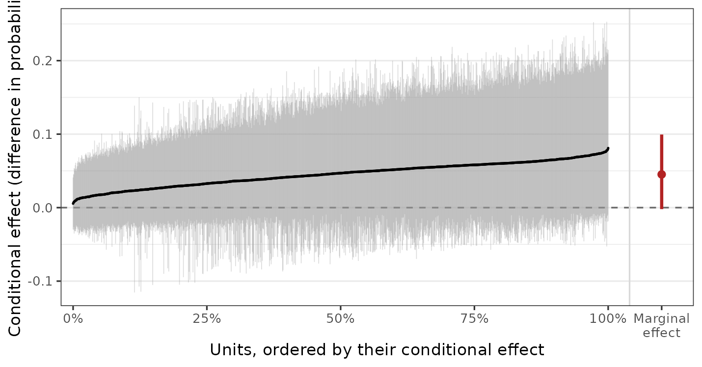
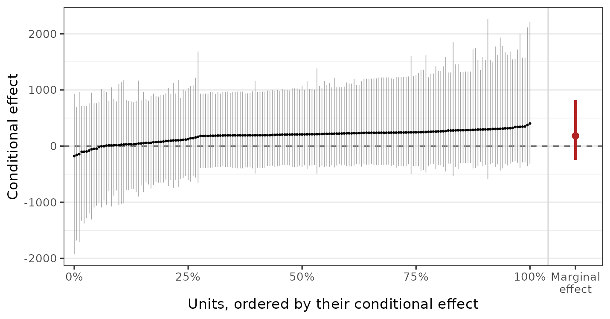

# Causal Inference with BART

## Introduction

BART is a popular choice for causal inference because it allows one to
fit the nuisance functionals required for effect estimation (the
relationships among the outcome, the treatment, and the potential
confounders) in a flexible manner ([Hill 2011](#ref-hill2011)). BART has
repeatedly been shown to outperform other effect estimation methods in
competitions ([Dorie et al. 2019](#ref-dorie2019)). In this vignette, we
demonstrate how to use BART implemented in *bartisan* to estimate
treatment effects under the assumption of no unmeasured confounding.
This includes both standard BART as well as Bayesian causal forests
(BCF), which is an improvement on traditional BART that works by fitting
separate BART models for the outcome under control and for the treatment
effect itself as a varying coefficient model.

However, it’s important to remember that BART is not a “causal inference
method”; it is just a method of estimating certain quantities, which
often are interpretable as associations. The assumptions that turn an
association into a causal effect are assumptions about the design, and
no model supplies them.

In addition to its use here, BART can be used with instrumental
variables analysis ([McCulloch et al.,
n.d.](#ref-mccullochCausalInferenceInstrumental2021)) and regression
discontinuity ([Alcantara et al.,
n.d.](#ref-alcantaraModifiedBARTLearning2024)).

The example we use here is a dataset used to answer whether right heart
catheterization helps or harms critically ill patients ([Connors et al.
1996](#ref-connors1996)).

``` r

library(bartisan)

data(rhc)

set.seed(2026)
```

## Confounding

Catheterization was not randomized. Doctors chose it, and they chose it
more often for patients who were already doing badly. Those patients
were also more likely to die. We can use
[`cobalt::bal.tab()`](https://ngreifer.github.io/cobalt/reference/bal.tab.html)
to see how the patients differ between groups:

``` r

bal.tab(rhc ~ age + sex + race + edu + aps + meanbp + resp +
          hema + pafi + paco2 + crea + surv2m + card,
        data = rhc, stats = c("m", "ovl"), disp = "m")
#> Balance Measures
#>               Type  M.0.Un  M.1.Un Diff.Un OVL.Un
#> age        Contin.  61.816  60.756  -0.065  0.101
#> sex_male    Binary   0.524   0.591   0.067  0.067
#> race_white  Binary   0.793   0.768  -0.024  0.024
#> race_black  Binary   0.157   0.168   0.011  0.011
#> race_other  Binary   0.050   0.064   0.013  0.013
#> edu        Contin.  11.568  11.767   0.061  0.048
#> aps        Contin.  51.369  62.099   0.530  0.223
#> meanbp     Contin.  85.302  66.871  -0.505  0.231
#> resp       Contin.  28.841  27.465  -0.097  0.055
#> hema       Contin.  32.545  30.237  -0.290  0.159
#> pafi       Contin. 238.232 182.995  -0.504  0.208
#> paco2      Contin.  40.045  36.871  -0.262  0.096
#> crea       Contin.   1.905   2.506   0.292  0.179
#> surv2m     Contin.   0.604   0.559  -0.229  0.105
#> card_yes    Binary   0.299   0.405   0.106  0.106
#> 
#> Sample sizes
#>     Control Treated
#> All     935     565
```

The `M.0.Un` column indicates the mean for each variable in the control
group and the `M.1.Un` column indicates the mean for each variable in
the treated group. `Diff.Un` and `OVL.Un` are measures of the
distributional difference between the groups for each covariate; values
far from 0 indicate imbalance due to differential selection into
treatment. In particular, we can see that patients with higher values of
`aps` and `crea` and lower values of `meanbp`, `hema`, `pafi`, `paco2`,
and `surv2m` are overrepresented among treated units.

Given that sicker patients are both more likely to die and more likely
to receive RHC, it would not be unexpected to see that patients who
receive RHC are more likely to die, and we do see that:

``` r

with(rhc, tapply(death, rhc, mean))
#>      0      1 
#> 0.6193 0.7115
```

However, that doesn’t mean RHC causes death; to disentangle the effects
of RHC from the confounding effects of patients’ characteristics, we
need to adjust for these characteristics.

## Assumptions for Causal Inference

Several assumptions are required to interpret an adjusted effect
estimate as causal, none of which the fit can check:

1.  **No unmeasured confounding.** Every common cause of catheterization
    and death is in the model. Here that is the crux: the covariates
    include a physiological profile and the study’s own prognostic
    score, which is a serious attempt, but a doctor’s judgment at the
    bedside may not be fully captured by these thirteen variables.

2.  **Positivity.** Every kind of patient could have received the
    procedure or not. This one is partly checkable and is checked below.

3.  **Consistency.** “Catheterization” names a single well defined
    intervention.

4.  **No interference.** One patient’s treatment does not affect
    another’s outcome.

The first is the one that usually fails and the one to be explicit
about. State it as an assumption in what you write, rather than letting
the interval imply it has been handled.

### Checking Positivity

Positivity fails when some combination of covariates makes the treatment
nearly certain. To look for that, model the treatment and inspect the
fitted probabilities in both groups. BART is a good choice for this
model too, for the same reason it is a good choice for the outcome: the
functional form is not known.

``` r

ps_fit <- bartisan(
  rhc ~ age + sex + race + edu + aps + meanbp + resp + hema + pafi +
    paco2 + crea + surv2m + card,
  data = rhc, family = binomial(), chains = 4
)

prop_score <- fitted(ps_fit)
```

We can use
[`cobalt::bal.plot()`](https://ngreifer.github.io/cobalt/reference/bal.plot.html)
to examine the overlap of the propensity score distribution between the
groups:

``` r

bal.plot(rhc ~ prop_score, data = rhc, type = "hist", mirror = TRUE)
```


What matters for positivity is that the two groups overlap over most of
their range, and they do. Distributions pushed against zero and one with
little overlap are what failure looks like, and the honest response then
is to restrict the analysis to the region of overlap rather than let the
model extrapolate into a part of the covariate space where one treatment
was never observed.

This check belongs before the outcome model, not after. A flexible
outcome model will happily produce an estimate in a region with no data,
and the interval will not tell you that is what happened.

## The Estimator: G-Computation

To estimate the average treatment effect \\\tau\_{\text{ATE}} =
E\[Y(1)\] - E\[Y(0)\]\\, which is a function of the unobserved potential
outcomes \\Y(1)\\ and \\Y(0)\\, we can use the assumptions above to
express it as a function of observed quantities:

\\E\[Y(1)\] - E\[Y(0)\] = E \left\[ E\[Y \| X, A = 1\] \right\] - E
\left\[ E\[Y \| X, A = 0\] \right\]\\ To estimate \\E \left\[ E \left\[
Y \| X, A = a \right\] \right\] = \theta_a\\, we use g-computation
([Snowden et al.
2011](#ref-snowdenImplementationGComputationSimulated2011)):

\\\hat{\theta}\_a = \frac{1}{n}\sum\_{i=1}^n {\mu(a, x_i)}\\

where \\\mu(a, x_i)\\ is the predicted value from a regression of \\Y\\
on \\A\\ and \\X\\ for a unit with covariate profile \\X=x_i\\ and
treatment \\A\\ set to \\a\\. This estimator is sometimes also known as
the “regression estimator” or the “plug-in estimator”.

Here, we use traditional BART and BCF to model \\\mu(A, X)\\. The rest
of the analysis comes from the definitions above.

### Controlling Sparsity

Before we fit the outcome model, we need to change one setting to make
traditional BART suitable for estimating the ATE. The default splitting
prior is a variable-selection prior. It can drop a predictor from every
tree in the forest at once, which is what makes it worth having when the
goal is prediction, and exactly what you do not want when the estimand
is a contrast on one particular predictor. The traditional BART outcome
model below is fitted with `sparsity = FALSE`, which weights the
predictors equally and cannot drop any of them.

The propensity score model above keeps the default, and should:
predicting who was treated is a prediction problem, and no contrast is
read off it.
[`?bartisan_control`](https://ngreifer.github.io/bartisan/reference/bartisan_control.md)
explains both halves of this, and `split_prior` is the alternative when
there are enough covariates that weighting them all alike is wasteful.

## The Outcome Model

We can fit the outcome model as a simple binary BART regression of the
outcome on the treatment and covariates, as in Hill
([2011](#ref-hill2011)):

``` r

fit <- bartisan(death ~ rhc + age + sex + race + edu + aps + meanbp + resp +
                  hema + pafi + paco2 + crea + surv2m + card,
                data = rhc, family = binomial(),
                chains = 4, sparsity = FALSE)
```

We include both the treatment and the covariates in the formula’s
right-hand side, set `family = binomial()` to model the binary outcome
with logistic regression, and `sparsity = FALSE` to remove the
sparsity-inducing prior. We could also have included the propensity
score as a covariate, which is recommended by Carnegie
([2019](#ref-carnegie2019)) to slightly improve performance (in this
case it doesn’t affect the result, which has also been reported by Souto
and Louzada ([n.d.](#ref-soutoAblationStudiesNovel2024))). Normally, we
would examine convergence diagnostics for this model to make sure it was
fit correctly; see
[`vignette("diagnostics")`](https://ngreifer.github.io/bartisan/articles/diagnostics.md)
for more information on how to do that.

## Potential Outcomes

The quantities underlying the effect estimate are the two average
potential outcomes: the proportion who would die if every patient were
catheterized, and if none were.
[`estimate_effect()`](https://ngreifer.github.io/bartisan/reference/estimate_effect.md)
computes them on the way to the effect and prints them beneath it. On a
fit from
[`bartisan()`](https://ngreifer.github.io/bartisan/reference/bartisan.md)
the treatment has to be named, since nothing in the formula marks one
predictor as the treatment:

``` r

ate <- estimate_effect(fit, treat = "rhc")

ate
#> Average treatment effect (difference)
#> 
#> Treatment: `rhc`
#> Averaged over 1500 units
#> 
#>     contrast estimate  lower upper    n
#>  Y[1] - Y[0]    0.061 0.0106 0.111 1500
#> 
#> Average potential outcomes
#> 
#>  quantity estimate lower upper
#>      Y[0]    0.631 0.602  0.66
#>      Y[1]    0.692 0.655  0.73
#> 
#> ℹ estimate is the posterior mean; lower and upper bound the 95% equal-tailed
#>   credible interval.
#> ℹ Y[a] is the average response with `rhc` set to "a".
```

Under the assumptions above this is the average treatment effect:
catheterization raises the probability of death by about 6 percentage
points, with an interval running from roughly 1.1 to 11.1.

The two rows below the contrast are the estimates of \\E\[Y(0)\]\\ and
\\E\[Y(1)\]\\, each averaged over the observed covariate distribution.
Reporting both is often more informative than reporting their difference
alone, because a difference of a few percentage points means something
different against a baseline of 63% than it would against 5%.
`potential_outcomes = FALSE` in the
[`print()`](https://rdrr.io/r/base/print.html) call drops them where the
difference is all that is wanted.

### Computation and Scale of the Estimate

[`estimate_effect()`](https://ngreifer.github.io/bartisan/reference/estimate_effect.md)
performs the g-computation above literally. Every unit is predicted
twice, once with the treatment set to each of its levels; the two sets
of predictions are averaged over the units the estimand asks for,
*within each posterior draw*; and only then are the two averages
contrasted. What comes back is a posterior for the estimand, summarized
by its mean and a credible interval.

That order is what makes a ratio here the marginal ratio rather than the
average of the conditional ones, which is a different quantity. For a
difference the two orders agree, so it only shows up once a ratio is
asked for.

The scale matters, and it is the reason the default is
`type = "response"`. On that scale the average of the unit-level
differences *is* the marginal effect. A contrast read off the link scale
is not: on a logistic fit the average of the conditional log odds ratios
is not the marginal log odds ratio, and the two can differ by a good
deal. `comparison` asks for the contrast rather than the scale, so a
risk ratio or an odds ratio is available without leaving the response
scale:

``` r

estimate_effect(fit, treat = "rhc", comparison = "lnor")
#> Average treatment effect (log odds ratio)
#> 
#> Treatment: `rhc`
#> Averaged over 1500 units
#> 
#>                contrast estimate  lower upper    n
#>  log(O(Y[1]) / O(Y[0]))    0.274 0.0484 0.505 1500
#> 
#> Average potential outcomes
#> 
#>  quantity estimate lower upper
#>      Y[0]    0.631 0.602  0.66
#>      Y[1]    0.692 0.655  0.73
#> 
#> ℹ estimate is the posterior mean; lower and upper bound the 95% equal-tailed
#>   credible interval.
#> ℹ Y[a] is the average response with `rhc` set to "a", and O(y) is the odds
#>   `y/(1-y)`.
```

### The Same Answer Through *marginaleffects*

A fit also works with *marginaleffects*, and for the average effect the
two routes compute the same thing from the same draws. The one thing to
set is the posterior summary: *marginaleffects* reports the median by
default and
[`estimate_effect()`](https://ngreifer.github.io/bartisan/reference/estimate_effect.md)
reports the mean, so an unadjusted comparison shows a difference that is
not there.

``` r

options(marginaleffects_posterior_center = mean)

avg_comparisons(fit, variables = "rhc")
#> 
#>  Estimate  2.5 % 97.5 %
#>     0.061 0.0106  0.111
#> 
#> Term: rhc
#> Type: response
#> Comparison: 1 - 0
```

The point estimate and the interval match
[`estimate_effect()`](https://ngreifer.github.io/bartisan/reference/estimate_effect.md)
above to machine precision. Which to reach for is a question of what
else is wanted:
[`estimate_effect()`](https://ngreifer.github.io/bartisan/reference/estimate_effect.md)
covers the estimands a treatment question asks for and needs no extra
package, while *marginaleffects* covers a much wider class of
quantities.
[`vignette("effects")`](https://ngreifer.github.io/bartisan/articles/effects.md)
is about the second.

## Using Bayesian Causal Forests

Traditional BART shrinks the fitted function toward a constant; that
shrinkage applies to everything the forest fits, including the part of
the outcome that depends on the exposure. When the exposure is strongly
predicted by the covariates, the forest can explain the outcome using
the covariates alone, leaving little for the exposure to explain, and
shrink the estimated effect toward zero. The interval shrinks with it,
so the result is a confident estimate biased toward no effect.

Hahn et al. ([2020](#ref-hahn2020)) identified this mechanism; their
remedy is to give the treatment effect its own forest with its own
prior, so that shrinking the confounding part does not shrink the
effect. This is the Bayesian causal forest (BCF) model, a special case
of the varying coefficients BART model.
[`bcf()`](https://ngreifer.github.io/bartisan/reference/bcf.md) fits it.

One specifies the control function in the model formula and identifies
the treatment in the `treat` argument.
[`bcf()`](https://ngreifer.github.io/bartisan/reference/bcf.md) then
fits a varying coefficient BART model, the BCF. By default,
[`bcf()`](https://ngreifer.github.io/bartisan/reference/bcf.md)
estimates a propensity score using a logistic BART model and includes
that as a covariate in the control function, as recommended by Hahn et
al. ([2020](#ref-hahn2020)).

``` r

fit_bcf <- bcf(death ~ age + sex + race + edu + aps + meanbp + resp + hema +
                 pafi + paco2 + crea + surv2m + card,
               treat = ~ rhc, data = rhc,
               family = binomial(), chains = 4)

fit_bcf
#> Generalized BART
#> 
#> Call:
#> bcf(formula = death ~ age + sex + race + edu + aps + meanbp + 
#>     resp + hema + pafi + paco2 + crea + surv2m + card, treat = ~rhc, 
#>     data = rhc, family = binomial(), chains = 4)
#> 
#> Family: "binomial" with the "logit" link
#> Observations: 1500
#> Structure: 2 forests of 50 and 25 trees, soft decision rules
#> Draws: 3200 kept across 4 chains after 200 warmup
#> 
#> Posterior means: b.rhc.0 = -0.0651, b.rhc.1 = 0.124
#> 
#> Treatment: "rhc"
#> Effect moderators: "age", "sex", "race", "edu", "aps", "meanbp", "resp", "hema", "pafi", "paco2", "crea", "surv2m", and "card"
#> ℹ `estimate_effect()` reports the treatment effect, with the average potential
#>   outcomes beside it; `plot()` draws the conditional ones.
```

Using [`bcf()`](https://ngreifer.github.io/bartisan/reference/bcf.md)
rather than writing the varying coefficient BART model by hand sets four
settings to improve effect estimation:

1.  the effect gets a forest of its own
2.  the estimated propensity score goes into the control function and
    not into the effect forest
3.  the effect forest gets fewer trees because effect heterogeneity is
    usually simpler than a prognostic surface
4.  a binary treatment’s coding is drawn rather than fixed, so the
    answer does not depend on which arm was written as 1.

Note that `sparsity = FALSE` is not among them: the reason for it in the
section above is that the prior can drop the predictor whose contrast we
want, and here the treatment is the coefficient rather than a predictor
the forest splits on, so nothing can drop it.

Because the treatment is named in the call,
[`estimate_effect()`](https://ngreifer.github.io/bartisan/reference/estimate_effect.md)
needs nothing else:

``` r

estimate_effect(fit_bcf)
#> Average treatment effect (difference)
#> 
#> Treatment: `rhc`
#> Averaged over 1500 units
#> 
#>     contrast estimate    lower  upper    n
#>  Y[1] - Y[0]   0.0452 -0.00203 0.0995 1500
#> 
#> Average potential outcomes
#> 
#>  quantity estimate lower upper
#>      Y[0]    0.637 0.605 0.667
#>      Y[1]    0.682 0.645 0.723
#> 
#> ℹ estimate is the posterior mean; lower and upper bound the 95% equal-tailed
#>   credible interval.
#> ℹ Y[a] is the average response with `rhc` set to "a".
```

The two potential outcomes are printed beneath the contrast, since a
difference of a few percentage points means one thing against a baseline
of 64% and another against 5%; `potential_outcomes = FALSE` in
[`print()`](https://rdrr.io/r/base/print.html) suppresses them. The
contrast’s label names the quantity rather than leaving it to the
heading, which matters once a ratio is asked for: `Y[1] - Y[0]` is a
difference of average responses where `log(O(Y[1]) / O(Y[0]))` is a log
odds ratio, and the note beneath the table says what `Y[a]` is, adding
what `O(y)` is once an odds ratio is asked for.

[`summary()`](https://rdrr.io/r/base/summary.html) on a
[`bcf()`](https://ngreifer.github.io/bartisan/reference/bcf.md) fit is
the same summary of the forests it is on any other fit, and says at the
end where the effect is reported. That way the same call means the same
thing whichever way the model was written.

### Conditional Effects

The effect forest gives one coefficient per patient, and
[`estimate_effect()`](https://ngreifer.github.io/bartisan/reference/estimate_effect.md)
turns those coefficients into one effect per patient with
`estimand = "CATE"`, reported on the response scale rather than on the
forest’s own link scale. Here we ask for them as odds ratios, which for
a conditional effect is a conditional odds ratio:

``` r

cate <- estimate_effect(fit_bcf, estimand = "CATE", comparison = "or")

quantile(cate$estimate, probs = c(0, .25, .5, .75, 1))
#>    0%   25%   50%   75%  100% 
#> 1.157 1.270 1.316 1.358 1.526
```

[`plot()`](https://rdrr.io/r/graphics/plot.default.html) draws the
conditional effects, as differences unless `comparison` says otherwise:
patients ordered by their estimate, with a credible interval each, and
the marginal effect as a single interval past the right edge in its own
color. Ordering is what makes the spread readable as heterogeneity
rather than as a list of numbers, and keeping the marginal effect off to
the side is what makes it comparable against any of them.
`marginal = FALSE` leaves it out.

``` r

plot(fit_bcf)
```



[`plot()`](https://rdrr.io/r/graphics/plot.default.html) on the fit is
the conditional effects on the response scale; passing a
`<bartisan_effect>` object to
[`plot()`](https://rdrr.io/r/graphics/plot.default.html) draws whatever
that object holds, so `plot(estimate_effect(fit_bcf, by = ~ sex))` is a
subgroup forest plot instead.

Note that a conditional odds ratio is not the marginal one, and their
average is not it either. That is the scale caution from earlier in a
second place: an average of conditional contrasts equals the marginal
contrast only when the contrast is a difference. For an identity link,
which the next example uses, the ATE *is* the average of the conditional
effects.

## A Second Example: A Continuous Outcome, and the ATT

The catheterization question is about a whole population, so the ATE is
the estimand. Many questions are not. When a program is offered to a
particular group and the question is whether it helped *them*, the ATT
is what to report, and the outcome is often continuous rather than
binary.

`lalonde`, from *cobalt*, is the standard example: a job training
program, with earnings in 1978 as the outcome.

``` r

data("lalonde", package = "cobalt")

with(lalonde, tapply(re78, treat, mean))
#>    0    1 
#> 6984 6349
```

Participants earned less than non-participants. Taken at face value, the
program looks harmful, but that doesn’t mean it actually is:
participants were selected for being out of work, so they would have
earned less anyway. This is confounding in the opposite direction to the
catheterization example, and it is why the raw comparison is worth
showing before the adjusted one.

Below, we fit the BCF model, this time setting `family = dpm()`, which
is the default for a numeric outcome and makes sense here. Earnings are
heavily skewed with a spike at zero, which a single normal describes
badly; the Dirichlet process mixture estimates the shape instead of
assuming it, and costs almost nothing when a normal would have done.
Alternatively, `family = tweedie()` can also work well for this type of
outcome. See
[`vignette("families")`](https://ngreifer.github.io/bartisan/articles/families.md).

``` r

fit_earn_bcf <- bcf(
  re78 ~ age + educ + race + married + nodegree + re74 + re75,
  treat = ~ treat,
  data = lalonde, family = dpm(),
  chains = 4
)

estimate_effect(fit_earn_bcf, estimand = "ATT")
#> Average treatment effect on the treated (difference)
#> 
#> Treatment: `treat`
#> Averaged over the 185 units in group "1"
#> 
#>     contrast estimate lower upper   n
#>  Y[1] - Y[0]      183  -248   823 185
#> 
#> Average potential outcomes
#> 
#>  quantity estimate lower upper
#>      Y[0]     5420  2750  7030
#>      Y[1]     5600  3000  7180
#> 
#> ℹ estimate is the posterior mean; lower and upper bound the 95% equal-tailed
#>   credible interval.
#> ℹ Y[a] is the average response with `treat` set to "a".
```

`estimand = "ATT"` averages over the treated rather than over everyone,
and `focal` is not needed because a 0/1 treatment settles which level is
the treated one. It does matter in other cases, and in different ways.
When the treatment has more than two levels, `focal` is required and
naming it is the whole of the choice, since `"ATT"` and `"ATC"` then
mean the same thing: the effect among the units in the level named. When
it has two levels whose labels say nothing about which is which, the
level order is assumed and a message says so, which `focal` silences.

The potential outcomes earn their place here: a few hundred dollars
means something different against a baseline of six thousand than it
would against six hundred.

Because the link is the identity, the ATT is exactly the average of the
conditional effects among the treated, which is worth checking once to
see that the two agree:

``` r

att <- estimate_effect(fit_earn_bcf, estimand = "ATT")

cate_att <- estimate_effect(fit_earn_bcf, estimand = "CATE",
                            newdata = subset(lalonde, treat == 1))

c(ATT = att$estimate, mean_CATE = mean(cate_att$estimate))
#>       ATT mean_CATE 
#>     183.3     183.3
```

And the conditional effects, drawn:

``` r

plot(cate_att)
```



Most of the conditional effects are positive, as the ATT is, and none of
their intervals excludes zero. That is the usual picture: a per-unit
effect is estimated from far less information than an average, so the
intervals are wide even where the average is clear.

## Interpreting the Credible Interval

The posterior interval is a credible interval for the estimand under the
model and under the identification assumptions. It covers uncertainty
from having a finite sample and from not knowing the shape of the
outcome surface. It does not cover uncertainty about whether the
assumptions hold.

An unmeasured confounder does not widen the interval. It moves the
estimate and leaves the interval where it was. This is why a sensitivity
analysis, asking how strong a confounder would have to be to explain the
result away, is a more informative addition than any refinement of the
model.

## Further Reading

[`?estimate_effect`](https://ngreifer.github.io/bartisan/reference/estimate_effect.md)
is the reference for the estimands used here, including the subgroup
form and the contrast types.
[`vignette("effects")`](https://ngreifer.github.io/bartisan/articles/effects.md)
covers what *marginaleffects* adds beyond them, which is a much wider
class of quantities and the route to take when the question is not a
treatment contrast.
[`vignette("diagnostics")`](https://ngreifer.github.io/bartisan/articles/diagnostics.md)
covers checking the fit, which should happen before any of this is
interpreted.

## References

Alcantara, Rafael, Meijia Wang, P. Richard Hahn, and Hedibert Lopes.
n.d. *Modified BART for Learning Heterogeneous Effects in Regression
Discontinuity Designs*. <https://doi.org/10.48550/arXiv.2407.14365>.

Carnegie, Nicole Bohme. 2019. “Comment: Contributions of Model Features
to BART Causal Inference Performance Using ACIC 2016 Competition Data.”
*Statistical Science* 34 (1): 90–93.
<https://doi.org/10.1214/18-STS682>.

Connors, Alfred F., Theodore Speroff, Neal V. Dawson, et al. 1996. “The
Effectiveness of Right Heart Catheterization in the Initial Care of
Critically Ill Patients.” *JAMA* 276 (11): 889–97.
<https://doi.org/10.1001/jama.1996.03540110043030>.

Dorie, Vincent, Jennifer Hill, Uri Shalit, Marc Scott, and Dan Cervone.
2019. “Automated Versus Do-It-Yourself Methods for Causal Inference:
Lessons Learned from a Data Analysis Competition.” *Statistical Science*
34 (1): 43–68. <https://doi.org/10.1214/18-STS667>.

Hahn, P. Richard, Jared S. Murray, and Carlos M. Carvalho. 2020.
“Bayesian Regression Tree Models for Causal Inference: Regularization,
Confounding, and Heterogeneous Effects (with Discussion).” *Bayesian
Analysis* 15 (3): 965–1056. <https://doi.org/10.1214/19-BA1195>.

Hill, Jennifer L. 2011. “Bayesian Nonparametric Modeling for Causal
Inference.” *Journal of Computational and Graphical Statistics* 20 (1):
217–40. <https://doi.org/10.1198/jcgs.2010.08162>.

McCulloch, Robert E., Rodney A. Sparapani, Brent R. Logan, and
Purushottam W. Laud. n.d. *Causal Inference with the Instrumental
Variable Approach and Bayesian Nonparametric Machine Learning*.
<https://doi.org/10.48550/arXiv.2102.01199>.

Snowden, Jonathan M., Sherri Rose, and Kathleen M. Mortimer. 2011.
“Implementation of g-Computation on a Simulated Data Set: Demonstration
of a Causal Inference Technique.” *American Journal of Epidemiology* 173
(7): 731–38. <https://doi.org/10.1093/aje/kwq472>.

Souto, Hugo Gobato, and Francisco Louzada. n.d. *Ablation Studies for
Novel Treatment Effect Estimation Models*.
<https://doi.org/10.48550/arXiv.2410.15560>.
