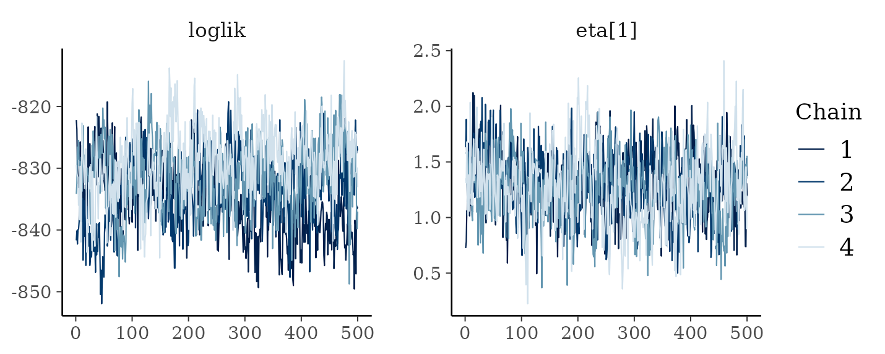
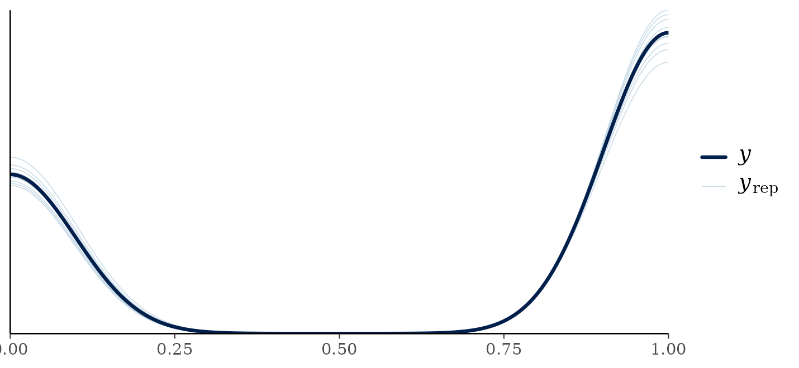
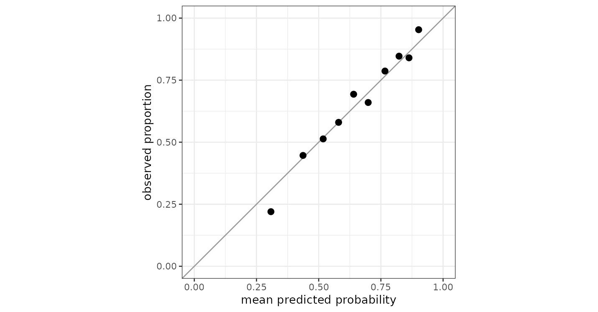

# Has it converged, and does it fit?

## Introduction

Two questions get asked together and are worth separating. Has the
sampler converged, meaning has it explored the posterior properly? And
does the model fit, meaning does it describe the data?

The first is about the algorithm and the second is about the model. A
fit can converge beautifully on a badly chosen family, and a well chosen
family can be fitted by a chain that has not run long enough.

``` r

library(bartisan)

data(rhc)

model <- death ~ rhc + age + sex + race + edu + aps + meanbp + resp +
  hema + pafi + paco2 + crea + surv2m + card

set.seed(2026)

fit <- bartisan(model, data = rhc, family = binomial(), chains = 4)
```

## Convergence

### One call for all of it

[`diagnose()`](https://ngreifer.github.io/bartisan/reference/diagnose.md)
computes every convergence and mixing statistic in this section, says
which of them fall short, and says what to do about each. Everything it
reports comes from the stored draws, so it needs no other package.

``` r

diagnose(fit)
#> Convergence and mixing
#> 
#>                            quantity rhat rhat_late ess_bulk ess_tail
#>                              loglik 1.18      1.32       16       76
#>                          splits.eta 1.06      1.05       62      258
#>  eta.eta (worst 5% of observations) 1.09      1.15       34      137
#> 
#> What to do
```

The rest of this section is what it is reporting and why, which is worth
reading once. Skip to
[`vignette("bartisan")`](https://ngreifer.github.io/bartisan/articles/bartisan.md)
if the summary is enough.

### Run more than one chain

`chains = 4` above is doing the work. The default is one chain, which
produces estimates but no way to check them: `fit$rhat` is `NULL` for a
single chain, because the statistic compares chains to each other.
Running four costs four times as much, which for most fits is a few
seconds.

``` r

fit$rhat
#>                            quantity rhat ess_bulk ess_tail
#> 1                            loglik 1.18     16.2     76.4
#> 2 eta.eta (worst over observations) 1.17     16.6     48.7
```

`rhat` compares the variance between chains to the variance within them
([Vehtari et al. 2021](#ref-vehtari2021)). If the chains have found the
same posterior the two agree and the ratio is near 1. `ess_bulk` and
`ess_tail` are effective sample sizes: how many independent draws the
correlated ones are worth, in the middle of the distribution and in the
tails.

The conventional thresholds are `rhat` below 1.01 and effective sample
sizes above about 400 for a quantity you intend to report precisely.
Those come from the general MCMC literature and are a reasonable default
here, with one exception described below.
[`diagnose()`](https://ngreifer.github.io/bartisan/reference/diagnose.md)
applies them, and takes both as arguments if you want to move them.

[`diagnose()`](https://ngreifer.github.io/bartisan/reference/diagnose.md)
adds two things this table does not have. It repeats `rhat` on the
second half of the retained draws alone, which is what tells a warmup
that ended too early from chains that have each settled somewhere
different: throwing away the early draws is exactly what more `num_burn`
would have done, so if that fixes `rhat`, warmup was the problem. And it
reports the total number of splitting rules in the forest at each draw,
which is the one quantity here that is about the trees rather than about
the fitted values, and which no general-purpose MCMC diagnostic would
think to look at.

### What the rows are

`loglik` is the log likelihood of the whole dataset at each draw. It is
a useful scalar summary of the fit and mixes reasonably.

`aux.*` are the nuisance parameters of the family, and are usually the
best behaved rows in the table. A binomial likelihood has none, so they
do not appear here; a Gaussian fit would show `aux.sigma`, and a
survival fit its scale or baseline hazard.

`eta.*` is the additive predictor, summarized over the observation that
mixes worst. This is the fitted function, so it is the row that matters
when predictions or effects are the output.

One quantity is deliberately not in the table. The leaf prior scale, in
`fit$sigma_mu`, mixes badly in every BART implementation: on one dataset
its counterparts in *dbarts* and in *stochtree* come out at `rhat` 1.12
and 1.16 with effective sample sizes of 22 and 17 out of 3000 draws, and
*stochtree* draws it exactly from its full conditional, so no sampler
can do better. The *BART* package avoids the question by never drawing
it. It is a hyperparameter whose disagreement between chains does not
reach the fitted function, which on those same fits has `rhat` 1.00 and
thousands of effective draws, so reporting it beside `eta` only produced
an alarming row with nothing to act on. It is out of this table and only
out of this table: the draws are in `fit$sigma_mu` and reach
[`as_draws()`](https://mc-stan.org/posterior/reference/draws.html), so
it can still be diagnosed by anyone who wants to.

### The one exception

The `eta` row is a maximum over every observation, so it is conservative
by construction, and forests mix slowly on their fitted values. Two
chains can visit quite different collections of trees that imply nearly
identical predictions, which inflates a between-chain statistic without
meaning the two chains disagree about anything you would report.

On harder problems this shows up clearly. The following fits the
Friedman function, first with a chain far too short and then at the
defaults.

``` r

set.seed(3)
fr <- as.data.frame(matrix(runif(400 * 10), 400, 10))
names(fr) <- paste0("x", 1:10)
fr$y <- 10 * sin(pi * fr$x1 * fr$x2) + 20 * (fr$x3 - 0.5)^2 +
  10 * fr$x4 + 5 * fr$x5 + rnorm(400)

too_short <- bartisan(y ~ ., fr, family = gaussian(), chains = 4,
                      control = bartisan_control(num_trees = 20, num_burn = 50,
                                                 num_draws = 50))
too_short$rhat
#>                            quantity rhat ess_bulk ess_tail
#> 1                            loglik 1.72     6.85     12.3
#> 2                         aux.sigma 1.26    12.33     29.6
#> 3 eta.eta (worst over observations) 2.33     5.62     12.1
```

Everything is bad: `rhat` above 2 for the log likelihood, the residual
standard deviation and the fitted values, with effective sample sizes
under 10. This chain has not converged and nothing from it should be
used.

``` r

long_enough <- bartisan(y ~ ., fr, family = gaussian(), chains = 4)

long_enough$rhat
#>                            quantity rhat ess_bulk ess_tail
#> 1                            loglik 1.14     20.7     87.1
#> 2                         aux.sigma 1.03    145.2    822.5
#> 3 eta.eta (worst over observations) 1.30     10.3     16.7
```

Now the log likelihood and the residual standard deviation have
converged, and `eta` has improved but is still above 1.01. That residual
is the phenomenon described above, and adding draws does not reliably
remove it.

When the `eta` row is elevated, look at the distribution behind it
rather than the maximum:

``` r

per_observation_rhat <- function(fit) {
  draws <- fit$eta$eta
  per <- nrow(draws) / fit$chains
  index <- matrix(seq_len(per * fit$chains), per, fit$chains)
  apply(draws, 2, function(column) {
    posterior::rhat(matrix(column[index], per, fit$chains))
  })
}

round(quantile(per_observation_rhat(fit), c(0.5, 0.9, 0.99, 1)), 3)
#>  50%  90%  99% 100% 
#> 1.03 1.07 1.12 1.17
```

The median is a little above 1 and so is most of the distribution, so
the maximum in the table is not one badly behaved observation: the
fitted function as a whole mixes slowly here. That is the phenomenon
described above rather than a broken chain, and the two are told apart
by what happens to the quantities you report. If the log likelihood has
converged, along with any nuisance parameters the family has, and an
[`avg_comparisons()`](https://rdrr.io/pkg/marginaleffects/man/comparisons.html)
estimate is stable across chains and across a longer run, the fit is
usable.

If instead the log likelihood were badly elevated too, or the estimate
moved when the chain was lengthened, that would be a chain that has not
converged, and the answer is more draws or a simpler model.

### Looking at the chains

[`as_draws()`](https://mc-stan.org/posterior/reference/draws.html) hands
the fit to *posterior* and *bayesplot*. It carries the scalar parameters
and a representative set of `eta` columns.

``` r

library(posterior)

summarise_draws(as_draws(fit))
#> # A tibble: 12 × 10
#>    variable         mean   median     sd    mad       q5      q95  rhat ess_bulk
#>    <chr>           <dbl>    <dbl>  <dbl>  <dbl>    <dbl>    <dbl> <dbl>    <dbl>
#>  1 loglik       -8.32e+2 -8.32e+2 6.14   6.20   -8.43e+2 -8.23e+2  1.18     16.3
#>  2 sigma_mu.eta  2.47e-1  2.39e-1 0.0551 0.0577  1.69e-1  3.48e-1  1.31     10.4
#>  3 eta[380]     -1.50e+0 -1.49e+0 0.340  0.343  -2.08e+0 -9.73e-1  1.10     29.7
#>  4 eta[324]     -4.31e-1 -4.26e-1 0.281  0.278  -9.06e-1  2.21e-2  1.03    129. 
#>  5 eta[917]     -1.20e-2 -5.33e-3 0.442  0.436  -7.28e-1  7.25e-1  1.09     32.1
#>  6 eta[48]       2.88e-1  2.81e-1 0.346  0.340  -2.68e-1  8.95e-1  1.02    210. 
#>  7 eta[1034]     5.81e-1  5.89e-1 0.311  0.307   5.93e-2  1.06e+0  1.01    229. 
#>  8 eta[639]      8.85e-1  8.83e-1 0.344  0.331   3.34e-1  1.44e+0  1.04     70.5
#>  9 eta[1372]     1.28e+0  1.25e+0 0.409  0.420   6.30e-1  1.98e+0  1.07     44.7
#> 10 eta[1222]     1.66e+0  1.64e+0 0.376  0.364   1.06e+0  2.29e+0  1.01    347. 
#> 11 eta[362]      2.01e+0  2.01e+0 0.416  0.407   1.34e+0  2.68e+0  1.02    312. 
#> 12 eta[1135]     3.13e+0  3.09e+0 0.514  0.500   2.35e+0  4.05e+0  1.12     25.3
#> # ℹ 1 more variable: ess_tail <dbl>
```

``` r

library(bayesplot)

mcmc_trace(as_draws(fit, eta = 1), pars = c("loglik", "eta[1]"))
```



What you want to see is four chains overlapping, wandering around the
same level, with no drift and no long excursions. `eta = 1` selects the
first observation; `eta = TRUE` gives a spread of ten and `eta = FALSE`
gives none.

### What to do when it has not converged

In order of what usually helps:

1.  Increase `num_burn` and `num_draws`. This is the first thing to try
    and it fixes most cases.
2.  Reduce `num_trees`. A smaller forest has fewer ways to represent the
    same function and mixes faster.
3.  Check the family. A likelihood that fits the data badly can produce
    a posterior that is hard to explore.

## Fit

Convergence says the sampler did its job. It says nothing about whether
the model is right.

### Posterior predictive checks

Simulate outcomes from the fitted model and compare their distribution
to the observed one.

``` r

pp_check(fit)
```



For a continuous outcome this is the workhorse check, and systematic
differences are what to look for: replicates that are too narrow, that
miss a second mode, or that put mass where the outcome cannot go.
Simulating negative values for an outcome that cannot be negative says
the family is wrong, and
[`vignette("families")`](https://ngreifer.github.io/bartisan/articles/families.md)
covers the alternatives.

For a **binary** outcome it is a weak check, which is worth knowing
before reading too much into it. There are only two values the
replicates can take, so they will match the observed proportion unless
the model has gone badly wrong. Passing this tells you almost nothing.

### Calibration

The useful question for a binary outcome is whether the predicted
probabilities mean what they say. Group the patients by their fitted
probability and compare the average prediction in each group with the
proportion who actually died.

``` r

library(ggplot2)

p <- fitted(fit)
bins <- cut(p, quantile(p, seq(0, 1, 0.1)), include.lowest = TRUE)

calibration <- data.frame(
  predicted = tapply(p, bins, mean),
  observed  = tapply(rhc$death, bins, mean)
)

ggplot(calibration, aes(predicted, observed)) +
  geom_abline(slope = 1, intercept = 0, colour = "grey60") +
  geom_point(size = 2) +
  coord_equal(xlim = c(0, 1), ylim = c(0, 1)) +
  labs(x = "mean predicted probability", y = "observed proportion") +
  theme_bw(base_size = 9)
```



Points on the diagonal mean the probabilities are calibrated: among
patients the model gave a 30% chance of dying, about 30% died. These sit
close to it across the whole range.

Points systematically above the line at the left and below it at the
right would mean the predictions are too extreme, which is the usual
failure of an overfitted model. The opposite pattern means they are too
timid, which is what heavy shrinkage produces.

This is an in-sample check and so is optimistic. For an honest version,
fit on part of the data and calibrate on the rest.

### Residuals

For a continuous outcome, plot residuals against fitted values and read
it the way you would for a linear model, with one difference. A forest
shrinks its predictions toward the overall mean, so a mild negative
trend is expected even when the model is correct: the highest fitted
values are pulled down and the lowest pulled up. A strong slope is not
expected, and a fan shape means the spread of the outcome depends on the
predictors, which
[`location_scale()`](https://ngreifer.github.io/bartisan/reference/bartisan-families.md)
models directly.

For a binary outcome the residuals take two values for any given fitted
probability and the plot is not informative. Use the calibration check
instead.

### How much is the model explaining

``` r

performance::r2(fit)
#> # Bayesian R2 with Compatibility Interval
#> 
#>   Conditional R2: 0.172 (95% CI [0.138, 0.204])
```

This is the Bayesian \\R^2\\ of Gelman et al. ([2019](#ref-gelman2019)),
computed from the posterior rather than from a single fit, so it comes
with an interval and cannot exceed 1. For a binary outcome it is bounded
well below 1 by the outcome’s own randomness, so read it as a relative
measure rather than against any absolute standard.

## A checklist

Before reporting anything from a fit:

1.  Fit with `chains = 4`.
2.  Run `diagnose(fit)` and read what it says to change. It covers steps
    2 and 3 of the older advice: the thresholds, which rows are exempt,
    and whether a short warmup or genuinely disagreeing chains is the
    problem.
3.  Run
    [`pp_check()`](https://mc-stan.org/bayesplot/reference/pp_check.html)
    and look for systematic differences.
4.  If the outcome is bounded, check that the replicates respect the
    bound.

## Where to go next

[`vignette("comparison")`](https://ngreifer.github.io/bartisan/articles/comparison.md)
covers choosing between models once each of them fits.
[`vignette("families")`](https://ngreifer.github.io/bartisan/articles/families.md)
covers what to do when the posterior predictive check says the family is
wrong.

## References

Gelman, Andrew, Ben Goodrich, Jonah Gabry, and Aki Vehtari. 2019.
“R-Squared for Bayesian Regression Models.” *The American Statistician*
73 (3): 307–9. <https://doi.org/10.1080/00031305.2018.1549100>.

Vehtari, Aki, Andrew Gelman, Daniel Simpson, Bob Carpenter, and
Paul-Christian Bürkner. 2021. “Rank-Normalization, Folding, and
Localization: An Improved r-Hat for Assessing Convergence of MCMC.”
*Bayesian Analysis* 16 (2): 667–718.
<https://doi.org/10.1214/20-BA1221>.
