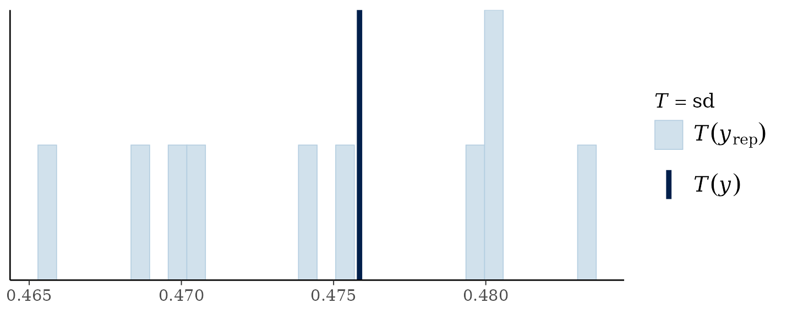
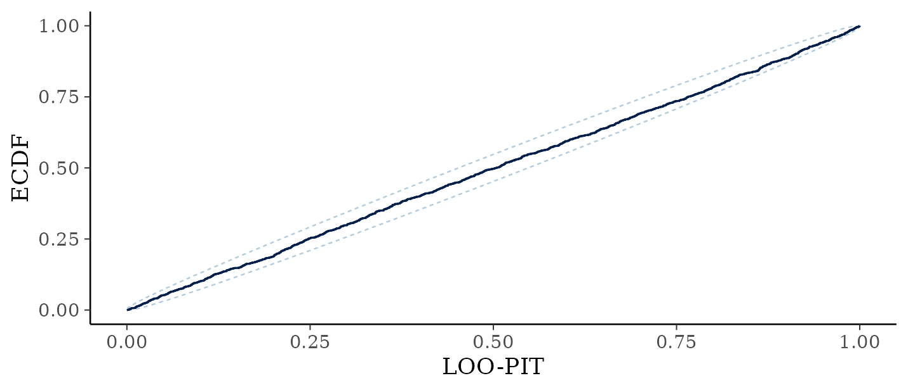

# Checking Convergence and Fit

## Introduction

Two questions get asked together and are worth separating. Has the
sampler converged, meaning has it explored the posterior properly? And
does the model fit, meaning does it describe the data?

The first is about the algorithm and the second is about the model; a
fit can converge beautifully on a badly chosen family, and a well chosen
family can be fitted by a chain that has not run long enough.

In this guide, we will take the two questions in that order. First we’ll
fit a model with four chains, hand it to
[`diagnose()`](https://ngreifer.github.io/bartisan/reference/diagnose.md),
and then unpack what that summary reports and why, including the one row
(the additive predictor `eta`) whose conventional threshold does not
apply to a forest and the one quantity that is deliberately left out of
the table. Next we’ll ask whether the model describes the data, using
posterior predictive checks, a calibration plot for the binary case in
which those checks are weak, residuals, and a Bayesian \\R^2\\. A short
checklist at the end collects what we recommend running before reporting
anything from a fit.

``` r

library(bartisan)

# For parallelization; optional
if (rlang::is_installed("future")) {
  future::plan(future::multisession)
}

data("rhc")

set.seed(2026)

fit <- bartisan(death ~ rhc + age + sex + race + edu + aps + meanbp + resp +
                  hema + pafi + paco2 + crea + surv2m + card,
                data = rhc, family = binomial(), chains = 4)
```

## Convergence

### Every Statistic in One Call (`diagnose()`)

[`diagnose()`](https://ngreifer.github.io/bartisan/reference/diagnose.md)
computes every convergence and mixing statistic in this section, says
which of them fall short, and says what to do about each. Everything it
reports comes from the stored draws, so it needs no other package.

``` r

diagnose(fit)
#> Convergence and mixing
#> 
#>                             quantity rhat rhat_late ess_bulk ess_tail
#>                               loglik 1.12     1.036       23      234
#>                           splits.eta 1.01     1.039      264      731
#>  eta.eta (average over observations) 1.00     0.999     1610     2278
#>   eta.eta (worst 5% of observations) 1.04     1.073       80      305
#> 
#> ✔ 4 chains, 3200 draws kept in total
#> ✖ R-hat is above 1.01 for loglik
#> ✖ That R-hat rests on only 23 effective draws, where 4 chains average 1.171
#>   even when they agree
#> ℹ A longer warmup is not the fix: R-hat stays high on the second half of the
#>   draws alone as well
#> ✖ The chains disagree about how many splitting rules the forest has (R-hat
#>   1.01)
#> ✖ Bulk ESS is 23 for loglik, below 400
#> ✖ Tail ESS is 234 for loglik, below 400
#> ℹ The chains disagree about individual observations and agree about their
#>   average (R-hat 1.00, 1610 effective draws)
#> ℹ Per-draw efficiency is lowest for loglik, which carries 0.7 effective draws
#>   per hundred kept
#> 
#> What to do
#> 
#> • Raise `num_draws`, which was `800`. R-hat is above the threshold for a
#>   quantity that carries too few effective draws for the threshold to mean
#>   anything: with this many chains it would sit about where it does even if the
#>   chains agreed exactly, as the check above reports. Effective sample size is
#>   what makes it readable, and that grows with the total number of draws; using
#>   fewer chains lowers the bar as well, since R-hat's null rises with the number
#>   of chains being compared.
#> • If that does not settle it, reduce `num_trees`. A smaller forest has fewer
#>   ways to represent the same fit, so the sampler has less room to move between
#>   them.
#> • Then check the family. A likelihood that fits the data badly can give a
#>   posterior with no single place to be; `bayesplot::pp_check()` is the
#>   diagnostic.
#> • Note that the chains disagree about the fitted values of individual
#>   observations and not about their average, which is the usual shape of this in
#>   a forest. What that means for an estimand cannot be read off this table
#>   either way, since an estimand is a contrast and a contrast can mix badly
#>   where the function it contrasts mixes well. Compute it: `diagnose()` takes
#>   the output of `estimate_effect()`, and `posterior::as_draws()` hands the
#>   draws to `posterior::summarise_draws()` for anything else.
```

The rest of this section is what it is reporting and why, which is worth
reading once; when the summary itself is enough,
[`vignette("bartisan")`](https://ngreifer.github.io/bartisan/articles/bartisan.md)
is the shorter tour of the whole workflow.

### Running More Than One Chain (`chains`)

`chains = 4` above is doing the work. The default is one chain, which
produces estimates but no way to check most of what matters, because
R-hat compares chains to each other; with one chain it is computed by
splitting that chain, which catches drift but cannot catch two chains
settling in different places. Running four costs four times as much
sampling, which for most fits is a few seconds, and less than that under
a *future* plan.

More chains is not, however, a way to improve `rhat`, and it is worth
knowing which way it cuts before reaching for it. Effective sample size
depends on the total number of draws and not on how they are divided, so
twice as many chains and twice as long a chain buy the same amount of
it. `rhat` is not symmetric that way: because it compares chains against
each other, its value under a sampler with nothing wrong is about
`1 + chains / ess`, so at 400 effective draws four chains sit at 1.010
and sixteen chains at 1.040. Adding chains raises the bar it has to
clear. When a fit fails on `rhat`, longer chains are the fix; when it
fails only on effective sample size, either will do.

The table is in `diagnose(fit)$table` when it is wanted as a data frame,
and the checks and the advice are in `$checks` and `$advice`.

`rhat` compares the variance between chains to the variance within them
([Vehtari et al. 2021](#ref-vehtari2021)); if the chains have found the
same posterior the two agree and the ratio is near 1. `ess_bulk` and
`ess_tail` are effective sample sizes, meaning how many independent
draws the correlated ones are worth, in the middle of the distribution
(i.e., the bulk) and in the tails respectively.

The conventional thresholds are `rhat` below 1.01 and effective sample
sizes above about 400 for a quantity we intend to report precisely.
Those come from the general MCMC literature and are a reasonable default
here, with one exception described below.
[`diagnose()`](https://ngreifer.github.io/bartisan/reference/diagnose.md)
applies them, and takes both as arguments so they can be moved.

Two of the columns are worth naming separately. `rhat_late` is the same
statistic computed on the second half of the retained draws alone, which
is what tells a warmup that ended too early (i.e., too small a
`num_burn`) from chains that have each settled somewhere different:
throwing away the early draws is exactly what more `num_burn` would have
done, so if that fixes `rhat`, warmup was the problem. The `splits.*`
row is the total number of splitting rules in the forest at each draw,
the one quantity here that is about the trees rather than about the
fitted values, and which no general-purpose MCMC diagnostic would think
to look at.

### The Rows of the Table

`loglik` is the log likelihood of the whole dataset at each draw. It is
a useful scalar summary of the fit, and usually the slowest-mixing row
in the table, since it moves with every observation’s fitted value at
once.

`aux.*` are the nuisance parameters of the family (i.e., the parameters
that are not part of the additive predictor), and are usually the best
behaved rows in the table. The binomial likelihood has none of its own,
so none appear here, though a
[`vc()`](https://ngreifer.github.io/bartisan/reference/vc.md) coding
contributes its coefficients to `aux`, which is where the `aux.b.*` rows
in the [`bcf()`](https://ngreifer.github.io/bartisan/reference/bcf.md)
table below come from; a Gaussian fit would show `aux.sigma`, and a
survival fit its scale or baseline hazard.

`eta.*` is the additive predictor, and it gets two rows. One summarizes
the worst 5% of observations rather than the single worst, because the
worst of a thousand values is extreme even when every chain has
converged; the other is the average over observations. Reading them
against each other is the point of having both, because they routinely
differ by orders of magnitude: a forest settles the level of the fitted
function within a sweep or two and takes far longer to settle which
observation gets which share of it. A prediction for one observation is
governed by the worst-5% row.

Neither row settles an effect, and the average row in particular should
not be read as though it did. An effect is a *contrast*, and a contrast
can mix badly where the function it is a contrast of mixes well, so what
[`estimate_effect()`](https://ngreifer.github.io/bartisan/reference/estimate_effect.md)
or
[`avg_comparisons()`](https://rdrr.io/pkg/marginaleffects/man/comparisons.html)
reports needs diagnosing on its own draws rather than inferring from
this table. The section below does that.

One quantity is deliberately not in the table. The leaf prior scale, in
`fit$sigma_mu`, mixes badly in every BART implementation: on one dataset
its counterparts in *dbarts* and in *stochtree* both come out above
`rhat` 1.1 with effective sample sizes in the tens out of 3000 draws,
and *stochtree* draws it exactly from its full conditional, so no
sampler can do better. It is a hyperparameter whose disagreement between
chains does not reach the fitted function, which on those same fits has
`rhat` 1.00 and thousands of effective draws, so reporting it beside
`eta` only produces an alarming row with nothing to act on. It is out of
this table and only out of this table: the draws are in `fit$sigma_mu`
and reach
[`as_draws()`](https://mc-stan.org/posterior/reference/draws.html), so
it can still be diagnosed by anyone who wants to.

### The Exception for `eta`

The `eta` row is a high percentile over every observation, so it is
conservative by construction, and forests mix slowly on their fitted
values. Two chains can visit quite different collections of trees, and a
forest settles the level of the fitted function in a sweep or two while
taking far longer to settle which observation gets which share of it,
which is why the per-observation R-hats run high without meaning the two
chains disagree about anything we would report, so whether two chains
found the same trees is not a question the `eta` rows can answer;
`splits.*` is the row that asks it.

On harder problems this shows up clearly. Below we fit the Friedman
function, first with a chain far too short and then at the defaults.

``` r

set.seed(3)
fr <- as.data.frame(matrix(runif(400 * 10), 400, 10))
names(fr) <- paste0("x", 1:10)
fr$y <- 10 * sin(pi * fr$x1 * fr$x2) + 20 * (fr$x3 - 0.5)^2 +
  10 * fr$x4 + 5 * fr$x5 + rnorm(400)

too_short <- bartisan(y ~ ., fr, family = gaussian(), chains = 4,
                      control = bartisan_control(num_trees = 20, num_burn = 50,
                                                 num_draws = 50))

diagnose(too_short)$table
#>                              quantity rhat rhat_late ess_bulk ess_tail ess_frac
#> 1                              loglik 1.72      1.79     6.85     12.3   0.0342
#> 2                           aux.sigma 1.26      1.10    12.33     29.6   0.0617
#> 3                          splits.eta 1.57      1.96     7.73     17.8   0.0387
#> 4 eta.eta (average over observations) 1.02      1.02   203.44    191.7   1.0172
#> 5  eta.eta (worst 5% of observations) 1.86      1.97     6.46     14.6   0.0323
#>   rhat_bad late_bad
#> 1    1.000        1
#> 2    1.000        1
#> 3    1.000        1
#> 4    1.000        1
#> 5    0.998        1
```

Almost everything is bad. Every `rhat` but the average over observations
is far above the 1.01 threshold, and the effective sample sizes are a
fraction of the 200 draws kept (4 chains x 50 kept draws per chain) on
every row but that one. `rhat_late` is no better than `rhat` on any row
but the residual standard deviation, which is the informative part:
discarding the early draws does not fix it, so this is not a warmup that
ended too soon but chains that have each settled somewhere different.
Nothing from this fit should be used.

``` r

long_enough <- bartisan(y ~ ., fr, family = gaussian(), chains = 4)

diagnose(long_enough)$table
#>                              quantity rhat rhat_late ess_bulk ess_tail ess_frac
#> 1                              loglik 1.12      1.14     26.9    127.8  0.00839
#> 2                           aux.sigma 1.03      1.04    130.5    550.1  0.04077
#> 3                          splits.eta 1.08      1.11     37.3    164.5  0.01166
#> 4 eta.eta (average over observations) 1.00      1.00   3322.6   3158.2  1.03830
#> 5  eta.eta (worst 5% of observations) 1.14      1.23     20.5     70.5  0.00641
#>   rhat_bad late_bad
#> 1    1.000    1.000
#> 2    1.000    1.000
#> 3    1.000    1.000
#> 4    0.000    0.000
#> 5    0.993    0.995
```

Everything has improved by a large factor, and the residual standard
deviation is nearly at the threshold. But the log likelihood and `eta`
are both still above 1.01, and `eta`’s effective sample size is still in
the tens. That residual is the phenomenon described above rather than a
chain that merely needs to be longer, and adding draws does not reliably
remove it.

When the `eta` row is elevated, the distribution behind it is more
informative than the maximum:

``` r

per_observation_rhat <- function(fit) {
  draws <- fit$eta$eta
  per <- nrow(draws) / fit$chains
  index <- matrix(seq_len(per * fit$chains), per, fit$chains)
  apply(draws, 2, function(column) {
    posterior::rhat(matrix(column[index], per, fit$chains))
  })
}

round(quantile(per_observation_rhat(fit), c(0.5, 0.9, 0.99, 1)), 3)
#>  50%  90%  99% 100% 
#> 1.02 1.04 1.06 1.07
```

The median is a little above 1 and so is most of the distribution, so
the worst-5% row in the table is not one badly behaved observation: the
fitted function as a whole mixes slowly here. That is the phenomenon
described above rather than a broken chain, and the two are told apart
by what happens to the quantities we report. If the log likelihood has
converged, along with any nuisance parameters the family has, and an
[`avg_comparisons()`](https://rdrr.io/pkg/marginaleffects/man/comparisons.html)
estimate is stable across chains and across a longer run, the fit is
usable.

If instead the log likelihood were badly elevated too, or the estimate
moved when the chain was lengthened, that would be a chain that has not
converged, and the answer is more draws or a simpler model.

### Looking at the Chains (`as_draws()`)

[`as_draws()`](https://mc-stan.org/posterior/reference/draws.html) hands
the fit to *posterior* and *bayesplot*. It carries the scalar parameters
and a representative set of `eta` columns.

``` r

library(posterior)

as_draws(fit) |>
  summarise_draws()
#> # A tibble: 12 × 10
#>    variable         mean   median     sd    mad       q5      q95  rhat ess_bulk
#>    <chr>           <dbl>    <dbl>  <dbl>  <dbl>    <dbl>    <dbl> <dbl>    <dbl>
#>  1 loglik       -8.32e+2 -8.32e+2 6.26   6.11   -841.    -821.     1.13    23.5 
#>  2 sigma_mu.eta  2.50e-1  2.36e-1 0.0650 0.0577    0.165    0.372  1.33     9.85
#>  3 eta[119]     -1.52e+0 -1.50e+0 0.363  0.348    -2.13    -0.945  1.04   102.  
#>  4 eta[466]     -4.19e-1 -4.06e-1 0.336  0.322    -0.976    0.127  1.02   294.  
#>  5 eta[541]     -2.67e-5  5.60e-3 0.289  0.282    -0.482    0.462  1.01   374.  
#>  6 eta[673]      2.97e-1  2.92e-1 0.311  0.301    -0.219    0.818  1.01   281.  
#>  7 eta[763]      5.78e-1  5.64e-1 0.296  0.289     0.123    1.08   1.01   294.  
#>  8 eta[1261]     8.69e-1  8.63e-1 0.336  0.338     0.319    1.42   1.02   337.  
#>  9 eta[1228]     1.28e+0  1.28e+0 0.341  0.333     0.717    1.83   1.01   269.  
#> 10 eta[137]      1.66e+0  1.65e+0 0.388  0.391     1.04     2.31   1.02   157.  
#> 11 eta[1374]     2.01e+0  2.01e+0 0.485  0.473     1.24     2.80   1.01   288.  
#> 12 eta[1135]     3.16e+0  3.12e+0 0.512  0.491     2.39     4.08   1.06    48.8 
#> # ℹ 1 more variable: ess_tail <dbl>
```

``` r

library(bayesplot)

as_draws(fit, eta = 1) |>
  mcmc_trace(pars = c("loglik", "eta[1]"))
```


What we want to see is four chains overlapping, wandering around the
same level, with no drift and no long excursions. `eta = 1` selects the
first observation; `eta = TRUE` gives a spread of ten and `eta = FALSE`
gives none.

### Diagnosing the Quantity Being Reported

Everything above is about the parameters the sampler draws. What gets
reported is usually not one of them: it is an effect, a contrast, a
predicted probability at some covariate value, a difference between two
subgroups. Those need their own diagnostics, because a contrast can mix
badly where the function it is a contrast of mixes well, and nothing in
the table above will say so.

When estimating a treatment effect, the quantity of interest is produced
by
[`estimate_effect()`](https://ngreifer.github.io/bartisan/reference/estimate_effect.md),
the output of which is accepted by
[`diagnose()`](https://ngreifer.github.io/bartisan/reference/diagnose.md)
directly. Below we fit a Bayesian causal forest model to estimate the
ATE:

``` r

bcf_fit <- bcf(death ~ age + sex + race + edu + aps + meanbp + resp +
                 hema + pafi + paco2 + crea + surv2m + card,
               treat = ~rhc, data = rhc,
               family = binomial("probit"), chains = 4)

estimate_effect(bcf_fit, estimand = "ATE") |>
  diagnose()
#> Convergence and mixing
#> 
#>     quantity rhat rhat_late ess_bulk ess_tail
#>  Y[1] - Y[0] 1.04      1.12       88      327
#>         Y[0] 1.02      1.05      258     1389
#>         Y[1] 1.02      1.08      167      976
#> 
#> ✔ 4 chains, 3200 draws kept in total
#> ✖ R-hat is above 1.01 for Y[1] - Y[0]
#> ✖ That R-hat rests on only 88 effective draws, where 4 chains average 1.045
#>   even when they agree
#> ℹ A longer warmup is not the fix: R-hat stays high on the second half of the
#>   draws alone as well
#> ✖ Bulk ESS is 88 for Y[1] - Y[0], below 400
#> ✖ Tail ESS is 327 for Y[1] - Y[0], below 400
#> ℹ Per-draw efficiency is lowest for Y[1] - Y[0], which carries 2.7 effective
#>   draws per hundred kept
#> 
#> What to do
#> 
#> • Raise `num_draws`, which was `800`. R-hat is above the threshold for a
#>   quantity that carries too few effective draws for the threshold to mean
#>   anything: with this many chains it would sit about where it does even if the
#>   chains agreed exactly, as the check above reports. Effective sample size is
#>   what makes it readable, and that grows with the total number of draws; using
#>   fewer chains lowers the bar as well, since R-hat's null rises with the number
#>   of chains being compared.
#> • If that does not settle it, reduce `num_trees`. A smaller forest has fewer
#>   ways to represent the same fit, so the sampler has less room to move between
#>   them.
#> • Then check the family. A likelihood that fits the data badly can give a
#>   posterior with no single place to be; `bayesplot::pp_check()` is the
#>   diagnostic.
```

Three rows: the contrast, and the two average potential outcomes it is a
contrast of. The effect is the row that falls short, at a bulk effective
sample size well under 400 and an R-hat above the threshold, while the
two averages it is built from are in better shape than it is. A
difference can be worse than either of its parts, and that is the
reading here.

Now compare what the fit’s own table says about the same sampler:

``` r

diagnose(bcf_fit)$table
#>                                      quantity rhat rhat_late ess_bulk ess_tail
#> 1                                      loglik 1.04      1.19     68.8    199.6
#> 2                                 aux.b.rhc.0 1.16      1.37     30.4     75.6
#> 3                                 aux.b.rhc.1 1.08      1.17     38.2    137.1
#> 4                          splits.(Intercept) 1.02      1.04    201.5    410.0
#> 5                                  splits.rhc 1.00      1.03    285.5    587.0
#> 6 eta.(Intercept) (average over observations) 1.32      1.70     10.2     14.6
#> 7  eta.(Intercept) (worst 5% of observations) 1.24      1.45     12.6     15.9
#> 8         eta.rhc (average over observations) 1.26      1.61     12.1     22.3
#> 9          eta.rhc (worst 5% of observations) 1.26      1.56     12.1     18.9
#>   ess_frac rhat_bad late_bad
#> 1  0.02149        1        1
#> 2  0.00950        1        1
#> 3  0.01192        1        1
#> 4  0.06298        1        1
#> 5  0.08923        0        1
#> 6  0.00317        1        1
#> 7  0.00393        1        1
#> 8  0.00378        1        1
#> 9  0.00379        1        1
```

The two forests are far worse than the estimand. Their R-hats are in the
region of 1.4 to 1.7 with effective sample sizes in single figures,
where the effect manages a bulk size in the low hundreds. That is not a
contradiction: a varying coefficient model is \\f_0(x) + z\\f_1(x)\\,
and on the treated units the two forests are only jointly identified, so
the sampler can move level between them while their sum, and much of
what is built from it, stays where it was. The effect inherits part of
that wandering and not all of it.

So the estimand’s diagnosis cannot be deduced from the fit’s in either
direction. Read only the `eta` rows here and the fit looks unusable;
read only the effect’s own table and the sampler looks merely short of
the thresholds; neither reading gives the other. Both are worth running,
and it is the second that decides whether the number being reported can
be reported.

### Diagnosing Anything Else (`summarise_draws()`)

For a quantity this package has no method for, *posterior* is the
general tool: anything that can be arranged as draws by chains can be
handed to
[`summarise_draws()`](https://mc-stan.org/posterior/reference/draws_summary.html),
which computes the same statistics
[`diagnose()`](https://ngreifer.github.io/bartisan/reference/diagnose.md)
reports.

The arranging is the only step with a decision in it. The sampler stacks
its chains, so the draws of any quantity are one long vector in chain
order, and folding it into an iterations-by-chains matrix is what
recovers the structure R-hat needs. Below, the quantity is an average
comparison computed by *marginaleffects*, whose draws come out of
[`posterior_draws()`](https://rdrr.io/pkg/marginaleffects/man/posterior_draws.html):

``` r

library(marginaleffects)

drawn <- avg_comparisons(fit, variables = "rhc") |>
  posterior_draws()

chains <- fit$chains
per_chain <- nrow(drawn) / chains

folded <- array(drawn$draw, dim = c(per_chain, chains, 1L),
                dimnames = list(NULL, NULL, "ATE"))

folded |>
  as_draws_array() |>
  summarise_draws("mean", "rhat", "ess_bulk", "ess_tail")
#> # A tibble: 1 × 5
#>   variable   mean  rhat ess_bulk ess_tail
#>   <chr>     <dbl> <dbl>    <dbl>    <dbl>
#> 1 ATE      0.0568  1.04     117.     63.8
```

The same statistics
[`diagnose()`](https://ngreifer.github.io/bartisan/reference/diagnose.md)
reports, computed by a different route on a quantity it has no method
for, which is the point: any posterior quantity can be diagnosed this
way, including ones neither package knows about. Draw it, fold it,
summarize it.

Two things to get right. The fold has to match the order the draws are
stored in, which here is all of chain one, then all of chain two, and so
on; filling the array in that order is what
`dim = c(per_chain, chains, 1)` does. And the quantity has to be the one
being reported: diagnosing a prediction is not diagnosing the contrast
of two predictions, for the reason the section above gives.

### Remedies for a Chain That Has Not Converged

Three things are worth trying, in the order in which they usually help.
**More draws** is the first: increasing `num_burn` and `num_draws` fixes
most cases. **A smaller forest** is the second, since reducing
`num_trees` leaves fewer ways to represent the same function, so the
sampler mixes faster. **A different family** is the third, because a
likelihood that fits the data badly can produce a posterior that is hard
to explore, so the family is worth checking when more draws and a
smaller forest have not helped;
[`vignette("families")`](https://ngreifer.github.io/bartisan/articles/families.md)
covers the alternatives.

Note these latter two options change the model itself, so only use them
when required, not as a routine fix.

One thing to rule out first. `rhat` above 1.01 on a quantity carrying
only a handful of effective draws is not yet evidence that the chains
disagree, since that is roughly where `rhat` sits when nothing is wrong,
and
[`diagnose()`](https://ngreifer.github.io/bartisan/reference/diagnose.md)
says so rather than reporting a disagreement it cannot support. In that
case the effective sample size is what to fix, and more draws is the
whole of the remedy.

### A Worked Example: More Draws, Same Model

The first remedy is the only one that leaves the model alone, so it is
worth seeing how far it goes on its own. Below, a fit that fails and
then the same model run longer; the formula, the family, the tree count
and every prior setting are identical between the two, and only
`num_burn` and `num_draws` move.

``` r

model <- death ~ rhc + age + aps + meanbp + surv2m

set.seed(2026)
short <- bartisan(model, data = rhc, family = binomial(), chains = 4)

diagnose(short)
#> Convergence and mixing
#> 
#>                             quantity rhat rhat_late ess_bulk ess_tail
#>                               loglik 1.04     1.050      101      317
#>                           splits.eta 1.01     1.016      252      528
#>  eta.eta (average over observations) 1.00     0.999     1912     2678
#>   eta.eta (worst 5% of observations) 1.03     1.039      136      585
#> 
#> ✔ 4 chains, 3200 draws kept in total
#> ✖ R-hat is above 1.01 for loglik
#> ✖ That R-hat rests on only 101 effective draws, where 4 chains average 1.040
#>   even when they agree
#> ℹ A longer warmup is not the fix: R-hat stays high on the second half of the
#>   draws alone as well
#> ✔ The chains agree about the size of the forest
#> ✖ Bulk ESS is 101 for loglik, below 400
#> ✖ Tail ESS is 317 for loglik, below 400
#> ℹ The chains disagree about individual observations and agree about their
#>   average (R-hat 1.00, 1912 effective draws)
#> ℹ Per-draw efficiency is lowest for loglik, which carries 3.2 effective draws
#>   per hundred kept
#> 
#> What to do
#> 
#> • Raise `num_draws`, which was `800`. R-hat is above the threshold for a
#>   quantity that carries too few effective draws for the threshold to mean
#>   anything: with this many chains it would sit about where it does even if the
#>   chains agreed exactly, as the check above reports. Effective sample size is
#>   what makes it readable, and that grows with the total number of draws; using
#>   fewer chains lowers the bar as well, since R-hat's null rises with the number
#>   of chains being compared.
#> • If that does not settle it, reduce `num_trees`. A smaller forest has fewer
#>   ways to represent the same fit, so the sampler has less room to move between
#>   them.
#> • Then check the family. A likelihood that fits the data badly can give a
#>   posterior with no single place to be; `bayesplot::pp_check()` is the
#>   diagnostic.
#> • Note that the chains disagree about the fitted values of individual
#>   observations and not about their average, which is the usual shape of this in
#>   a forest. What that means for an estimand cannot be read off this table
#>   either way, since an estimand is a contrast and a contrast can mix badly
#>   where the function it contrasts mixes well. Compute it: `diagnose()` takes
#>   the output of `estimate_effect()`, and `posterior::as_draws()` hands the
#>   draws to `posterior::summarise_draws()` for anything else.
```

Four things are flagged. `rhat` is above the threshold, and the check
under it says that the R-hat in question rests on too few effective
draws for the threshold to mean anything, which is the case the previous
section says to rule out first: the chains are not demonstrably
disagreeing, they have not run long enough for the statistic to be
readable. Both effective sample sizes are short of 400 as well.
Everything here points the same way, and none of it points at the model.

So we run it longer, increasing the burn-in to 2000 and the number of
draws per chain to 8000. Nothing else changes, so we can call
[`update()`](https://rdrr.io/r/stats/update.html) on the previous model
with our new arguments supplied:

``` r

set.seed(2026)
longer <- update(short, num_burn = 2000, num_draws = 8000)

diagnose(longer)
#> Convergence and mixing
#> 
#>                             quantity rhat rhat_late ess_bulk ess_tail
#>                               loglik 1.01      1.02      407     1139
#>                           splits.eta 1.00      1.00     2949     5444
#>  eta.eta (average over observations) 1.00      1.00    15655    24219
#>   eta.eta (worst 5% of observations) 1.01      1.01      921     2542
#> 
#> ✔ 4 chains, 32000 draws kept in total
#> ✔ R-hat is below 1.01 throughout
#> ✔ Warmup was long enough, since R-hat is already fine
#> ✔ The chains agree about the size of the forest
#> ✔ Bulk ESS is at least 407 everywhere, above 400
#> ✔ Tail ESS is at least 1139 everywhere, above 400
#> ℹ Per-draw efficiency is lowest for loglik, which carries 1.3 effective draws
#>   per hundred kept
#> 
#> ✔ Nothing to change.
```

Nothing is flagged. The checks report R-hat below 1.01 throughout,
though the table rounds too coarsely to show it, and both effective
sample sizes clear 400 with room. What is left of it sits on the log
likelihood and the worst-5% row, which is where a forest’s largest R-hat
usually sits. This fit can be reported from.

Two things about the arithmetic are worth taking from it. The first is
that effective sample size grows roughly in proportion to the draws, so
the shortfall tells you the factor you need: a fit an order of magnitude
short of 400 needs about an order of magnitude more draws, not a little
more. An intermediate run at `num_burn = 1000` and `num_draws = 4000`
cleared both effective-sample-size warnings on these data and still left
R-hat at 1.010, a hair over the line, which is the usual shape of the
last stretch.

The second is that the estimate of effective sample size is itself
noisy, and can fall as the chain lengthens: a short chain cannot see
autocorrelation at long lags, so it reports an efficiency the chain does
not have. Reading a single ESS figure as exact invites chasing it; the
factor is what to read.

Increasing draws does not always suffice. Doing so sufficed here because
the flagged R-hat was the unreadable kind, resting on too few effective
draws. Where R-hat instead stays above the threshold however many draws
are added, as it does for the Friedman fit above, the chains genuinely
disagree and more of them will not help. That is when the remedies that
change the model come up, and the order in the list above is the order
to try them in.

## Fit

Convergence says the sampler did its job; it says nothing at all about
whether the model is right. The checks below assess the fit of the model
to the data.

### What the Prior Is (`prior_summary()`)

Everything else in this section compares the model to the data it was
fitted to. Two checks are worth running before any of that information
has been spent, and the first is simply to read the prior back.

``` r

rstantools::prior_summary(fit)
#> Priors
#> 
#> Trees
#> • 50 trees per additive predictor, summed. A node at depth d branches with
#>   probability 0.95 * (1 + d)^-2, so the root splits with probability 0.95 and a
#>   node at depth 3 with 0.059.
#> 
#> Leaves
#> • Each leaf value is Normal(0, 0.212^2), that scale being 3 * s / (2 *
#>   sqrt(50)) with s the response's scale on the link scale. The scale is itself
#>   given a half-Cauchy prior centred there and is estimated.
#> 
#> Splitting variables
#> • The share of the rules each of the 14 predictors receives is Dirichlet(1 /
#>   14), whose concentration enters as a / (a + 14) ~ Beta(0.5, 1). Both are
#>   estimated.
#> 
#> Decision rules
#> • Soft, with "smoothstep" gates. Each tree's bandwidth is drawn from an
#>   exponential with mean 0.1, on predictors mapped to [0, 1], and is estimated.
#> 
#> Family: binomial, logit link
#> • No parameters of its own beyond the additive predictors above.
#> 
#> ℹ The leaf scale, and any number above read off the response, are calibrated
#>   rather than fitted; that is how a BART prior is specified.
#> ℹ `prior_only = TRUE` in `bartisan()` draws from all of this, so that what it
#>   implies can be read on the outcome's own scale.
```

This is the prior the engine was given rather than the one we wrote, and
the two are not the same object: we named no priors at all, and the
defaults are a function of the response and of the number of trees. Note
in particular that the leaf scale is not a number anyone typed. It is
`3 * s / (k * sqrt(num_trees))`, so halving the number of trees widens
each leaf’s prior by a factor of \\\sqrt 2\\ and leaves the prior on
their sum alone, which is why `num_trees` is not the tuning knob it
looks like.

### Before the Data: The Prior Predictive (`prior_only`)

Reading the prior back is not the same as knowing what it implies. The
settings in
[`bartisan_control()`](https://ngreifer.github.io/bartisan/reference/bartisan_control.md)
are statements about trees and leaves, and nobody has intuition for what
`k = 2` implies about a patient’s chance of dying. A prior predictive
check puts the prior on the outcome’s own scale, where it can be judged.

`prior_only = TRUE` fits the same model to no data. Every observation is
given a weight of zero, and since the weight multiplies that
observation’s contribution to the likelihood, the likelihood goes flat
and the sampler draws from the prior.

``` r

set.seed(2026)

prior <- bartisan(death ~ rhc + age + sex + race + edu + aps + meanbp + resp +
                    hema + pafi + paco2 + crea + surv2m + card,
                  data = rhc, family = binomial(), prior_only = TRUE)
```

What comes back is an ordinary fit whose draws are prior draws, so
everything that reads a fit reads this one. The question to put to it is
whether the risks the prior considers plausible are ones a critically
ill patient could actually have.

``` r

p <- c(.01, .1, .5, .9, .99)

quantile(predict(prior, type = "response", draws = TRUE), p)
#>      1%     10%     50%     90%     99% 
#> 0.00971 0.21408 0.65613 0.93302 0.99520

quantile(predict(fit, type = "response", draws = TRUE), p)
#>    1%   10%   50%   90%   99% 
#> 0.192 0.368 0.676 0.893 0.950
```

The prior runs from about .01 to about .99, which is what we want of a
prior on a probability: it rules almost nothing out and asserts almost
nothing. The fitted model runs from about .19 to about .95 over the same
quantiles, so the data have brought it a long way in from where it
started. A prior that had come back concentrated near zero and one, or
confined to a narrow band in the middle, would be worth changing before
going any further.

There is one thing not to read into this. The median sits close to the
observed death rate because the additive predictor is anchored at an
intercept-only fit, which is how a BART prior is specified and not a
leak. The replicates take their location and scale from the response and
everything else from the prior, so read them for shape and spread rather
than for level.

Every family supports this except
[`ordinal()`](https://ngreifer.github.io/bartisan/reference/bartisan-families.md)
and
[`ordbeta()`](https://ngreifer.github.io/bartisan/reference/bartisan-families.md),
whose cutpoints are drawn from the likelihood alone and so have nothing
to fall back on when the likelihood goes flat;
[`?bartisan`](https://ngreifer.github.io/bartisan/reference/bartisan.md)
has the details.

### Posterior Predictive Checks (`pp_check()`)

A posterior predictive check simulates outcomes from the fitted model
and compares their distribution to the observed one.

``` r

pp_check(fit)
```


For a continuous outcome this is the workhorse check, and systematic
differences are what to look for: replicates that are too narrow, that
miss a second mode, or that put mass where the outcome cannot go.
Simulating negative values for an outcome that cannot be negative says
the family is wrong, and
[`vignette("families")`](https://ngreifer.github.io/bartisan/articles/families.md)
covers the alternatives.

For a binary outcome it is a weak check, which is worth knowing before
reading too much into it. There are only two values the replicates can
take, so they will match the observed proportion unless the model has
gone badly wrong; passing this check tells us almost nothing. The
calibration check below is what to read instead.

#### Checks Worth Reaching For

`type` names any of *bayesplot*’s checks without its `ppc_` prefix, and
four of them earn their place for a forest.

The default compares whole distributions, which is a coarse question. A
test statistic is a sharper one: `type = "stat"` compares any summary of
the replicates with the same summary of the outcome, so the spread, a
tail quantile, or the share of zeros can each be asked about on its own.
The share of zeros is the one that finds an unmodeled point mass, which
is what
[`vignette("families")`](https://ngreifer.github.io/bartisan/articles/families.md)
recommends
[`zi_poisson()`](https://ngreifer.github.io/bartisan/reference/bartisan-families.md)
and
[`tweedie()`](https://ngreifer.github.io/bartisan/reference/bartisan-families.md)
for.

``` r

pp_check(fit, type = "stat", stat = "sd")
```



**Calibration of the whole predictive distribution** is what
`type = "loo_pit_ecdf"` asks. Each observation is transformed through
its own leave-one-out predictive distribution, which should leave a
uniform if the model is calibrated, and the plot compares the result
with one. A curve that leaves the band says the predictive spread is
wrong even where the mean is right, which the default check cannot see.

``` r

pp_check(fit, type = "loo_pit_ecdf")
```



**Where a residual is left**, rather than how big it is, is what
`type = "error_scatter_avg_vs_x"` shows: the average residual against a
predictor, which is where a missing interaction appears as structure.
And `type = "intervals"` draws a predictive interval per observation, so
systematic under-coverage is visible as a run of points outside their
intervals.

The rest apply where the response allows, and say so when it does not: a
rootogram wants counts, a bar plot wants discrete values, a calibration
plot wants a binary outcome. `type = "km_overlay"` is the one written
for censored data, overlaying the replicate survival curves on the
observed Kaplan-Meier curve; it takes the censoring indicator from the
fit’s own response, and needs the *ggfortify* package installed
alongside *bayesplot*.

### Calibration

The useful question for a binary outcome is whether the predicted
probabilities mean what they say: among the patients the model gave a
30% chance of dying, did about 30% die?

``` r

pp_check(fit, type = "loo_calibration")
```


A line on the diagonal means the probabilities are calibrated, and this
one sits close to it across the whole range. The dots along the bottom
show where the predictions fall, so a departure over a stretch holding
few patients can be discounted.

A line above the diagonal at the left and below it at the right means
the predictions are too extreme, which is the usual failure of an
overfitted model; the opposite pattern means they are too timid, which
is what heavy shrinkage produces.

Each patient is judged here against a probability estimated without
them, which is what separates this from the in-sample version,
`type = "calibration"`. That one reads optimistically, by however much
the model has fitted the individual patients rather than the pattern.
[`fitted()`](https://rdrr.io/r/stats/fitted.values.html) returns the
probabilities themselves, for binning them some other way.

### Residuals

For a continuous outcome, residuals plotted against fitted values read
the way they would for a linear model, with one difference. A forest
shrinks its predictions toward the overall mean, so a mild positive
trend is expected even when the model is correct: the highest fitted
values are pulled down and the lowest pulled up. A strong slope is not
expected, and a fan shape means the spread of the outcome depends on the
predictors, which
[`gaussian_ls()`](https://ngreifer.github.io/bartisan/reference/bartisan-families.md)
models directly.

For a binary outcome, the residuals take two values for any given fitted
probability and the plot is not informative; the calibration check above
is what to use instead.

### How Much the Model Explains (`r2()`)

``` r

performance::r2(fit)
#> # Bayesian R2 with Compatibility Interval
#> 
#>   Conditional R2: 0.172 (95% CI [0.138, 0.204])
```

This is the Bayesian \\R^2\\ of Gelman et al. ([2019](#ref-gelman2019)),
computed from the posterior rather than from a single fit, so it comes
with an interval and cannot exceed 1. For a binary outcome it is bounded
well below 1 by the outcome’s own randomness, so it is best read as a
relative measure rather than against any absolute standard.

## A Checklist

Before fitting in earnest we read the prior back with `prior_summary()`
and run the model once with `prior_only = TRUE`, checking that the
replicates fall where the outcome can actually go, since a prior worth
changing is cheapest to change before any of the data’s information has
been spent. Then, before reporting anything from a fit, we run it with
`chains = 4` and pass it to
[`diagnose()`](https://ngreifer.github.io/bartisan/reference/diagnose.md),
reading what that says to change: it applies the thresholds, names the
rows that fall short, says when an R-hat rests on too few effective
draws to be read at all, and separates a warmup that ended too early
from chains that have each genuinely settled somewhere different. We
then run
[`pp_check()`](https://mc-stan.org/bayesplot/reference/pp_check.html)
and look for systematic differences, checking in particular that the
replicates respect any bound the outcome has (e.g., a count that cannot
go below zero), and for a binary outcome we read a calibration plot
instead, since the predictive check has little to say there.

## Where to Go Next

[`vignette("comparison")`](https://ngreifer.github.io/bartisan/articles/comparison.md)
covers choosing between models once each of them fits, and
[`vignette("families")`](https://ngreifer.github.io/bartisan/articles/families.md)
covers what to do when the posterior predictive check says the family is
wrong.

## References

Gelman, Andrew, Ben Goodrich, Jonah Gabry, and Aki Vehtari. 2019.
“R-Squared for Bayesian Regression Models.” *The American Statistician*
73 (3): 307–9. <https://doi.org/10.1080/00031305.2018.1549100>.

Vehtari, Aki, Andrew Gelman, Daniel Simpson, Bob Carpenter, and
Paul-Christian Bürkner. 2021. “Rank-Normalization, Folding, and
Localization: An Improved r-Hat for Assessing Convergence of MCMC.”
*Bayesian Analysis* 16 (2): 667–718.
<https://doi.org/10.1214/20-BA1221>.
