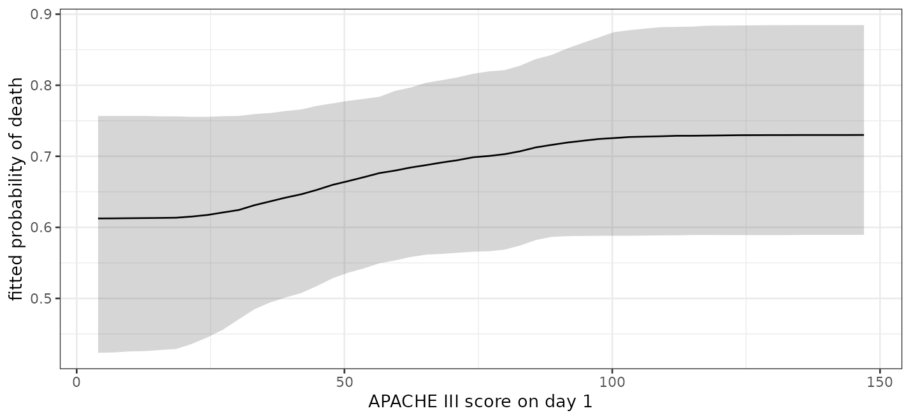
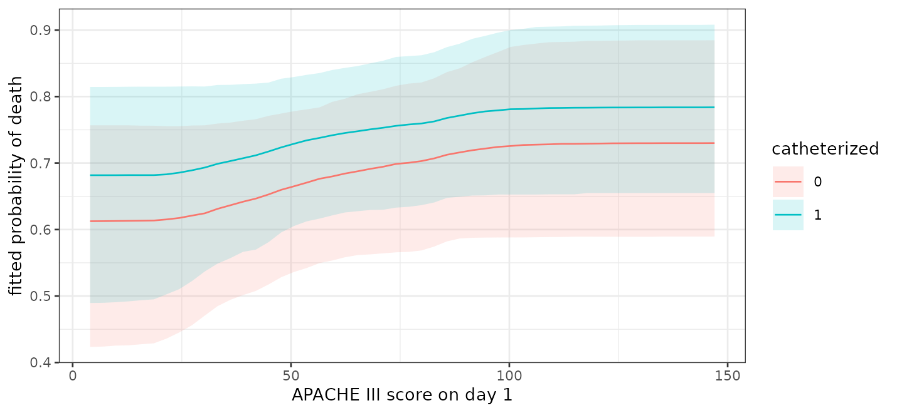

# Effects, curves and interactions

## Introduction

A forest has no coefficients: there is no table of slopes to read, and
no standard error to put beside one. This is the part of the workflow
that changes most when moving from
[`glm()`](https://rdrr.io/r/stats/glm.html) to BART, and it is the part
where the change is an improvement rather than a cost.

The replacement is to ask the fitted model questions about predictions.
What does it predict for these people? What would it predict if this
variable were different? How much does the answer differ between groups?
The *marginaleffects* package ([Arel-Bundock et al.
2024](#ref-arelbundock2024)) asks all of them, and returns posterior
intervals with the answers.

This vignette covers the questions worth asking and how to phrase them.
[`vignette("bartisan")`](https://ngreifer.github.io/bartisan/articles/bartisan.md)
is the shorter tour, and this expands its section on interpreting the
fit.

In this guide, we will start from the three kinds of question the
package answers and then work through them in turn. First we’ll take
average effects and the choice of step for a numeric predictor, along
with the one prior setting (`sparsity`) that can quietly attenuate a
contrast. Next we’ll split those effects by subgroup and test a
moderation with the difference of the two, then plot the shape of a
fitted relationship and choose the scale on which an effect is reported.
Finally we’ll write the effect as a parameter rather than a contrast
with [`vc()`](https://ngreifer.github.io/bartisan/reference/vc.md), and
close with what none of these estimates can be taken to mean.

``` r

library(bartisan)
library(marginaleffects)

data("rhc")

model <- death ~ rhc + age + sex + race + edu + aps + meanbp + resp +
  hema + pafi + paco2 + crea + surv2m + card

set.seed(2026)

fit <- bartisan(model, data = rhc, family = binomial(), chains = 4)
```

## Three Questions

Everything below is one of three things.

A **prediction** is what the model expects for a set of covariate
values.
[`predictions()`](https://rdrr.io/pkg/marginaleffects/man/predictions.html)
gives one per row,
[`avg_predictions()`](https://rdrr.io/pkg/marginaleffects/man/predictions.html)
averages them.

A **comparison** is the difference between two predictions that differ
in one variable. This is the closest thing to a regression coefficient,
and it is usually what we want.

A **slope** is the derivative of the prediction with respect to a
numeric variable. It is the least useful of the three here, for a reason
given below.

## Average Effects (`avg_comparisons()`)

[`avg_comparisons()`](https://rdrr.io/pkg/marginaleffects/man/comparisons.html)
with no `variables` argument gives every predictor at once, which for
this model is a long table. A few at a time is easier to read:

``` r

avg_comparisons(fit, variables = c("rhc", "age", "card"))
#> 
#>  Term Contrast Estimate    2.5 %  97.5 %
#>  age  +1        0.00317  0.00150 0.00491
#>  card yes - no  0.00000 -0.00246 0.07933
#>  rhc  1 - 0     0.05962  0.00000 0.11124
#> 
#> Type: response
```

This reads as a coefficient table. Each estimate is an average
difference in predicted probability, holding everything else at each
patient’s own values: for a factor, between the levels named in the
`Contrast` column, and for a numeric predictor, for an increase of one
unit. `rhc` is coded `0` and `1`, so its one-unit contrast is the
treatment effect.

### The Splitting Prior and a Contrast (`sparsity`)

An estimate here can come back as exactly zero, and an interval bound
with it; that is not a rounding artifact. The default splitting prior is
a variable-selection prior (i.e., one that can leave a predictor out of
the forest altogether), so in a draw where it uses the predictor in no
tree the prediction does not depend on it and the contrast is exactly
zero; the posterior of the contrast is a mixture with a point mass
there, holding whatever share of draws dropped the predictor.

It matters more than it sounds: on a simulated effect of .2 against
residual noise of 1, the prior halved the estimate and its 95% interval
covered the truth only 60% of the time. A strong effect is untouched,
because the prior never has reason to drop a predictor that is earning
its splits, so this is a weak-signal problem rather than a general one.

If a contrast is what we are reporting, we fit with `sparsity = FALSE`,
or with `split_prior`, which fixes the weights (i.e., the probability
that each predictor is chosen for a split) and so cannot drop anything.
[`?bartisan_control`](https://ngreifer.github.io/bartisan/reference/bartisan_control.md)
has the measurements for both.

### The Step for a Numeric Predictor (`variables`)

One unit is the default and is often the wrong scale. One point of an
illness score is a small change; ten points is a difference someone
would notice.

``` r

avg_comparisons(fit, variables = list(aps = 10))
#> 
#>  Estimate 2.5 % 97.5 %
#>    0.0124     0 0.0291
#> 
#> Term: aps
#> Type: response
#> Comparison: +10
```

A numeric effect should always be reported together with the step it was
computed at. Unlike a linear model, the answer here is not ten times the
one-unit effect, because the relationship is not assumed to be a
straight line.

## Effects for Subgroups (`by`)

`by` splits the average by a grouping variable.

``` r

avg_comparisons(fit, variables = "rhc", by = "card")
#> 
#>  card Estimate 2.5 % 97.5 %
#>   no    0.0601     0  0.113
#>   yes   0.0585     0  0.112
#> 
#> Term: rhc
#> Type: response
#> Comparison: 1 - 0
```

The two subgroup estimates are close, and both intervals reach zero.

A common mistake is to stop here and conclude that the effect differs
between groups; that comparison is not a test. The question is whether
the two effects differ from each other, which needs the difference of
the two (i.e., a difference of differences) with an interval of its own.

``` r

avg_comparisons(fit, variables = "rhc", by = "card",
                hypothesis = ~pairwise)
#> 
#>    Hypothesis  Estimate   2.5 % 97.5 %
#>  (yes) - (no) -0.000333 -0.0224 0.0118
#> 
#> Type: response
```

The difference is small with an interval covering zero, so there is no
evidence here that the effect of catheterization depends on
cardiovascular disease. This is how to test an interaction in a model
that never had an interaction term to test, and the interval on that
difference is the only thing that separates a real interaction from two
subgroup estimates that merely look different.

[`avg_predictions()`](https://rdrr.io/pkg/marginaleffects/man/predictions.html)
does the same thing for predictions rather than differences, which is
useful for describing groups:

``` r

avg_predictions(fit, by = "card")
#> 
#>  card Estimate 2.5 % 97.5 %
#>   no     0.637 0.608  0.662
#>   yes    0.686 0.654  0.727
#> 
#> Type: response
```

## The Shape of a Relationship (`plot_predictions()`)

Averages hide shape. The fitted function is seen by plotting predictions
against one predictor with everything else held fixed; below we ask for
the numbers rather than the plot, which gives more control over how it
is drawn:

``` r

library(ggplot2)

curve <- plot_predictions(fit, condition = "aps", draw = FALSE)

ggplot(curve, aes(aps, estimate)) +
  geom_ribbon(aes(ymin = conf.low, ymax = conf.high), alpha = 0.2) +
  geom_line() +
  labs(x = "APACHE III score on day 1", y = "fitted probability of death") +
  theme_bw(base_size = 9)
```



The probability of death rises with the illness score, and the rise is
not a straight line on any scale the model was told about; nothing was
specified to find the shape.

The band is a credible interval and is wide at the top, where few
patients were that sick, so the ends of a curve deserve more caution
than the middle: with little data out there the forest shrinks its
predictions toward the overall mean, which flattens the curve at both
edges of the predictor’s range.

Adding a second variable shows how the shape differs across groups.

``` r

curve2 <- plot_predictions(fit, condition = c("aps", "rhc"), draw = FALSE)

ggplot(curve2, aes(aps, estimate, colour = factor(rhc))) +
  geom_ribbon(aes(ymin = conf.low, ymax = conf.high, fill = factor(rhc)),
              alpha = 0.15, colour = NA) +
  geom_line() +
  labs(x = "APACHE III score on day 1", y = "fitted probability of death",
       colour = "catheterized", fill = "catheterized") +
  theme_bw(base_size = 9)
```



The two curves run close together; if they diverged, that would be a
moderation worth reporting, and the difference of differences above is
how to put a number on it.

## Scales (`type`)

`type` chooses the scale on which predictions are made and therefore the
scale on which effects are reported.

``` r

avg_comparisons(fit, variables = "rhc", type = "link")
#> 
#>  Estimate 2.5 % 97.5 %
#>     0.319     0    0.6
#> 
#> Term: rhc
#> Type: link
#> Comparison: 1 - 0
```

On the link scale this is a difference in log-odds, which is what a
logistic regression coefficient is. It is the less useful of the two
here: a difference in probability is interpretable without reference to
the model and is the number a reader can act on, whereas a difference in
log-odds needs a baseline before it means anything.

For survival families, `type = "survival"` with a `times` argument gives
a difference in survival probability at a horizon. See
[`vignette("survival")`](https://ngreifer.github.io/bartisan/articles/survival.md).

## Unreliable Slopes (`avg_slopes()`)

[`avg_slopes()`](https://rdrr.io/pkg/marginaleffects/man/slopes.html)
reports a derivative; it is available and it will return a number, but
that number should not be trusted for a fit made with the default
settings.

The reason is the predictor transform: by default numeric predictors are
mapped through their empirical distribution function before the trees
see them, which makes the fitted function a step function of the
original predictor. Between two observed values the prediction does not
change at all, so the difference quotient is either exactly zero or a
whole step divided by a very small number, depending on where the step
lands.

Instead we use
[`comparisons()`](https://rdrr.io/pkg/marginaleffects/man/comparisons.html)
with a step we can interpret, as with `aps = 10` above. If a genuine
derivative is needed, we refit with `x_transform = "range"` in
[`bartisan_control()`](https://ngreifer.github.io/bartisan/reference/bartisan_control.md),
which is linear and so does have one. This is documented at
`?bartisan-marginaleffects`.

## Varying Coefficients (`vc()`)

Everything above reads an effect out of a fitted surface by asking the
model what it predicts under two versions of the data. There is another
way to write the model, in which the effect is a parameter rather than a
contrast:

\\f_0(x) + z\\f_1(x)\\

Here \\f_1\\ is a forest of its own, and it *is* the effect of `z`: how
much the prediction moves per unit of `z`, as a function of the other
predictors.
[`vc()`](https://ngreifer.github.io/bartisan/reference/vc.md) asks for
it. This is the varying-coefficient model of Deshpande et al.
([2026](#ref-deshpande2026)), of which Hahn et al.
([2020](#ref-hahn2020)) is the case of one binary covariate and Woody et
al. ([2020](#ref-woody2020)) the case of one continuous one.

``` r

fit_vc <- bartisan(death ~ age + sex + race + edu + aps + meanbp + resp +
                     hema + pafi + paco2 + crea + surv2m + card + vc(rhc),
                   data = rhc, family = binomial(), chains = 4,
                   sparsity = FALSE)

head(coef(fit_vc))
#>         rhc
#> [1,] 0.4305
#> [2,] 0.2133
#> [3,] 0.2268
#> [4,] 0.3200
#> [5,] 0.2755
#> [6,] 0.2717
```

[`coef()`](https://rdrr.io/r/stats/coef.html) returns one value per
patient, which is what a coefficient becomes when it is allowed to vary.
It is on the link scale, so for this binary outcome it is a difference
in log odds rather than in probability;
[`avg_comparisons()`](https://rdrr.io/pkg/marginaleffects/man/comparisons.html)
is still what reports an effect on the scale a reader can act on.

What the reparameterization buys is a prior on the effect itself. The
forest for \\f_1\\ is regularized separately from the forest for the
rest of the outcome, so shrinking the prognostic part does not shrink
the effect.
[`vignette("causal")`](https://ngreifer.github.io/bartisan/articles/causal.md)
covers why that matters and
[`bcf()`](https://ngreifer.github.io/bartisan/reference/bcf.md) sets it
up for the causal case.

Two things worth knowing before reaching for it.

The effect is **linear in the covariate** unless we say otherwise. For a
binary treatment that is no assumption at all, since there are only two
values. For a continuous predictor it says the effect is proportional to
it, which is a real restriction. Letting the coefficient’s forest split
on the covariate itself removes it, and then the effect varies across
the covariate’s own range:

``` r

# The effect of `aps` may itself change across `aps`.
y ~ age + vc(aps, ~ aps + age)
```

And a covariate whose coefficient varies should not also be a predictor
of the control function. With it in both, the two are not separately
identified: any function of it can move between them. Writing the
covariate only inside
[`vc()`](https://ngreifer.github.io/bartisan/reference/vc.md) is what
keeps them apart, and
[`bartisan()`](https://ngreifer.github.io/bartisan/reference/bartisan.md)
warns if the formula does otherwise.

For a family with several additive predictors, each parameter’s formula
carries its own
[`vc()`](https://ngreifer.github.io/bartisan/reference/vc.md) terms, so
a covariate can have a coefficient on more than one of them:

``` r

# The effect of `z` on the mean, and separately on the spread.
bartisan(list(mean = y ~ x1 + x2 + vc(z), log_sd = ~ x1 + x2 + vc(z)),
         data = d, family = gaussian_ls())
```

[`coef()`](https://rdrr.io/r/stats/coef.html) then returns one column
per coefficient, named `mean:z` and `log_sd:z` for the forests they come
from, which is also how per-forest settings like `num_trees` are keyed.
[`?vc`](https://ngreifer.github.io/bartisan/reference/vc.md) covers the
rest, including the one family that refuses this.

## What These Estimates Are Not

Everything here is a description of the fitted model.
[`avg_comparisons()`](https://rdrr.io/pkg/marginaleffects/man/comparisons.html)
reports what the model predicts would differ between two versions of the
data, which is a causal quantity only if the model contains enough
covariates to account for confounding. Patients were not randomized to
catheterization, so for this fit that is a strong assumption.
[`vignette("causal")`](https://ngreifer.github.io/bartisan/articles/causal.md)
covers what is needed.

The intervals are posterior credible intervals under the model: they
cover the uncertainty in the fitted function, and they do not cover the
possibility that the model is missing a confounder, that the outcome is
measured with bias, or that the sample is not the population of
interest.

## Where to Go Next

[`vignette("importance")`](https://ngreifer.github.io/bartisan/articles/importance.md)
covers which predictors the forest uses, which is a different question
from how much they move the outcome.
[`vignette("diagnostics")`](https://ngreifer.github.io/bartisan/articles/diagnostics.md)
covers whether the fit can be trusted before any of this is read.
`?bartisan-marginaleffects` documents which *marginaleffects* functions
are supported and the arguments that are specific to this package.

## References

Arel-Bundock, Vincent, Noah Greifer, and Andrew Heiss. 2024. “How to
Interpret Statistical Models Using marginaleffects for R and Python.”
*Journal of Statistical Software* 111 (9): 1–32.
<https://doi.org/10.18637/jss.v111.i09>.

Deshpande, Sameer K., Ray Bai, Cecilia Balocchi, Jennifer E. Starling,
and Jordan Weiss. 2026. “VCBART: Bayesian Trees for Varying
Coefficients.” *Bayesian Analysis* 21 (1): 281–308.
<https://doi.org/10.1214/24-BA1470>.

Hahn, P. Richard, Jared S. Murray, and Carlos M. Carvalho. 2020.
“Bayesian Regression Tree Models for Causal Inference: Regularization,
Confounding, and Heterogeneous Effects (with Discussion).” *Bayesian
Analysis* 15 (3): 965–1056. <https://doi.org/10.1214/19-BA1195>.

Woody, Spencer, Carlos M. Carvalho, P. Richard Hahn, and Jared S.
Murray. 2020. *Estimating Heterogeneous Effects of Continuous Exposures
Using Bayesian Tree Ensembles: Revisiting the Impact of Abortion Rates
on Crime*. <https://arxiv.org/abs/2007.09845>.
