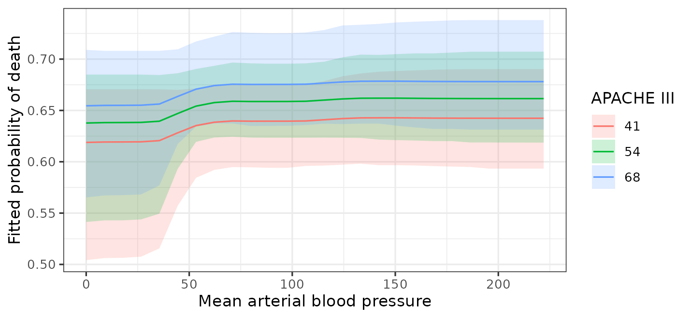
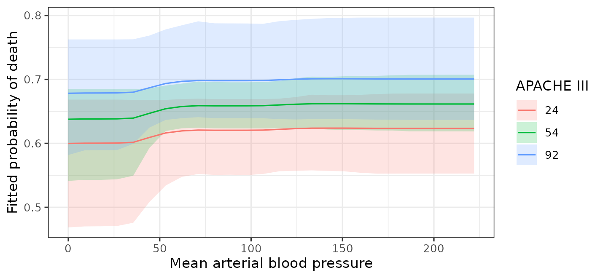

# Effects, Curves, and Interactions

## Introduction

A forest has no coefficients: there is no table of slopes to read, and
no standard error to put beside one. This is the part of the workflow
that changes most when moving from parametric models to BART. At the
same time, this is the very reason to switch to BART: the absence of
coefficients accompanies to the extreme flexibility BART has in modeling
relationships without the analyst having to specify their form.

Though this may seem like a loss, modern approaches to characterizing
variable relationships can support a model-agnostic workflow ([Rohrer
and Arel-Bundock 2026](#ref-rohrerModelsPredictionMachines2026)). The
replacement for coefficients is to ask the fitted model questions about
predictions. What does it predict for these people? What would it
predict if this variable were different? How much does the answer differ
between groups? The [*marginaleffects*](https://marginaleffects.com/)
package ([Arel-Bundock et al. 2024](#ref-arelbundock2024)) answers all
of them, and returns posterior intervals with those answers.

Two of those questions *bartisan* answers itself:
[`estimate_effect()`](https://ngreifer.github.io/bartisan/reference/estimate_effect.md)
considers one binary or factor treatment and reports the contrast as the
average treatment effect or as one effect per unit, optionally within
subgroups;
[`partial_dependence()`](https://ngreifer.github.io/bartisan/reference/partial_dependence.md)
averages the fitted surface over the sample at each value of one or two
predictors.
[`vignette("causal")`](https://ngreifer.github.io/bartisan/articles/causal.md)
contains the worked version of the first. Everything else in this
vignette uses *marginaleffects*: slopes, contrasts between covariate
values, a continuous predictor, hypotheses comparing one estimate to
another, and any grid that fixes the other covariates at chosen values
rather than averaging over them.

This vignette covers the questions worth asking and how to phrase them.
[`vignette("bartisan")`](https://ngreifer.github.io/bartisan/articles/bartisan.md)
is the shorter tour, and this expands its section on interpreting the
fit.

In this guide, we will start from the three kinds of question the
package answers and then work through them in turn. First, we’ll
consider average effects of categorical and numeric predictors, along
with the prior setting (`sparsity`) that can quietly attenuate a
contrast. Next we’ll split those effects by subgroup and test a
moderation with the difference of the two, then plot the shape of a
fitted relationship and choose the scale on which an effect is reported,
and close with what these estimates can and cannot be taken to mean.

Below, we load in the `rhc` dataset (see
[`vignette("bartisan")`](https://ngreifer.github.io/bartisan/articles/bartisan.md)
or
[`help("rhc", package = "bartisan")`](https://ngreifer.github.io/bartisan/reference/rhc.md)
for details) and fit a BART logistic regression model predicting `death`
from the available predictors. (Normally we would use multiple chains,
perform diagnostics on mixing, and possibly modify the fitting
parameters; we skip those here for brevity.)

``` r

library(bartisan)
library(marginaleffects)

data("rhc")

set.seed(2026)

# Fit a BART logistic regression model
fit <- bartisan(death ~ rhc + age + sex + race + edu + aps + meanbp + resp +
                  hema + pafi + paco2 + crea + surv2m + card,
                data = rhc, family = binomial())

fit
#> Generalized BART
#> 
#> Call:
#> bartisan(formula = death ~ rhc + age + sex + race + edu + aps + 
#>     meanbp + resp + hema + pafi + paco2 + crea + surv2m + card, 
#>     data = rhc, family = binomial())
#> 
#> Family: "binomial" with the "logit" link
#> Observations: 1500
#> Structure: 1 forest of 50 trees, soft decision rules
#> Draws: 800 kept after 200 warmup
```

## Predictions, Comparisons, and Slopes

Everything below is one of the following:

A **prediction** is what the model expects for a set of covariate
values.
[`predictions()`](https://rdrr.io/pkg/marginaleffects/man/predictions.html)
gives one per unit or covariate profile,
[`avg_predictions()`](https://rdrr.io/pkg/marginaleffects/man/predictions.html)
averages them.

A **comparison** is the difference between two predictions that differ
in one variable. This is the closest thing to a regression coefficient,
and it is often what we want to report.

A **slope** is the derivative of the prediction with respect to a
numeric variable. These are often also used to report but come with some
limitations due to some peculiarities of using a tree-based model.

## Average Effects (`avg_comparisons()`)

[`avg_comparisons()`](https://rdrr.io/pkg/marginaleffects/man/comparisons.html)
with no `variables` argument gives every predictor at once, which for
this model is a long table. A few at a time is easier to read, and often
only a few effects are of primary interest anyway ([Keele et al.
2020](#ref-keeleCausalInterpretationEstimated2020)):

``` r

comp <- avg_comparisons(fit, variables = c("rhc", "age", "card"))

comp
#> 
#>  Term Contrast Estimate    2.5 %  97.5 %
#>  age  +1        0.00321  0.00160 0.00495
#>  card yes - no  0.01300 -0.00558 0.08184
#>  rhc  1 - 0     0.06492  0.01007 0.11539
#> 
#> Type: response
```

This reads as a coefficient table. Each estimate is an average
difference in predicted probability, holding everything else at each
patient’s own values: for a factor, between the levels named in the
`Contrast` column, and for a numeric predictor, for an increase of one
unit. `rhc` is coded `0` and `1`, so its one-unit contrast is the
treatment effect.

The comparison for `age`, for example, means that increasing all units’
age by 1, keeping all other predictors at their observed values, would
yield an increase in the overall probability of death of 0.321
percentage points (a very small effect on this scale), with a 95%
credible interval excluding 0. This isn’t a causal estimate; it’s just
what the model predicts would happen.

### The Splitting Prior and a Contrast (`sparsity`)

An estimate here can come back as exactly zero, and an interval bound
with it; that is not a rounding artifact. The default splitting prior is
a variable-selection prior (i.e., one that can leave a predictor out of
the forest altogether), so in a draw where it uses the predictor in no
tree, the prediction does not depend on it, and the contrast is exactly
zero; the posterior of the contrast is a mixture with a point mass
there, holding whatever share of draws dropped the predictor.
*marginaleffects* centers a posterior at its median by default, so once
that point mass holds half of it the reported estimate is exactly zero
however far the rest of the posterior sits from zero. Setting
`options(marginaleffects_posterior_center = mean)` asks for the mean
instead, which is the how
[`predict()`](https://rdrr.io/r/stats/predict.html) and
[`estimate_effect()`](https://ngreifer.github.io/bartisan/reference/estimate_effect.md)
report predictions.

This can matter more than it sounds: on a weak signal, the prior can
attenuate the estimate substantially, and its interval can cover the
truth well below its nominal rate. A strong effect is untouched, because
the prior never has reason to drop a predictor that is earning its
splits, so this is a weak-signal problem rather than a general one.

If a contrast is what we are reporting, we can fit the model with
`sparsity = FALSE`, or by supplying `split_prior`, which fixes the
weights (i.e., the probability that each predictor is chosen for a
split) and so cannot drop anything.
[`?bartisan_control`](https://ngreifer.github.io/bartisan/reference/bartisan_control.md)
explains both options.

### Choosing the Step (`variables`)

One unit is the default step size for a contrast but is often the wrong
scale. One point of an illness score is a small change; ten points is a
difference someone would notice. For example, the variable `aps` ranges
from 4 to 147 in the sample, so we might request a comparison
corresponding to increasing its value by 10.

``` r

avg_comparisons(fit, variables = list(aps = 10))
#> 
#>  Estimate 2.5 % 97.5 %
#>    0.0108     0 0.0283
#> 
#> Term: aps
#> Type: response
#> Comparison: +10
```

A numeric effect should always be reported together with the step it was
computed at. Unlike a linear model, the answer here is not ten times the
one-unit effect because the relationship is not assumed to be a straight
line. We’ll see below other ways to characterize the relationship
graphically.

## Effects for Subgroups (`by`)

Supplying `by` to
[`avg_comparisons()`](https://rdrr.io/pkg/marginaleffects/man/comparisons.html)
and other functions in *marginaleffects* splits the average by a
grouping variable.

``` r

avg_comparisons(fit, variables = "rhc", by = "card")
#> 
#>  card Estimate   2.5 % 97.5 %
#>   no    0.0658 0.01324  0.116
#>   yes   0.0636 0.00852  0.114
#> 
#> Term: rhc
#> Type: response
#> Comparison: 1 - 0
```

The two subgroup estimates are close, and both intervals reach zero. A
common mistake is to stop here and conclude that the effect differs
between groups; that comparison is not a test. The question is whether
the two effects differ from each other, which needs the difference of
the two (i.e., a difference of differences) with an interval of its own.
This can be requested by specifying `hypothesis = ~pairwise`.

``` r

avg_comparisons(fit, variables = "rhc", by = "card",
                hypothesis = ~pairwise)
#> 
#>    Hypothesis  Estimate   2.5 % 97.5 %
#>  (yes) - (no) -0.000921 -0.0236 0.0109
#> 
#> Type: response
```

The difference is small with an interval covering zero, so there is no
evidence here that the effect of catheterization varies by
cardiovascular disease status. This is how to test an interaction in a
model that never had an interaction term to test, and the interval on
that difference is the only thing that separates a real interaction from
two subgroup estimates that merely look different.

[`avg_predictions()`](https://rdrr.io/pkg/marginaleffects/man/predictions.html)
does the same thing for predictions rather than differences, which is
useful for describing groups:

``` r

avg_predictions(fit, by = "card")
#> 
#>  card Estimate 2.5 % 97.5 %
#>   no     0.636 0.608  0.661
#>   yes    0.687 0.657  0.728
#> 
#> Type: response
```

These correspond to the fitted predictions among those in each
cardiovascular disease status group. That answers a different question
from whether the model predicts that changing units’ disease status
changes the probability of death, which corresponds to running the
following:

``` r

avg_predictions(fit, variables = "card")
#> 
#>  card Estimate 2.5 % 97.5 %
#>   no     0.646 0.617  0.672
#>   yes    0.666 0.635  0.713
#> 
#> Type: response
```

In the latter,
[`avg_predictions()`](https://rdrr.io/pkg/marginaleffects/man/predictions.html)
computes predictions for all units, first setting `card` to `"no"` and
then to `"yes"`.

## The Shape of a Relationship (`partial_dependence()`)

Averages can hide the shape of the relationship between a predictor and
the outcome. To see the fitted function we plot predictions against one
predictor while the others are averaged over, which is what
[`partial_dependence()`](https://ngreifer.github.io/bartisan/reference/partial_dependence.md)
does: it sets the predictor to each value of a grid in turn, predicts
for every unit, and averages within each posterior draw, so the interval
that comes back is on the average prediction rather than on any one
patient’s. `partial_dependence(fit, ~ x)` builds the grid, and
[`plot()`](https://rdrr.io/r/graphics/plot.default.html) draws it.

``` r

library(ggplot2)

pd <- partial_dependence(fit, ~aps)

pd
#> Partial dependence
#> 
#> Predictor: "aps"
#> Averaged over 1500 units, on the
#>            "response" scale
#> 
#>     aps estimate lower upper
#>    4.00    0.613 0.518 0.668
#>    9.72    0.613 0.518 0.668
#>   15.44    0.613 0.520 0.668
#>   21.16    0.615 0.531 0.668
#>   26.88    0.620 0.555 0.668
#>   --- 16 rows omitted ---
#>  124.12    0.701 0.639 0.797
#>  129.84    0.701 0.639 0.797
#>  135.56    0.701 0.639 0.798
#>  141.28    0.701 0.639 0.798
#>  147.00    0.701 0.639 0.798
#> 
#> ℹ lower and upper bound the 95% credible interval on the average prediction.
#> ℹ `n_print` in `print()` (`?bartisan::print.bartisan_partial()`) sets how many
#>   rows are shown, half from each end; `print(., n_print = Inf)` shows all of
#>   them.

plot(pd) +
  labs(x = "APACHE III score on day 1", y = "Fitted probability of death")
```


``` r


# Same thing:
## plot(fit, ~aps)
```

The probability of death rises with the illness score, and the rise is
not a straight line on any scale the model was told about; nothing was
specified to find the shape.
[`plot()`](https://rdrr.io/r/graphics/plot.default.html) returns a
*ggplot2* object, so the labels above are added the way they would be to
any other plot.

The band is a credible interval and is wide at the top, where few
patients were that sick, so the ends of a curve deserve more caution
than the middle: with little data out there the forest shrinks its
predictions toward the overall mean, which flattens the curve at both
edges of the predictor’s range.

Naming a second predictor shows how the shape differs across groups.

``` r

pd2 <- partial_dependence(fit, ~ aps + rhc)

pd2
#> Partial dependence
#> 
#> Predictors: "aps" and "rhc"
#> Averaged over 1500 units, on the
#>            "response" scale
#> 
#>     aps rhc estimate lower upper
#>    4.00   0    0.587 0.488 0.645
#>    9.72   0    0.587 0.488 0.645
#>   15.44   0    0.587 0.489 0.645
#>   21.16   0    0.589 0.502 0.645
#>   26.88   0    0.594 0.521 0.645
#>     --- 42 rows omitted ---
#>  124.12   1    0.738 0.671 0.831
#>  129.84   1    0.738 0.671 0.831
#>  135.56   1    0.738 0.671 0.831
#>  141.28   1    0.738 0.671 0.831
#>  147.00   1    0.738 0.671 0.831
#> 
#> ℹ lower and upper bound the 95% credible interval on the average prediction.
#> ℹ `n_print` in `print()` (`?bartisan::print.bartisan_partial()`) sets how many
#>   rows are shown, half from each end; `print(., n_print = Inf)` shows all of
#>   them.

plot(pd2) +
  labs(x = "APACHE III score on day 1", y = "Fitted probability of death",
       color = "Catheterized", fill = "Catheterized")
```


The two curves run close together; if they diverged, that would be a
moderation worth reporting, and the difference of differences above is
how to put a number on it.

### Values of the Second Predictor

A second predictor with a few values gives one curve for each of them,
which is what happened above. With a continuous predictor, it is held at
three values near its quartiles and a message reports them.

``` r

plot(fit, ~ meanbp + aps) +
  labs(x = "Mean arterial blood pressure", y = "Fitted probability of death",
       color = "APACHE III", fill = "APACHE III")
#> ℹ Grouping by `aps` at 41, 54, and 68, three of its values near its quartiles.
#> ℹ Set `values` to choose them yourself.
```



`values` chooses others, and an entry of it may be a function of the
predictor rather than the values themselves. `values = list(z = unique)`
asks for every value a predictor takes, which is usually what a numeric
predictor with four or five of them wants; the illness score has 114, so
here we write the summary we want instead.

``` r

plot(fit, ~ meanbp + aps,
     values = list(aps = function(x) quantile(x, c(.05, .5, .95)))) +
  labs(x = "Mean arterial blood pressure", y = "Fitted probability of death",
       color = "APACHE III", fill = "APACHE III")
```



### The Same Curve Through *marginaleffects*

[`marginaleffects::avg_predictions()`](https://rdrr.io/pkg/marginaleffects/man/predictions.html)
produces the same estimates as
[`partial_dependence()`](https://ngreifer.github.io/bartisan/reference/partial_dependence.md).
It has additional options that may be helpful, but otherwise the syntax
is similar.

``` r

at <- quantile(rhc$aps, c(.1, .5, .9))

# Uses posterior mean
partial_dependence(fit, ~ aps, values = list(aps = at))
#> Partial dependence
#> 
#> Predictor: "aps"
#> Averaged over 1500 units, on the
#>            "response" scale
#> 
#>   aps estimate lower upper
#>  29.9    0.623 0.562 0.668
#>  54.0    0.656 0.624 0.687
#>  83.0    0.687 0.639 0.757
#> 
#> ℹ lower and upper bound the 95% credible interval on the average prediction.

# Uses posterior median by default
avg_predictions(fit, variables = list(aps = at))
#> 
#>   aps Estimate 2.5 % 97.5 %
#>  29.9    0.626 0.562  0.668
#>  54.0    0.655 0.624  0.687
#>  83.0    0.685 0.639  0.757
#> 
#> Type: response
```

The two summarize one posterior two ways.
[`partial_dependence()`](https://ngreifer.github.io/bartisan/reference/partial_dependence.md)
reports its mean and
[`avg_predictions()`](https://rdrr.io/pkg/marginaleffects/man/predictions.html)
its median, which is the whole of the difference between the estimates;
the intervals are quantiles of the same draws and agree to the digit.

What *marginaleffects* adds is control over what the other predictors
do.
[`partial_dependence()`](https://ngreifer.github.io/bartisan/reference/partial_dependence.md)
always averages them over the sample, while
[`predictions()`](https://rdrr.io/pkg/marginaleffects/man/predictions.html)
and
[`plot_predictions()`](https://rdrr.io/pkg/marginaleffects/man/plot_predictions.html)
in *marginaleffects* allows one to hold them fixed instead, and prints
the profile it chose beside the estimates:

``` r

plot_predictions(fit, condition = list(aps = at), draw = FALSE)
#>   rowid estimate conf.low conf.high  df   age card  crea   edu  hema meanbp
#> 1     1   0.6296   0.5008    0.7477 Inf 61.42   no 2.132 11.64 31.68     78
#> 2     2   0.6661   0.5464    0.7775 Inf 61.42   no 2.132 11.64 31.68     78
#> 3     3   0.7051   0.5697    0.8176 Inf 61.42   no 2.132 11.64 31.68     78
#>   paco2  pafi  race resp rhc  sex surv2m  aps
#> 1 38.85 217.4 white   28   0 male  0.587 29.9
#> 2 38.85 217.4 white   28   0 male  0.587 54.0
#> 3 38.85 217.4 white   28   0 male  0.587 83.0
```

Those columns are why the numbers move: each row is a prediction for one
synthetic patient who is average or modal in every other respect, where
the curve above is an average over the patients in the data. The average
is what to report for a population, and the profile what to report for a
described kind of patient.
[`plot_predictions()`](https://rdrr.io/pkg/marginaleffects/man/plot_predictions.html)
also takes an arbitrary grid and will draw slopes and comparisons across
a condition, which is where to go when the question outgrows a partial
dependence plot.

## Slopes and the Predictor Transform (`avg_slopes()`)

[`marginaleffects::avg_slopes()`](https://rdrr.io/pkg/marginaleffects/man/slopes.html)
reports the derivative of the regression function with respect to a
predictor; this is closest quantity to a regression slope. However,
whether that derivative means anything depends on `gate` and
`x_transform` in
[`bartisan_control()`](https://ngreifer.github.io/bartisan/reference/bartisan_control.md).
Under a soft gate, the fit is a smooth function of the (transformed)
predictor; with `gate = "hard"`, the fit is piecewise constant under any
transform and has no derivative worth taking.

Because a numeric predictor is transformed to the interval \\\[0, 1\]\\
according to `x_transform`, how its effect translates into a slope
depends on the value supplied. Writing the fit as \\f(T(x))\\, a slope
is \\f'(T(x))\\T'(x)\\, where \\T(\cdot)\\ is the transform function
specified in `x_transform`: an affine \\T(\cdot)\\ has a known constant
derivative, so only \\f'\\ is estimated.

The default, `"smoothcdf"`, is differentiable, so
[`avg_slopes()`](https://rdrr.io/pkg/marginaleffects/man/slopes.html)
works, but any error in estimating the density of \\X\\ yields
additional error in the estimation of the slope. Under `"range"`, which
is an affine map from the covariate’s observed range to \\\[0, 1\]\\,
slopes are more accurate. `"quantile"` maps each predictor through its
empirical distribution function, which is a step function, so the fitted
function is a step function of the original predictor and the difference
quotient grows without bound as the step shrinks. There is no derivative
there to estimate, and the number
[`avg_slopes()`](https://rdrr.io/pkg/marginaleffects/man/slopes.html)
returns is a property of the step size rather than of the fit.

So, when a slope is the quantity being reported, it is best to fit the
model with `x_transform = "range"`, though the default can be okay as
well, especially with a large sample (which yields less error in the
estimation of the predictor distribution). For everything else, it makes
most sense to use
[`avg_comparisons()`](https://rdrr.io/pkg/marginaleffects/man/comparisons.html)
with a step we can interpret, as with `aps = 10` above, which evaluates
the fit at two points a substantive distance apart rather than dividing
by a vanishing one. This is documented at `?bartisan-marginaleffects`.

## Descriptions of the Fitted Model

Everything here is a description of the fitted model.
[`avg_comparisons()`](https://rdrr.io/pkg/marginaleffects/man/comparisons.html)
reports what the model predicts would differ between two versions of the
data, which is a causal quantity only if the model contains enough
covariates to account for confounding. Patients were not randomized to
catheterization, so for this fit that is a strong assumption.
[`vignette("causal")`](https://ngreifer.github.io/bartisan/articles/causal.md)
covers what is needed.

The intervals are posterior credible intervals under the model: they
cover the uncertainty in the fitted function, and they do not cover the
possibility that the model is missing a confounder, that the outcome is
measured with bias, or that the sample is not the population of
interest.

## Further Reading

[`vignette("varying")`](https://ngreifer.github.io/bartisan/articles/varying.md)
covers [`vc()`](https://ngreifer.github.io/bartisan/reference/vc.md),
which writes an effect into the model as a parameter with a prior of its
own rather than reading it off as a contrast, and is where to go when
the effect is the point of the model.
[`vignette("importance")`](https://ngreifer.github.io/bartisan/articles/importance.md)
covers which predictors the forest uses, which is a different question
from how much they move the outcome.
[`vignette("diagnostics")`](https://ngreifer.github.io/bartisan/articles/diagnostics.md)
covers whether the fit can be trusted before any of this is read.
`?bartisan-marginaleffects` documents which *marginaleffects* functions
are supported and the arguments that are specific to this package, and
[`?estimate_effect`](https://ngreifer.github.io/bartisan/reference/estimate_effect.md)
and
[`?partial_dependence`](https://ngreifer.github.io/bartisan/reference/partial_dependence.md)
document the two questions answered without it.

## References

Arel-Bundock, Vincent, Noah Greifer, and Andrew Heiss. 2024. “How to
Interpret Statistical Models Using marginaleffects for R and Python.”
*Journal of Statistical Software* 111 (9): 1–32.
<https://doi.org/10.18637/jss.v111.i09>.

Keele, Luke, Randolph T. Stevenson, and Felix Elwert. 2020. “The Causal
Interpretation of Estimated Associations in Regression Models.”
*Political Science Research and Methods* 8 (1): 1–13.
<https://doi.org/10.1017/psrm.2019.31>.

Rohrer, Julia M., and Vincent Arel-Bundock. 2026. “Models as Prediction
Machines: How to Convert Confusing Coefficients into Clear Quantities.”
*Advances in Methods and Practices in Psychological Science* 9 (2):
25152459261424825. <https://doi.org/10.1177/25152459261424825>.
