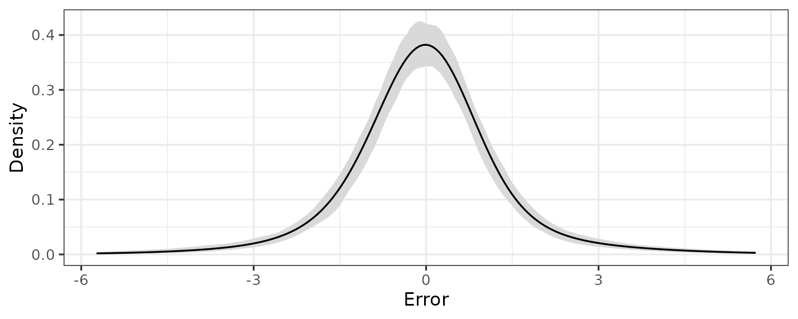
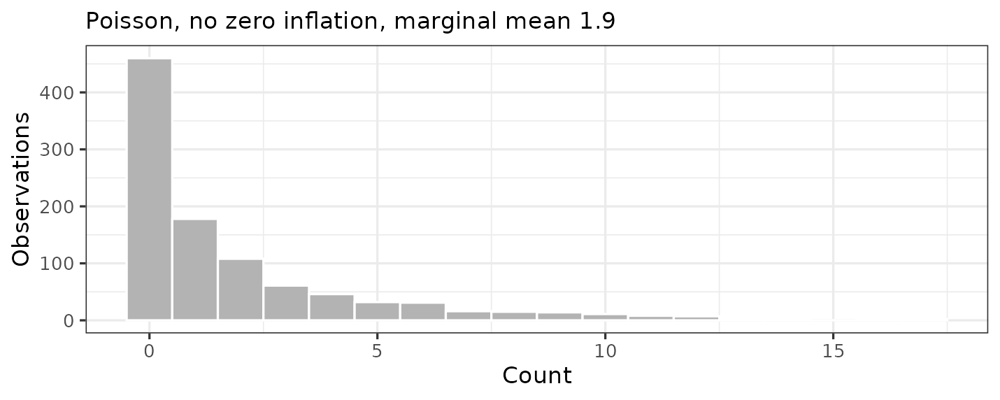

# Response Families in bartisan

``` r

library(bartisan)

set.seed(2026)

# Small chains throughout, so that this vignette builds quickly. The defaults
# are 50 trees and 800 draws after 200 warmup iterations.
ctrl <- bartisan_control(num_trees = 10, num_burn = 150, num_draws = 150)
```

## Introduction

This vignette is about choosing a `family` for
[`bartisan()`](https://ngreifer.github.io/bartisan/reference/bartisan.md).
It covers what each one assumes, when to prefer it over the
alternatives, and the handful of places where the choice has a
consequence that is easy to miss.
[`?bartisan_control`](https://ngreifer.github.io/bartisan/reference/bartisan_control.md)
covers how the sampler goes about fitting them.

`family` works the way it does in
[`glm()`](https://rdrr.io/r/stats/glm.html): the
[`stats::family`](https://rdrr.io/r/stats/family.html) objects work
unchanged, *bartisan* adds the families that have no
[`glm()`](https://rdrr.io/r/stats/glm.html) counterpart in the same
style, and
[`custom_family()`](https://ngreifer.github.io/bartisan/reference/custom_family.md)
takes a log density written as an R function when nothing on the list
fits. Unlike ordinary BART, nothing here requires the response to be
conditionally conjugate ([Linero 2025](#ref-linero2025)), which is why
the list is as long as it is.

In this guide, we will work through the families one at a time. First
we’ll lay out the full list and the two questions that most often decide
between them, and then the family that is inferred when `family` is left
unnamed. Next we’ll take the response types in turn (i.e., numeric,
positive and continuous, binary, counts, ordered and unordered
categories, bounded, and right-censored times), reporting for each what
the measured differences between the candidate families are. Finally
we’ll cover the links beyond the listed ones and the route to a
likelihood of one’s own through
[`custom_family()`](https://ngreifer.github.io/bartisan/reference/custom_family.md).

## The Families

| Family | Links | Additive predictors | Drawn nuisance parameters |
|----|----|----|----|
| [`gaussian()`](https://rdrr.io/r/stats/family.html) | `identity` | 1 | residual standard deviation |
| [`dpm()`](https://ngreifer.github.io/bartisan/reference/bartisan-families.md) | `identity` | 1 | error mixture, concentration |
| [`gaussian_ls()`](https://ngreifer.github.io/bartisan/reference/bartisan-families.md) | `identity` | 2 | none |
| `Gamma("log")` | `log` | 1 | shape |
| [`Gamma_ls()`](https://ngreifer.github.io/bartisan/reference/bartisan-families.md) | `log` | 2 | none |
| [`binomial()`](https://rdrr.io/r/stats/family.html) | `logit`, `probit`, `cloglog` | 1 | none |
| [`poisson()`](https://rdrr.io/r/stats/family.html) | `log` | 1 | none |
| [`negbin()`](https://ngreifer.github.io/bartisan/reference/bartisan-families.md) | `log` | 1 | dispersion |
| [`zi_poisson()`](https://ngreifer.github.io/bartisan/reference/bartisan-families.md) | `log` | 2 | none |
| [`zi_negbin()`](https://ngreifer.github.io/bartisan/reference/bartisan-families.md) | `log` | 2 | dispersion |
| [`ordinal()`](https://ngreifer.github.io/bartisan/reference/bartisan-families.md) | `logit`, `probit`, `cloglog` | 1 | cutpoints |
| [`multinomial()`](https://ngreifer.github.io/bartisan/reference/bartisan-families.md) | `logit`, `probit` | one per category, or per non-reference level | latent covariance, for the probit link |
| [`Beta()`](https://ngreifer.github.io/bartisan/reference/bartisan-families.md) | `logit`, `probit`, `cloglog` | 1 | precision |
| [`ordbeta()`](https://ngreifer.github.io/bartisan/reference/bartisan-families.md) | `logit` | 1 | 2 cutpoints, precision |
| [`tweedie()`](https://ngreifer.github.io/bartisan/reference/bartisan-families.md) | `log` | 1 | dispersion, and the power if it is drawn |
| [`weibull_aft()`](https://ngreifer.github.io/bartisan/reference/bartisan-families.md), [`loglogistic_aft()`](https://ngreifer.github.io/bartisan/reference/bartisan-families.md), [`lognormal_aft()`](https://ngreifer.github.io/bartisan/reference/bartisan-families.md) | none | 1 | scale |
| [`ph()`](https://ngreifer.github.io/bartisan/reference/bartisan-families.md) | none | 1 | baseline hazard per bin |
| [`dpm_aft()`](https://ngreifer.github.io/bartisan/reference/bartisan-families.md) | none | 1 | error mixture, concentration |
| [`custom_family()`](https://ngreifer.github.io/bartisan/reference/custom_family.md) | implied by `logdens` | as many as requested | as many as named in `aux_names` |

A family with more than one additive predictor fits one forest per
predictor, and `predict(type = "link")` returns one column per forest.
Nuisance parameters are drawn alongside the trees and reported in
`fit$aux`.

## Choosing a Family

We start from the shape of the response:

| The response is | Use |
|----|----|
| numeric, unbounded | [`dpm()`](https://ngreifer.github.io/bartisan/reference/bartisan-families.md), the default; [`gaussian()`](https://rdrr.io/r/stats/family.html) if prior weights are needed; [`gaussian_ls()`](https://ngreifer.github.io/bartisan/reference/bartisan-families.md) if the spread varies with the predictors |
| positive and continuous | `Gamma("log")`, or [`Gamma_ls()`](https://ngreifer.github.io/bartisan/reference/bartisan-families.md) if the dispersion varies with the predictors |
| a proportion strictly inside \\(0, 1)\\ | [`Beta()`](https://ngreifer.github.io/bartisan/reference/bartisan-families.md) |
| a proportion that can equal 0 or 1 | [`ordbeta()`](https://ngreifer.github.io/bartisan/reference/bartisan-families.md) |
| non-negative and continuous, with a point mass at zero | [`tweedie()`](https://ngreifer.github.io/bartisan/reference/bartisan-families.md) |
| a 0/1 indicator, or a two-column matrix of successes and failures | [`binomial()`](https://rdrr.io/r/stats/family.html) |
| a count | [`poisson()`](https://rdrr.io/r/stats/family.html), [`negbin()`](https://ngreifer.github.io/bartisan/reference/bartisan-families.md) if overdispersed, or a zero-inflated family if there are more zeros than either can produce |
| an ordered factor | [`ordinal()`](https://ngreifer.github.io/bartisan/reference/bartisan-families.md) |
| an unordered factor | [`multinomial()`](https://ngreifer.github.io/bartisan/reference/bartisan-families.md) |
| a time with censoring | [`weibull_aft()`](https://ngreifer.github.io/bartisan/reference/bartisan-families.md), [`loglogistic_aft()`](https://ngreifer.github.io/bartisan/reference/bartisan-families.md) or [`lognormal_aft()`](https://ngreifer.github.io/bartisan/reference/bartisan-families.md); [`ph()`](https://ngreifer.github.io/bartisan/reference/bartisan-families.md) for proportional hazards with a free baseline; [`dpm_aft()`](https://ngreifer.github.io/bartisan/reference/bartisan-families.md) if the shape of the error is in doubt |
| something else | [`custom_family()`](https://ngreifer.github.io/bartisan/reference/custom_family.md) |

Two considerations cut across that table.

The first is whether anything besides the mean varies with the
predictors. Every family except
[`gaussian_ls()`](https://ngreifer.github.io/bartisan/reference/bartisan-families.md),
[`Gamma_ls()`](https://ngreifer.github.io/bartisan/reference/bartisan-families.md),
and the zero-inflated pair puts a forest on one location parameter and
holds the rest of the distribution fixed across observations. If the
spread itself moves with \\x\\, that is the wrong assumption, and the
two location-scale families are what relax it:
[`gaussian_ls()`](https://ngreifer.github.io/bartisan/reference/bartisan-families.md)
gives the normal’s standard deviation a forest of its own, and
[`Gamma_ls()`](https://ngreifer.github.io/bartisan/reference/bartisan-families.md)
does the same for the gamma’s dispersion.

The second is whether that extra structure is real or a flexible mean
would absorb it. A nonparametric mean makes this sharper than it is in a
GLM. A sum of trees can produce excess zeros on its own, by driving a
Poisson mean very low where the zeros are, so a zero-inflated family is
for when the zero mechanism is a *separate process worth modeling*, not
merely for when a histogram spikes at zero. The same caution applies to
the multinomial probit’s latent correlations.

When two families are both defensible, we can compare them rather than
argue about them; [`loo()`](https://mc-stan.org/loo/reference/loo.html)
and [`waic()`](https://mc-stan.org/loo/reference/waic.html) work on a
fit:

``` r

# The count response used here and through the rest of the vignette
n <- 300
d <- data.frame(x1 = runif(n), x2 = runif(n))
d$count <- rpois(n, exp(1.2 * sin(pi * d$x1) + 0.4))
```

``` r

loo::loo_compare(
  loo::loo(bartisan(count ~ ., d, family = poisson(), control = ctrl)),
  loo::loo(bartisan(count ~ ., d, family = negbin(), control = ctrl))
)
#> Warning: Some Pareto k diagnostic values are too high. See help('pareto-k-diagnostic') for details.
#> Warning: Some Pareto k diagnostic values are too high. See help('pareto-k-diagnostic') for details.
#>   model elpd_diff se_diff p_worse       diag_diff       diag_elpd
#>  model2       0.0     0.0      NA                 1 k_psis > 0.54
#>  model1      -0.4     1.4    0.61 |elpd_diff| < 4 6 k_psis > 0.54
#> 
#> Diagnostic flags present.
#> See ?`loo-glossary` (sections `diag_diff` and `diag_elpd`)
#> or https://mc-stan.org/loo/reference/loo-glossary.html.
```

## The Default Family (`family` Omitted)

`family` may be omitted from
[`bartisan()`](https://ngreifer.github.io/bartisan/reference/bartisan.md),
in which case its default value is determined by the response variable:

| The response is | Family used |
|----|----|
| a `Surv` object | [`dpm_aft()`](https://ngreifer.github.io/bartisan/reference/bartisan-families.md) |
| an ordered factor | [`ordinal()`](https://ngreifer.github.io/bartisan/reference/bartisan-families.md) |
| logical, a factor or character with two levels, or numeric taking only the values 0 and 1 | [`binomial()`](https://rdrr.io/r/stats/family.html) |
| any other factor or character | [`multinomial()`](https://ngreifer.github.io/bartisan/reference/bartisan-families.md) |
| a two-column numeric matrix | [`binomial()`](https://rdrr.io/r/stats/family.html), read as successes and failures, unless the columns look like non-negative times and 0/1 events, which give [`dpm_aft()`](https://ngreifer.github.io/bartisan/reference/bartisan-families.md) |
| any other numeric | [`dpm()`](https://ngreifer.github.io/bartisan/reference/bartisan-families.md) |

The choice is reported when it is made, and naming `family` silences the
message. That is the intended way to silence it: an inferred family is a
modeling decision taken on the analyst’s behalf, so confirming it in the
call is a better outcome than suppressing the notice.

``` r

d$binary <- rbinom(n, 1, 0.4)

fit <- bartisan(binary ~ x1 + x2, data = d, control = ctrl)
#> ℹ Using `family = binomial()`.
#> ℹ Set `family` to choose another, which also silences this message.

fit
#> Generalized BART
#> 
#> Call:
#> bartisan(formula = binary ~ x1 + x2, data = d, control = ctrl)
#> 
#> Family: "binomial" with the "logit" link
#> Observations: 300
#> Structure: 1 forest of 10 trees, soft decision rules
#> Draws: 150 kept after 150 warmup
```

Two boundaries are deliberate. A numeric response taking exactly two
values that are *not* 0 and 1 is not read as binomial, because deciding
that `c(1, 2)` means failure and success would be a guess about which
value is the success. And a count is not read as Poisson, because “the
variance equals the mean” is a substantive claim rather than a reading
of the response’s type.

The number of distinct values does not enter into it: every numeric
response gets
[`dpm()`](https://ngreifer.github.io/bartisan/reference/bartisan-families.md).
A response with only a handful of distinct values probably wants
[`ordinal()`](https://ngreifer.github.io/bartisan/reference/bartisan-families.md),
but that is a modeling decision, and a threshold would make the default
arbitrary and hard to predict.

Prior weights are taken by
[`gaussian()`](https://rdrr.io/r/stats/family.html),
[`ordinal()`](https://ngreifer.github.io/bartisan/reference/bartisan-families.md),
and
[`gaussian_ls()`](https://ngreifer.github.io/bartisan/reference/bartisan-families.md)
for a numeric response, and by the three other `*_aft()` families and
[`ph()`](https://ngreifer.github.io/bartisan/reference/bartisan-families.md)
for a censored one.
[`dpm()`](https://ngreifer.github.io/bartisan/reference/bartisan-families.md)
and
[`dpm_aft()`](https://ngreifer.github.io/bartisan/reference/bartisan-families.md)
are the two that cannot, so a fit with weights and no family named is an
error rather than a silent substitution.

## Numeric Responses

Four families fit a numeric response by putting a forest on its mean.
They differ in what else they allow to vary:

- [`gaussian()`](https://rdrr.io/r/stats/family.html) assumes one normal
  error, with `sigma` drawn and reported.
- [`dpm()`](https://ngreifer.github.io/bartisan/reference/bartisan-families.md)
  estimates the error distribution (a Dirichlet process mixture of
  normals ([George et al. 2019](#ref-george2019)) rather than a single
  normal) but keeps it the same at every \\x\\.
- [`gaussian_ls()`](https://ngreifer.github.io/bartisan/reference/bartisan-families.md)
  puts a second forest on the log standard deviation, so the spread is
  an unrestricted function of the predictors.
- [`ordinal()`](https://ngreifer.github.io/bartisan/reference/bartisan-families.md)
  assumes nothing about the error at all; see [a continuous outcome as
  ordinal](#a-continuous-outcome-as-ordinal).

We measured the four on 1000 training and 1000 test observations, 50
trees, 500 draws after 500 warmup, three replicates, with the error
centered so that \\E\[Y \mid x\]\\ is the same function in every column.
RMSE and coverage are for that regression function on held-out data; the
log score is the held-out predictive density. Cells in all but the last
column are RMSE / log score, where lower RMSE and higher log score are
preferred. `ordinal("probit")` is fitted to the response binned onto 25
quantiles and predicted with `type = "mean"`, so its RMSE is on the same
scale as the others; its density is on the binned scale and so has no
comparable log score. A bold cell is one whose lead holds in every
replicate.

| Family | normal | \\t_3\\ | skewed | bimodal | heteroskedastic | seconds |
|----|----|----|----|----|----|----|
| [`gaussian()`](https://rdrr.io/r/stats/family.html) | 0.029 / -229 | 0.029 / -179 | 0.036 / -8 | 0.037 / -262 | 0.036 / -507 | **3.3** |
| [`dpm()`](https://ngreifer.github.io/bartisan/reference/bartisan-families.md) | 0.029 / -229 | **0.024** / **-64** | **0.022** / **181** | **0.022** / **166** | 0.038 / -487 | 4.0 |
| [`gaussian_ls()`](https://ngreifer.github.io/bartisan/reference/bartisan-families.md) | 0.029 / -231 | 0.030 / -174 | 0.031 / -7 | 0.040 / -265 | 0.032 / **-370** | 19.6 |
| `ordinal("probit")` | 0.029 | 0.035 | 0.031 | 0.043 | 0.037 | 5.1 |

Coverage was between .89 and 1.00 everywhere, with the four families’
medians between .98 and 1.00, so it does not separate them. Four things
to take from this:

On normal errors they all tie, to three decimal places on RMSE and
within two log points, even though
[`gaussian()`](https://rdrr.io/r/stats/family.html) is exactly right
there. This is what makes
[`dpm()`](https://ngreifer.github.io/bartisan/reference/bartisan-families.md)
a sensible default rather than a specialist tool: it costs nothing when
the simpler assumption holds.

[`dpm()`](https://ngreifer.github.io/bartisan/reference/bartisan-families.md)
is the family for a badly *shaped* error. Heavy tails are worth 115 log
points over [`gaussian()`](https://rdrr.io/r/stats/family.html),
skewness 189, and bimodality 428, each of them in every replicate, and
on the skewed and bimodal errors it also cuts RMSE to about 60% of
[`gaussian()`](https://rdrr.io/r/stats/family.html)’s. When we are
unsure what the errors look like, this is the safe choice, and it is why
it is the default.

[`gaussian_ls()`](https://ngreifer.github.io/bartisan/reference/bartisan-families.md)
is the family for a *varying* error, and only that. It is level with
[`gaussian()`](https://rdrr.io/r/stats/family.html) in the first four
columns and wins the fifth by 117 log points over
[`dpm()`](https://ngreifer.github.io/bartisan/reference/bartisan-families.md).
Reach for it when a residual plot fans out or when variability is itself
the question. It costs about six times a Gaussian fit, almost all of it
in the second forest, so that forest should be given fewer trees;
`num_trees = c(50, 10)` was two and a half times faster than `c(50, 50)`
with the same accuracy on both surfaces.

[`ordinal()`](https://ngreifer.github.io/bartisan/reference/bartisan-families.md)
never wins by much and never loses by much. Binned onto 25 quantiles it
ties the others on normal errors and stays within about a hundredth of
the best elsewhere, never first and never far from it, which is what we
would expect from a model that writes down no error distribution. Prefer
it when the outcome is bounded, heavily rounded, or piles up at a floor
or ceiling, where a continuous density smears mass across values the
outcome cannot take.

### Per-Forest Predictors and Settings

The two forests of a location-scale model are separate models of
separate things, and every argument that could differ between them may.
The tree counts are keyed by forest name rather than ordered, which is
the same thing written more legibly. The model formula works this way
too, so the scale forest can have predictors the mean forest does not,
or fewer:

``` r

d$het <- rnorm(n, 2 * d$x1, exp(-1 + 1.5 * d$x2))

fit_sub <- bartisan(list(mean   = het ~ x1 + x2,
                         log_sd =     ~ x2),
                    data = d, control = ctrl,
                    family = gaussian_ls(),
                    num_trees = c(mean = 10, log_sd = 5),
                    sparsity = c(mean = TRUE, log_sd = FALSE))

summary(fit_sub)
#> Generalized BART
#> 
#> Call:
#> bartisan(formula = list(mean = het ~ x1 + x2, log_sd = ~x2), 
#>     data = d, family = gaussian_ls(), control = ctrl, num_trees = c(mean = 10, 
#>         log_sd = 5), sparsity = c(mean = TRUE, log_sd = FALSE))
#> 
#> Family: "gaussian_ls" with the "identity" link
#> Observations: 300
#> Structure: 2 forests of 10 and 5 trees, soft decision rules
#> Draws: 150
#> 
#> Predictor usage
#> Splitting rules per draw, and how often used at all.
#> 
#> Predictor "mean":
#>     mean   sd lower upper prop_used
#> x1 14.64 3.34     8  20.3     1.000
#> x2  1.76 1.89     0   6.0     0.667
#> 
#> Predictor "log_sd":
#>    mean   sd lower upper prop_used
#> x2 6.39 1.52     4    11         1
#> x1 0.00 0.00     0     0         0
```

Separate is not always what we want. Each forest draws its own splitting
proportions by default, so each has to work out on its own which
predictors matter, and one component is often far better placed to
answer that than the other: the mean of a location-scale model usually
carries much more signal about the relevant predictors than the spread
does. `share_sparsity = TRUE` pools the splitting counts of the forests
behind one Dirichlet draw, so a predictor that earns its rules in one
forest keeps its weight in the others. The forests stay separate in
every other respect, with their own trees, cut points and leaf scales.

``` r

set.seed(9)
dw <- data.frame(matrix(runif(400 * 25), 400, 25))
names(dw) <- paste0("x", 1:25)
dw$y <- rnorm(400, 2 + 1.4 * sin(pi * dw$x1 * dw$x2) + 0.9 * dw$x4, 0.5)

apart <- bartisan(y ~ ., dw, family = gaussian_ls(), control = ctrl)
shared <- bartisan(y ~ ., dw, family = gaussian_ls(), control = ctrl,
                   share_sparsity = TRUE)

top3 <- function(fit, forest) {
  imp <- variable_importance(fit)
  part <- imp[imp$predictor == forest, ]
  paste(head(part$variable[order(-part$prop_splits)], 3), collapse = " ")
}

# the spread is constant here, so the scale forest has nothing of its own to
# find and whatever it concentrates on came from the mean forest
c(apart = top3(apart, "log_sd"), shared = top3(shared, "log_sd"))
#>        apart       shared 
#> "x8 x14 x17"   "x1 x4 x2"
```

That is a statement about the data rather than a free improvement: it
helps when the components really do depend on the same predictors and
there are enough irrelevant ones for the selection to be hard, and it
costs something when they depend on different ones.
[`variable_importance()`](https://ngreifer.github.io/bartisan/reference/variable_importance.md)
is where to check, and
[`?bartisan_control`](https://ngreifer.github.io/bartisan/reference/bartisan_control.md)
explains the trade.

A formula that names no predictor at all is the limiting case of this,
and it says the parameter is constant: `~ 1` leaves its forest nothing
to split on, so every tree in it is a stump and the forest is a single
drawn scalar. Every family that takes more than one formula accepts it,
which is what makes the line between a nuisance parameter and an empty
forest a thin one.
[`gaussian_ls()`](https://ngreifer.github.io/bartisan/reference/bartisan-families.md)
with `~ 1` on its scale is
[`gaussian()`](https://rdrr.io/r/stats/family.html) with its drawn
`sigma`;
[`Gamma_ls()`](https://ngreifer.github.io/bartisan/reference/bartisan-families.md)
with `~ 1` is `Gamma("log")` with its drawn shape; and
[`zi_poisson()`](https://ngreifer.github.io/bartisan/reference/bartisan-families.md)
with `~ 1` on its inflation part is the ordinary zero-inflated Poisson
with one structural-zero probability rather than a forest of them.

``` r

set.seed(8)
dz2 <- data.frame(x1 = runif(500), x2 = runif(500))
dz2$y <- rnorm(500, 2 * dz2$x1, 0.7)

flat <- bartisan(list(y ~ x1 + x2, ~ 1), data = dz2,
                 family = gaussian_ls(), control = ctrl)

# no splitting rules in the scale forest, and one value of sigma
c(scale_splits = sum(flat$counts$log_sd),
  sigma = mean(exp(flat$eta[[2L]])))
#> scale_splits        sigma 
#>        0.000        0.718
```

The scalar is drawn under the leaf prior rather than under the prior the
corresponding built-in family puts on its nuisance parameter, so the two
agree closely rather than exactly. The multinomial families are the
exception: their forests are the levels of one categorical parameter and
act together rather than describing separate components of the response
distribution, so every per-forest argument applies to all of them at
once, and more than one value is an error rather than a silent
recycling.

The scale forest never splits on `x1`, because its formula does not name
it. The predictor is still in the data, so nothing about
[`predict()`](https://rdrr.io/r/stats/predict.html) or `newdata`
changes; the forest simply never uses it. This is useful when we already
know which covariates drive the spread, or when the second forest is
spending capacity on predictors that only matter for the mean.

`?bartisan-families` lists the forests of every multi-forest family in
order, with their names.

[`dpm()`](https://ngreifer.github.io/bartisan/reference/bartisan-families.md)’s
additive predictor is the conditional mean, as
[`gaussian()`](https://rdrr.io/r/stats/family.html)’s is, so
`type = "link"` and `type = "response"` agree and either can be compared
against a truth or across families.
[`error_density()`](https://ngreifer.github.io/bartisan/reference/error_density.md)
returns the fitted error density with a pointwise interval, which is the
object the family exists to produce:

``` r

d$heavy <- 2 * sin(pi * d$x1) + d$x2 + rt(n, df = 3)

fit_dpm <- bartisan(heavy ~ x1 + x2, data = d,
                    family = dpm(), control = ctrl)
```

``` r

plot(error_density(fit_dpm))
```



## Positive Continuous Responses

The `Gamma("log")` family puts the forest on the log mean and draws the
shape (i.e., the inverse dispersion), which is one value for the whole
sample and so asserts that the coefficient of variation is constant.
[`Gamma_ls()`](https://ngreifer.github.io/bartisan/reference/bartisan-families.md)
relaxes that: it gives the log dispersion a forest of its own, so the
spread is free to move with the predictors the way
[`gaussian_ls()`](https://ngreifer.github.io/bartisan/reference/bartisan-families.md)
lets a normal’s standard deviation move. Giving its second forest an
intercept-only formula recovers the single-dispersion assumption, since
`~ 1` names no predictor and leaves that forest a sum of stumps:

``` r

bartisan(y ~ x1 + x2, data = d, family = Gamma_ls())          # dispersion varies
bartisan(list(y ~ x1 + x2, ~ 1), data = d, family = Gamma_ls())  # and held constant
```

[`stats::Gamma()`](https://rdrr.io/r/stats/family.html) defaults to
`link = "inverse"`, which is the canonical link for the gamma and the
wrong one here: the additive predictor is unconstrained, and only the
log link’s inverse keeps the mean positive over the whole line. A draw
that wanders non-positive has no gamma density at all, so it is rejected
during fitting and [`predict()`](https://rdrr.io/r/stats/predict.html)
returns `NaN` there. So *bartisan* ignores any other link and fits on
`"log"`, saying so once; writing `Gamma("log")` silences that.
[`stats::Gamma()`](https://rdrr.io/r/stats/family.html) itself is
untouched, so attaching the package cannot change what
[`glm()`](https://rdrr.io/r/stats/glm.html) does. If another link for a
gamma response is genuinely wanted,
[`custom_family()`](https://ngreifer.github.io/bartisan/reference/custom_family.md)
is the route.
[`Gamma_ls()`](https://ngreifer.github.io/bartisan/reference/bartisan-families.md)
defaults to the log link without warning.

We compared [`Gamma()`](https://rdrr.io/r/stats/family.html),
[`Gamma_ls()`](https://ngreifer.github.io/bartisan/reference/bartisan-families.md),
[`gaussian()`](https://rdrr.io/r/stats/family.html) with a `"log"` link,
[`dpm()`](https://ngreifer.github.io/bartisan/reference/bartisan-families.md),
and
[`ordinal()`](https://ngreifer.github.io/bartisan/reference/bartisan-families.md)
with a probit link on 800 training and 800 test observations, 50 trees,
500 draws after 500 warmup, four replicates, over four shapes of error
around one mean function, with each error centered so that \\E\[Y \mid
x\]\\ is the same function in every column.
[`Gamma_ls()`](https://ngreifer.github.io/bartisan/reference/bartisan-families.md)
was given `num_trees = c(50, 20)`. `ordinal("probit")` bins the outcome
onto 25 quantiles and predicts with `type = "mean"`, so its predictions
are on the response’s scale even though its density is not, which is why
it has no log score. Cells are RMSE / log score, medians over the
replicates, and lower RMSE and higher log score are better. A bold cell
is one whose lead over the next family holds in every replicate; four
replicates separate the families on the log score but often not on RMSE,
and the paragraphs below say which is which.

| Family | gamma, constant dispersion | gamma, varying dispersion | lognormal | heavy tail | seconds |
|----|----|----|----|----|----|
| `Gamma("log")` | 0.379 / -1940 | 0.530 / -2217 | 0.522 / -2075 | 0.455 / -2097 | 8.5 |
| [`Gamma_ls()`](https://ngreifer.github.io/bartisan/reference/bartisan-families.md) | 0.407 / -1939 | 0.513 / **-2158** | 0.560 / -2076 | 0.422 / -2130 | 53.4 |
| `gaussian("log")` | 0.443 / -2098 | 1.645 / -2480 | 0.997 / -2353 | 1.252 / -2289 | 19.1 |
| [`dpm()`](https://ngreifer.github.io/bartisan/reference/bartisan-families.md) | 0.775 / -2007 | 1.449 / -2251 | 0.893 / -2109 | 0.614 / **-2043** | **2.7** |
| `ordinal("probit")` | 0.440 | 0.857 | **0.415** | 0.418 | 3.5 |

A few things to take from this:

[`Gamma_ls()`](https://ngreifer.github.io/bartisan/reference/bartisan-families.md)
is the family to reach for when the dispersion might vary, and it costs
almost nothing when it does not. In the varying-dispersion column it
gains 59 log points on `Gamma("log")` and does so in all four
replicates, which is the reading the second forest exists to improve.
Its RMSE there is lower as well, .513 against .530, but not by enough to
separate the two: the paired differences average -.03 with a standard
error of .02. Both families have the same mean function to find, and it
is the spread around it that only one of them can follow. In the
constant-dispersion column, where `Gamma("log")` is exactly right, the
two are indistinguishable on both readings, the paired differences
averaging zero on RMSE and under a log point. That is the same property
that makes
[`dpm()`](https://ngreifer.github.io/bartisan/reference/bartisan-families.md)
a safe default against
[`gaussian()`](https://rdrr.io/r/stats/family.html), and it is the
argument for starting here when the outcome is positive and the spread
is not known to be stable. What it costs is time, at six times
`Gamma("log")`, almost all of it in the dispersion forest, which takes
the sampler’s general path where the mean forest does not.

`ordinal("probit")` on 25 bins has the best RMSE of any family on the
lognormal error, 21% below the best of the gammas and lower in every
replicate, and it ties them on the heavy tail, at a fraction of the cost
and with no assumption about the error’s shape at all. What it gives up
is the density on the original scale, and with it
[`loo()`](https://mc-stan.org/loo/reference/loo.html) comparisons
against the other families here. It is the option to remember when the
mean is the estimand and the error is a nuisance; see [a continuous
outcome as ordinal](#a-continuous-outcome-as-ordinal).

On the heavy tail,
[`dpm()`](https://ngreifer.github.io/bartisan/reference/bartisan-families.md)
has the best density of any family, 52 log points ahead of
`Gamma("log")` and ahead in every replicate, which is what the mixture
is for. Its RMSE there is middling, because a free error distribution
buys the density rather than the mean.

## Binary Responses

The [`binomial()`](https://rdrr.io/r/stats/family.html) family accepts a
0/1 numeric response, a logical, a two-level factor, or a two-column
matrix of successes and failures. For prediction, the link hardly
matters (`"logit"` and `"probit"` differ by a scale factor of about 1.6
and give fitted probabilities that are hard to tell apart), so the
choice is better made on grounds other than fit.

`"logit"` is the default because it is the default in
[`stats::binomial()`](https://rdrr.io/r/stats/family.html). Its
predictor is a log odds, which is the scale many readers of a binary
model expect, and it is the link under which a contrast has an
odds-ratio reading.

`"probit"` reads the model as a normal latent variable crossing a
threshold, which is the right link when that latent variable is the
object of interest, and it is the one `predict(type = "stdlv")` is most
natural for. It is also the fastest of the three.

`"cloglog"` is the one substantively different choice, because it is not
symmetric: swapping the labels of success and failure gives a different
model, where for logit and probit it gives the same model with the
predictor negated. Use it when that asymmetry is the point: when the
outcome is “at least one event occurred” and the underlying count is
Poisson, where the complementary log-log model is exactly right, or in
discrete time, where the cumulative version *is* the discrete
proportional hazards model and the predictor is a log hazard ratio.

With very few events, the whole fit mixes slowly regardless of the link
because a handful of events carry little information: at 2000
observations, the effective sample size of the level of the predictor
fell from about 860 at half positives to 8 at 0.2%. Lengthen the chain
and read
[`diagnose()`](https://ngreifer.github.io/bartisan/reference/diagnose.md).

## Counts

The [`poisson()`](https://rdrr.io/r/stats/family.html) family restricts
the conditional variance to equal the conditional mean, and the
[`negbin()`](https://ngreifer.github.io/bartisan/reference/bartisan-families.md)
family adds a dispersion parameter reported as `theta`. The
[`zi_poisson()`](https://ngreifer.github.io/bartisan/reference/bartisan-families.md)
and
[`zi_negbin()`](https://ngreifer.github.io/bartisan/reference/bartisan-families.md)
families mix a point mass at zero (the zero-inflation part) with a count
component and give each part its own forest (the first predictor is the
log mean of the count, the second the log odds of being a structural
zero), so the excess-zero mechanism can depend on the predictors. As
with standard GLMs for count variables, these models can include an
offset.

To decide which family to use, consider these two questions, in this
order.

### 1. Are there more zeros than the count component can produce?

Not “are there many zeros”: a Poisson with a small mean produces plenty,
and a forest can drive the mean low exactly where the zeros are. Fit the
plain family and the zero-inflated one and compare with
[`loo()`](https://mc-stan.org/loo/reference/loo.html). Reach for zero
inflation when the zero mechanism is itself something to *model*, or
when the two processes have different predictors, not merely to improve
a fit.

It is worth seeing how far a marginal look at the response can mislead
here. The counts below are Poisson with no inflation whatsoever, but the
conditional mean ranges over two orders of magnitude, so the low end of
it contributes a large pile of zeros:

``` r

set.seed(11)

nz <- 1000
dz <- data.frame(x1 = runif(nz), x2 = runif(nz), x3 = runif(nz))

# No zero inflation anywhere in this: one Poisson draw per observation
dz$count <- rpois(nz, exp(-3 + 5 * dz$x1 + 0.5 * dz$x2))

c(mean = mean(dz$count), zeros = mean(dz$count == 0),
  var_over_mean = var(dz$count) / mean(dz$count))
#>          mean         zeros var_over_mean 
#>          1.94          0.46          4.56
```

``` r

library(ggplot2)

ggplot(dz, aes(count)) +
  geom_histogram(binwidth = 1, fill = "grey70", color = "white") +
  labs(x = "Count", y = "Observations",
       subtitle = "Poisson, no zero inflation, marginal mean 1.9") +
  theme_bw()
```



Nearly half the observations are zero, where a Poisson with the
*marginal* mean of 1.9 would give 14%, and the variance is four and a
half times the mean. On both of the marginal diagnostics usually reached
for, these data look zero-inflated and overdispersed, and they are
neither. Here the comparison uses fuller settings than the rest of this
vignette, because a model comparison is what is being demonstrated and
the small chains used elsewhere leave the differences inside their own
standard errors:

``` r

count_control <- bartisan_control(num_trees = 50, num_burn = 500,
                                  num_draws = 500)

count_fit <- function(family) {
  set.seed(1)
  loo::loo(bartisan(count ~ x1 + x2 + x3, data = dz, family = family,
                    control = count_control))
}

loo::loo_compare(list(poisson = count_fit(poisson()),
                      negbin = count_fit(negbin()),
                      zi_poisson = count_fit(zi_poisson()),
                      zi_negbin = count_fit(zi_negbin())))
#>       model elpd_diff se_diff p_worse       diag_diff       diag_elpd
#>     poisson       0.0     0.0      NA                                
#>  zi_poisson      -1.5     0.6    1.00 |elpd_diff| < 4                
#>   zi_negbin      -7.2     2.7    1.00                 2 k_psis > 0.63
#>      negbin     -12.3     4.4    1.00
#> 
#> Diagnostic flags present.
#> See ?`loo-glossary` (sections `diag_diff` and `diag_elpd`)
#> or https://mc-stan.org/loo/reference/loo-glossary.html.
```

Read this the way
[`vignette("comparison")`](https://ngreifer.github.io/bartisan/articles/comparison.md)
recommends, which is to look at the standard errors before the ordering.
Every difference here is within about two standard errors, so these data
do not sharply separate any of the four, and that is worth saying before
anything else. What they certainly do not do is *prefer* a zero-inflated
fit: both zero-inflated families come out nominally behind the plain
Poisson rather than ahead of it, despite a response that is 46% zeros,
and the two families that add a dispersion parameter,
[`negbin()`](https://ngreifer.github.io/bartisan/reference/bartisan-families.md)
and
[`zi_negbin()`](https://ngreifer.github.io/bartisan/reference/bartisan-families.md),
sit at the bottom. Since the truth here has neither, “no better than the
plain Poisson” is the right answer rather than a failure to detect
something.

What has happened is that the forest already accounts for the zeros by
finding where the conditional mean is small, which is what a
nonparametric mean is for, so a mixture has nothing left to explain and
pays for its parameters. The lesson generalizes past counts: with a
flexible mean, a feature of the *marginal* distribution of the response
is not evidence about the conditional model. Reach for zero inflation
when the zero mechanism is a process worth modeling in its own right,
and let a comparison of fits, not a histogram, settle whether it is
there.

### 2. Is the count component overdispersed once the zeros are accounted for?

A spike at zero inflates the sample variance and looks like dispersion.
[`zi_negbin()`](https://ngreifer.github.io/bartisan/reference/bartisan-families.md)
separates the two at the cost of a parameter; if `theta` comes back
large with a tight posterior, the negative binomial is not buying
anything and
[`zi_poisson()`](https://ngreifer.github.io/bartisan/reference/bartisan-families.md)
is the better-conditioned fit.

Once again, the
[`ordinal()`](https://ngreifer.github.io/bartisan/reference/bartisan-families.md)
family is another option worth knowing about for counts. A count is
ordered and takes few distinct values, which is exactly what the
cutpoint structure is for: it makes no assumption about the count
distribution, needs no dispersion parameter, and handles excess zeros
without a mixture, since the zero category simply gets whatever
probability the cutpoints give it. Predict with `type = "mean"` to get
predictions on the original response scale. The limits are that it
cannot predict a count larger than the largest one observed, and that it
has no rate interpretation (i.e., no log link, so no incidence-rate
ratio). It can be useful to bin first if the counts range over more than
a few dozen values, as below.

## Ordered Categories

The
[`ordinal()`](https://ngreifer.github.io/bartisan/reference/bartisan-families.md)
family expects an ordered factor for the response variable, though a
numeric response is accepted and its sorted unique values are taken as
the categories. It uses the cumulative-link parameterization of
[`MASS::polr()`](https://rdrr.io/pkg/MASS/man/polr.html) ([Venables and
Ripley 2002](#ref-venables2002)) and
[`WeightIt::ordinal_weightit()`](https://ngreifer.github.io/WeightIt/reference/ordinal_weightit.html),
in which \\P(Y \le k) = F(c_k - \eta)\\, so larger values of the
additive predictor shift mass toward higher categories.

Only the differences \\c_k - \eta_i\\ are identified, so one location
has to be pinned. With three or more categories, the draws are reported
in the chart where the additive predictor has mean zero over the fitted
sample and every cutpoint is free, which is what `polr()` and
`ordinal_weightit()` report when its predictors are centered, and which
makes the cutpoints readable as category boundaries. With exactly two
categories, the single boundary is folded into the intercept instead, so
a two-category response is exactly binary regression on the same
scale[^1].

The three links are read as for the binomial, plus one consideration
specific to the ordinal case: the link decides what is held constant
across categories. `"logit"` gives the proportional odds model, in which
a contrast is a log odds ratio that is the same at every cutpoint.
`"probit"` gives the ordered probit, and is the link to choose when the
latent variable is the object of interest (e.g., a trait, a utility, an
underlying measurement recorded in bins). `"cloglog"` gives the
proportional *hazards* model on the categories, so choose it when the
categories are ordered durations or stages. Accuracy is much the same
across the three; `"probit"` is the fastest by a wide margin.

Ordered categories can also be treated as unordered categories and fit
with `family = multinomial()`, described below; typically this produces
more variable predictions as it requires a forest for each category
rather than a single forest governing the entire distribution function.

### The Prior on the Cutpoints (`cut_alpha`)

A cutpoint is an awkward thing to put a prior on. They are ordered, they
live on the latent scale, and no single value means anything on its own:
there is no intuition to draw on for whether \\c_3 = 1.4\\ is a
reasonable belief. What the cutpoints determine, though, is
interpretable. At a fixed anchor \\\varphi\\ they induce a vector of
category probabilities,

\\P_1 = F(c_1 - \varphi), \qquad P_k = F(c_k - \varphi) - F(c\_{k-1} -
\varphi), \qquad P_K = 1 - F(c\_{K-1} - \varphi)\\

which is a point on the simplex, and beliefs about *those* are easy to
state.

So the prior goes there and is pulled back through the change of
variables. This is the induced-Dirichlet construction ([Betancourt
2019](#ref-betancourt2019), [2025](#ref-betancourt2025)), used for
ordinal meta-analysis by Cerullo et al. ([2025](#ref-cerullo2025)):

\\p(\mathbf{c} \mid \alpha, \varphi) =
\mathrm{Dir}\big(\mathbf{P}(\mathbf{c}, \varphi) \mid \alpha\big) \cdot
\big\|\mathbf{J}\_{\mathbf{c} \to \mathbf{P}}\big\|\\

The Jacobian is what makes it cheap. Each \\c_k\\ appears in exactly two
of the probabilities, \\P_k\\ and \\P\_{k+1}\\, so the matrix is
bidiagonal and its determinant is the product of its diagonal, \\\prod_k
f(c_k - \varphi)\\, with \\f\\ the link’s density. The log prior is
therefore one link density per cutpoint plus a Dirichlet term:

\\\log p(\mathbf{c}) = \sum_k (\alpha_k - 1) \log P_k + \sum_k \log
f(c_k - \varphi)\\

At the default `cut_alpha = 1` the Dirichlet term drops out and what is
left says the induced probabilities are uniform over the simplex. That
is not the same as a flat prior on the cutpoints themselves, which is
improper; the Jacobian is exactly the difference between the two. Larger
values pull the probabilities toward equal shares and smaller ones
toward a few dominant categories. The anchor is the intercept, so the
probabilities being described are the ones at the null fit rather than
at an arbitrary zero, which is also the chart the cutpoints are reported
in.

[`ordbeta()`](https://ngreifer.github.io/bartisan/reference/bartisan-families.md)
carries the same prior. It has three probabilities at the anchor, the
masses at zero and one and the interior share, and the map from its two
cutpoints to them has the same bidiagonal shape.

What this buys is regularization where the data are thin. Over 344
paired fits with \\K\\ from 3 to 64, both arms on identical data,
cutpoint recovery improved in 64% of them (median 3.4%, Wilcoxon \\p = 2
\times 10^{-9}\\), and the gain tracks how thinly the categories are
observed:

| smallest category       | median gain in cutpoint RMSE |
|-------------------------|------------------------------|
| 2 observations or fewer | 6.6%                         |
| 3 to 15                 | 6.2%                         |
| 16 to 50                | 2.3%                         |
| more than 50            | 0.3%                         |

That is the shape a regularizer should have: it helps when the
likelihood has little to say and gets out of the way when it does. It is
also what makes `prior_only = TRUE` available on these two families,
since a flat likelihood now leaves a proper density to draw from rather
than nothing at all.

### Categories Nobody Selected

A level of an ordered factor that no observation takes is kept rather
than dropped, so a rating scale with an unused point is still fitted on
all of its points and can still predict one.

The thresholds either side of such a category remain identified. Each
\\c_k\\ enters the likelihood through \\P(Y = k)\\ and \\P(Y = k+1)\\,
so an unused category \\k\\ leaves \\c\_{k-1}\\ informed by the
observations in category \\k-1\\ and \\c_k\\ informed by those in
category \\k+1\\. Two *adjacent* unused categories are the exception:
the threshold between them appears only in terms no observation
contributes to, and it is then drawn from the prior, restricted to the
range its identified neighbors leave. That is the honest answer for a
quantity the data say nothing about.

A numeric response is read as the distinct values it takes, so a scale
with an unselected point has to be given as an ordered factor for that
point to be modeled. Fitting
[`ordinal()`](https://ngreifer.github.io/bartisan/reference/bartisan-families.md)
to an integer response whose range has gaps warns and says how:

``` r

# 0-10 Likert where nobody picked 3 or 7: the gaps are ignored
bartisan(score ~ ., data = d, family = ordinal())

# the same scale, with every point modeled
d$score <- ordered(d$score, levels = 0:10)
bartisan(score ~ ., data = d, family = ordinal())
```

### A Continuous Outcome as Ordinal

[`ordinal()`](https://ngreifer.github.io/bartisan/reference/bartisan-families.md)
on a numeric response can be a useful way to model it, as demonstrated
above. Every distinct value of \\Y\\ becomes a category, the cutpoints
absorb the marginal distribution of \\Y\\, and the forest is left to
explain only the *ordering*. Nothing is assumed about the error, and the
model for \\P(Y \le y \mid x)\\ is invariant to any monotone
transformation of \\Y\\ (i.e., fitting on \\Y\\, \\\log Y\\ or \\\sqrt
Y\\ gives the same model). This is the semiparametric ordinal regression
`rms::orm()` fits for continuous outcomes, with a forest in place of the
linear predictor. Predict with `type = "mean"`, which reads the category
labels as numbers and returns \\\sum_k y\_{(k)} P(Y = y\_{(k)} \mid
x)\\.

It can be useful to bin the outcome first in a smaller number of
categories, as one cutpoint per distinct value means \\n\\ cutpoints: at
1000 observations an unbinned fit took 73 seconds against 2.7 for
[`gaussian()`](https://rdrr.io/r/stats/family.html). Collapsing onto a
grid of quantiles is both faster *and* more accurate, because a cutpoint
vector with a thousand weakly-identified entries is worse conditioned
than one with 25. Somewhere between 10 and 50 quantile bins is enough,
and the choice inside that range hardly matters; 25 bins was sixteen
times faster than no binning and slightly more accurate. Keep each bin’s
mean as its label so that `type = "mean"` still reports on the outcome’s
scale. See below for an example:

``` r

# Binning d$heavy
nbins <- 25

d$binned <- d$heavy |>
  quantile(seq(0, 1, length.out = nbins + 1)) |>
  unique() |>
  cut(x = d$heavy, include.lowest = TRUE, labels = FALSE) |>
  ave(x = d$heavy)

fit_oc <- bartisan(binned ~ x1 + x2,
                   data = d, control = ctrl,
                   family = ordinal("probit"))

head(predict(fit_oc, type = "mean"))
#> [1]  2.2440  2.5803  1.5486  1.9539  2.8059 -0.0747
```

Two limits. `type = "mean"` is a convex combination of observed outcome
values, so it can never predict outside the range of the training
outcome, which is a feature when the outcome has a hard floor or ceiling
and a liability when extrapolation is needed. And the invariance is a
property of the model for \\P(Y \le y \mid x)\\, not of the mean read
off it: `type = "mean"` after fitting on \\\log Y\\ is not the log of
`type = "mean"` after fitting on \\Y\\.

## Unordered Categories

The
[`multinomial()`](https://ngreifer.github.io/bartisan/reference/bartisan-families.md)
family expects an unordered factor. It can accept one of two links:
`"logit"` and `"probit"`. Start with `link = "logit"`, the default: it
is faster, its predictor is a log odds, and it is the parameterization
most readers expect. By default it fits one forest per category and
leaves the model unidentified ([Murray 2021](#ref-murray2021)), which
keeps the prior symmetric in the categories; every identified quantity
is still recovered from the draws. Passing `reference` to
[`multinomial()`](https://ngreifer.github.io/bartisan/reference/bartisan-families.md)
pins that category and fits one fewer forest, giving log odds against it
the way [`nnet::multinom()`](https://rdrr.io/pkg/nnet/man/multinom.html)
and
[`WeightIt::multinom_weightit()`](https://ngreifer.github.io/WeightIt/reference/multinom_weightit.html)
do, which may be a better choice when a particular contrast is the
quantity of interest.

Choose `link = "probit"` when the alternatives are plausibly
*substitutes*: it allows the latent utilities to be correlated, which a
multinomial logit cannot express at all, so it is the link for when the
independence-of-irrelevant-alternatives assumption is the one in doubt.
Expect to pay in speed and in a simulated likelihood because the
probabilities are Gaussian orthant probabilities with no closed form, so
they and the reported log likelihood are computed by simulation. The
latent utilities are drawn by the augmentation sampler of Xu et al.
([2025](#ref-xu2025)), and their covariance is normalized by the trace
constraint of Burgette and Nordheim ([2012](#ref-burgette2012)) rather
than by pinning one variance, which is what keeps the prior symmetric in
the categories here too. Before that normalization the covariance
carries an inverse Wishart prior with the identity scale and one degree
of freedom more than its dimension ([Imai and van Dyk
2005](#ref-imai2005)), under which each of its correlations is
marginally uniform.

With a multinomial probit family, the latent correlations are only
weakly identified; we do not recommend reporting them as estimates. They
enter the likelihood only through orthant probabilities of a
distribution whose location is a sum of trees, and a flexible mean
absorbs much of the dependence they are meant to capture. At 900
observations, the posterior tracked a swept true correlation only
loosely and not monotonically, and the 95% intervals could cover more
than half of the \\(-1, 1)\\ the parameter can occupy at all; repeating
the zero case over eight draws of the data gave posterior means from
\\-.60\\ to \\.33\\. By 3000 observations it behaves. What the probit
link is still good for is the fit: allowing correlated errors changes
the category probabilities whether or not \\\Sigma\\ is pinned down.

## Bounded Responses

The
[`Beta()`](https://ngreifer.github.io/bartisan/reference/bartisan-families.md)
family is for beta regression with a response strictly inside the unit
interval \\(0, 1)\\: a forest on the link of the mean \\\mu\\ and a
precision \\\phi\\ drawn alongside it, so the response is distributed as
\\\mathrm{Beta}(\mu\phi, (1-\mu)\phi)\\ with variance
\\\mu(1-\mu)/(1+\phi)\\. The same three links as
[`binomial()`](https://rdrr.io/r/stats/family.html) are allowed, read
the same way.

``` r

d$rate <- rbeta(n, plogis(1.5 * sin(pi * d$x1)) * 12,
                12 - plogis(1.5 * sin(pi * d$x1)) * 12)

fit_beta <- bartisan(rate ~ x1 + x2, data = d, family = Beta(), control = ctrl)
mean(fit_beta$aux[, "phi"])
#> [1] 12.8
```

The
[`ordbeta()`](https://ngreifer.github.io/bartisan/reference/bartisan-families.md)
family requests the ordered beta regression of Kubinec
([2023](#ref-kubinec2023)), for a response on the *closed* unit interval
\\\[0, 1\]\\ with point masses at zero and one (e.g., a percentage of a
budget, a slider scale). One predictor drives both the probability of
landing on an endpoint, through a pair of cutpoints as in an ordinal
model, and the mean of the beta density in between.

Choose between
[`Beta()`](https://ngreifer.github.io/bartisan/reference/bartisan-families.md)
and
[`ordbeta()`](https://ngreifer.github.io/bartisan/reference/bartisan-families.md)
based on whether the response *can* reach a boundary, not on whether it
happens to in the sample at hand. A response *at* zero or one has no
beta density, so
[`Beta()`](https://ngreifer.github.io/bartisan/reference/bartisan-families.md)
errors rather than nudging it inward. In the other direction,
[`ordbeta()`](https://ngreifer.github.io/bartisan/reference/bartisan-families.md)
fitted to a response with no boundary observations leaves its two
cutpoints with nothing to identify them; the fit is not much worse for
it, but the cutpoints are not interpretable and drift to large
magnitudes.

## A Point Mass at Zero and a Continuous Positive Part

Spending, rainfall, insurance claims and earnings share a shape that
none of the families above has: a genuine mass of exact zeros, and a
skewed continuum above them. The
[`tweedie()`](https://ngreifer.github.io/bartisan/reference/bartisan-families.md)
family is the compound Poisson–gamma, one of the exponential dispersion
models of Jørgensen ([1987](#ref-jorgensen1987)), which models the pair
as one process. A Poisson number of gamma-distributed amounts are added
up, so a count of zero produces an exact zero and any positive count
produces a positive amount, and the mean and variance come out as

\\\mathrm{E}\[y \mid x\] = \mu(x) = \exp(\eta(x)), \qquad \mathrm{Var}(y
\mid x) = \phi\\\mu(x)^p\\

for a variance power \\p\\ between 1 and 2. One forest does all of it,
because the probability of a zero follows from the mean:

\\\Pr(y = 0 \mid x) =
\exp\\\left(-\frac{\mu(x)^{2-p}}{\phi\\(2-p)}\right)\\

That tie is what makes this a single process rather than two, and it is
also the assumption to check. The share of zeros has no level of its
own: two people with the same mean have the same probability of a zero,
with the functional form above. Where that is wrong, a two-part model is
the alternative, and
[`custom_family()`](https://ngreifer.github.io/bartisan/reference/custom_family.md)
is how to write one.

``` r

mu <- exp(1.5 + sin(pi * d$x1))
lambda <- mu^(2 - 1.5) / (4 * (2 - 1.5))
claims <- rpois(n, lambda)
d$spend <- ifelse(claims > 0,
                  rgamma(n, shape = claims * (2 - 1.5) / (1.5 - 1),
                         scale = 4 * (1.5 - 1) * mu^(1.5 - 1)),
                  0)

fit_tw <- bartisan(spend ~ x1 + x2, data = d, family = tweedie(), control = ctrl)
c(zeros = mean(d$spend == 0), phi = mean(fit_tw$aux[, "phi"]))
#> zeros   phi 
#> 0.233 3.907
```

The `power` argument is fixed at 1.5 by default rather than drawn, which
is the one place this family differs from the rest in how its nuisance
parameters are treated. The power is weakly identified at the sample
sizes this package is used on, and a badly determined power drags the
dispersion with it, since the two are identified jointly through the
share of zeros. Pass `power = NULL` to draw it when the sample is large
and the shape is of interest in itself; leave it alone when the mean is
what is wanted.

Because the mean is \\\exp(\eta)\\ and nothing more, a counterfactual
mean needs nothing beyond the forest, and a
[`tweedie()`](https://ngreifer.github.io/bartisan/reference/bartisan-families.md)
fit is directly comparable with a
[`poisson()`](https://rdrr.io/r/stats/family.html) or `Gamma("log")` fit
of the same response. A two-part model has no such property: its mean
has to be recombined across two forests before anything can be
contrasted.

## Right-Censored Survival Times

There are five families that can be used with survival time response,
all taking a
[`survival::Surv()`](https://rdrr.io/pkg/survival/man/Surv.html) object.
They differ in what the predictor means and in what the model leaves
free:

| Family | Model | A contrast in the predictor is | Left free |
|----|----|----|----|
| [`weibull_aft()`](https://ngreifer.github.io/bartisan/reference/bartisan-families.md) | \\\log T = \eta + \sigma\epsilon\\, \\\epsilon\\ smallest extreme value | a log time ratio, and also a log hazard ratio | \\\sigma\\ |
| [`loglogistic_aft()`](https://ngreifer.github.io/bartisan/reference/bartisan-families.md) | the same with \\\epsilon\\ logistic | a log time ratio | \\\sigma\\ |
| [`lognormal_aft()`](https://ngreifer.github.io/bartisan/reference/bartisan-families.md) | the same with \\\epsilon\\ normal | a log time ratio | \\\sigma\\ |
| [`dpm_aft()`](https://ngreifer.github.io/bartisan/reference/bartisan-families.md) | \\\log T = \eta + W\\, \\W\\ a mixture | a log time ratio | the whole error density |
| [`ph()`](https://ngreifer.github.io/bartisan/reference/bartisan-families.md) | \\\lambda(t \mid x) = \lambda_0(t)e^{r(x)}\\ | a log hazard ratio | the baseline \\\lambda_0\\ |

All four accelerated failure time families share the structure \\\log T
= \eta(x) + W\\ with \\W\\ independent of \\x\\, and that alone makes a
contrast in the predictor a log time ratio: every quantile of \\T\\, its
mean, and its geometric mean all scale by \\e^{\Delta\eta}\\, whatever
shape \\W\\ has. What differs between them is what \\e^{\eta}\\ is on
its own, since each pins its error’s location differently, and
[`vignette("survival")`](https://ngreifer.github.io/bartisan/articles/survival.md)
gives that per family.
[`weibull_aft()`](https://ngreifer.github.io/bartisan/reference/bartisan-families.md)
is the only one whose predictor also carries a log hazard ratio, of
\\-\Delta\eta/\sigma\\, and that is a property of the smallest extreme
value error rather than of the shared structure: it is the only error
that makes an accelerated failure time model proportional hazards as
well.

The three structured accelerated failure time families (i.e., the first
three above) fix the shape of the error and so of the hazard.
[`lognormal_aft()`](https://ngreifer.github.io/bartisan/reference/bartisan-families.md)
and
[`loglogistic_aft()`](https://ngreifer.github.io/bartisan/reference/bartisan-families.md)
are the quickest of the five to fit, since imputing the censored times
leaves the sampler a quadratic target;
[`weibull_aft()`](https://ngreifer.github.io/bartisan/reference/bartisan-families.md),
whose likelihood takes the exponential path instead, is the slowest.
[`ph()`](https://ngreifer.github.io/bartisan/reference/bartisan-families.md)
frees the baseline hazard instead, so it fits a hazard of any shape, at
the price of asserting proportionality and of reading the predictor on
the hazard scale.
[`dpm_aft()`](https://ngreifer.github.io/bartisan/reference/bartisan-families.md)
frees the error density ([Henderson et al. 2020](#ref-henderson2020)),
which costs little when a single normal was right and gains a great deal
when it was not.

[`dpm_aft()`](https://ngreifer.github.io/bartisan/reference/bartisan-families.md)
is the default for a `Surv` response, on the evidence in the survival
vignette and because it is one of the cheaper families to fit.
[`weibull_aft()`](https://ngreifer.github.io/bartisan/reference/bartisan-families.md)
is the one family that is both an accelerated failure time and a
proportional hazards model, so it is the one to name when a hazard-ratio
reading is what we want.

``` r

d$time <- rexp(n, exp(-(1 + d$x1)))
d$event <- rbinom(n, 1, 0.7)

fit_aft <- bartisan(survival::Surv(time, event) ~ x1 + x2,
                    data = d, control = ctrl,
                    family = weibull_aft())

colMeans(fit_aft$aux)
#> sigma 
#>  1.11
```

The survival function comes from `predict(., type = "survival")`, which
takes the times to report it at and works for every family in the table:

``` r

fit_ph <- bartisan(survival::Surv(time, event) ~ x1 + x2,
                   data = d, control = ctrl,
                   family = ph())

head(predict(fit_ph, type = "survival", times = c(1, 2, 5)), 3)
#>          1     2     5
#> [1,] 0.859 0.760 0.533
#> [2,] 0.852 0.749 0.516
#> [3,] 0.769 0.623 0.339
```

It is also the estimand we usually want. The question is rarely about
the predictor but about survival at a horizon (e.g., the difference in
one-year survival between two groups), and that is a contrast of
`type = "survival"` at one time.

We recommend
[`dpm_aft()`](https://ngreifer.github.io/bartisan/reference/bartisan-families.md)
as the default when we have no view about the shape of anything;
measured against five alternatives over six data-generating truths, it
was best or tied-best on four and never worse than third, and it matched
the correctly specified family on the two truths where one existed. Use
[`lognormal_aft()`](https://ngreifer.github.io/bartisan/reference/bartisan-families.md)
or
[`loglogistic_aft()`](https://ngreifer.github.io/bartisan/reference/bartisan-families.md)
when the fit has to be quick,
[`weibull_aft()`](https://ngreifer.github.io/bartisan/reference/bartisan-families.md)
when a hazard-ratio reading is wanted from a parametric fit, and
[`ph()`](https://ngreifer.github.io/bartisan/reference/bartisan-families.md)
when the shape of the baseline hazard is the point. If the covariate
effect may move with time, so that survival curves cross, none of the
five is right and the discrete-time route is.

The trade-offs behind these choices are measured in
[`vignette("survival", package = "bartisan")`](https://ngreifer.github.io/bartisan/articles/survival.md),
which covers what each estimand is, which hazard shapes each family can
and cannot represent, how they behave under censoring and under
misspecification, the discrete-time route for non-proportional hazards,
and one trap in comparing their log scores.

## Other Links and Custom Likelihoods

Links beyond those in the table are accepted for
[`gaussian()`](https://rdrr.io/r/stats/family.html),
[`binomial()`](https://rdrr.io/r/stats/family.html),
[`poisson()`](https://rdrr.io/r/stats/family.html) and
[`Beta()`](https://ngreifer.github.io/bartisan/reference/bartisan-families.md),
and applied from R by composing the supplied inverse link with the
family’s own. So `binomial("cauchit")` works, as does any link object of
the kind [`stats::make.link()`](https://rdrr.io/r/stats/make.link.html)
returns, including one written by hand. Two cautions: 1) the fit is
slower, because each leaf costs a call into R, and 2) the additive
predictor is unconstrained, so a link whose inverse has a restricted
range (e.g., `poisson("identity")`) gives non-finite densities for some
predictors, which are rejected rather than breaking the chain but are
wasted work.
[`bartisan()`](https://ngreifer.github.io/bartisan/reference/bartisan.md)
reports that when the fit starts. The families with more than one
predictor, or whose link enters somewhere other than a single mean, take
only their listed links.

[`custom_family()`](https://ngreifer.github.io/bartisan/reference/custom_family.md)
can be used to fit a BART model with a density of the user’s design. It
takes the log density itself and fits the model that goes with it. The
sampler needs only the first two derivatives with respect to each
additive predictor, and central differences of the supplied function
produce both. Terms free of `eta`, the predictor to be modeled by BART,
may be dropped: they cancel from every acceptance ratio. See below for
an example of a “hand-rolled” Poisson fit using the Poisson density
[`dpois()`](https://rdrr.io/r/stats/Poisson.html).

``` r

# Custom Poisson family
pois_by_hand <- custom_family(
  logdens = function(y, eta) dpois(y, exp(eta[, 1]), log = TRUE),
  start   = log(mean(d$count)),
  name    = "hand-rolled Poisson")

fit_custom <- bartisan(count ~ x1 + x2,
                       data = d, control = ctrl,
                       family = pois_by_hand)

# Internal Poisson family
fit_pois <- bartisan(count ~ x1 + x2,
                     data = d, control = ctrl,
                     family = poisson())

cor(predict(fit_custom, type = "link"),
    predict(fit_pois, type = "link"))
#> [1] 0.995
```

The function is called once per leaf per Fisher-scoring step with the
observations reaching that leaf, so it must be vectorized over `y` and
the rows of `eta` and must return exactly one value per row. Ask for
several additive predictors with `num_predictors`; supply `derivatives`
when they are easy to write down, which cuts three calls to one and
removes the differencing error. See
[`?custom_family`](https://ngreifer.github.io/bartisan/reference/custom_family.md)
for details.

Nuisance parameters are drawn too, if they are named. `logdens` then
takes a third argument holding their current values, and the draws come
back in `fit$aux` under the names given, covered by
[`summary()`](https://rdrr.io/r/base/summary.html) and
[`diagnose()`](https://ngreifer.github.io/bartisan/reference/diagnose.md)
like any other family’s:

``` r

# Custom Gaussian family
gauss_by_hand <- custom_family(
  logdens   = function(y, eta, aux) dnorm(y, eta[, 1], exp(aux[1]), log = TRUE),
  aux_start = c(log_sigma = 0),
  start     = mean(d$heavy))

fit_aux <- bartisan(heavy ~ x1 + x2,
                    data = d, control = ctrl,
                    family = gauss_by_hand)

# Internal Gaussian family
fit_gauss <- bartisan(heavy ~ x1 + x2,
                      data = d, control = ctrl,
                      family = gaussian())

cor(predict(fit_aux, type = "link"),
    predict(fit_gauss, type = "link"))
#> [1] 0.963

# Estimate of the auxiliary parameter
summary(exp(fit_aux$aux[, "log_sigma"]))
#>    Min. 1st Qu.  Median    Mean 3rd Qu.    Max. 
#>    1.35    1.44    1.49    1.49    1.53    1.66
summary(fit_gauss$aux[, "sigma"])
#>    Min. 1st Qu.  Median    Mean 3rd Qu.    Max. 
#>    1.29    1.44    1.48    1.48    1.52    1.66
```

There is no prior argument and no bounds argument. A parameter with a
restricted range is handled the way it would be for a real predictor, by
writing the transform into `logdens`, which is what the `exp(aux[1])`
above is doing. `aux_start` need only be the right order of magnitude;
the sampler walks to the posterior from a poor start.

What it cannot do: take a non-numeric response, so a factor has to be
coded first; or report a fitted mean, since the package cannot know what
the mean of a supplied density is, so `predict(type = "response")`
returns the additive predictors instead, though `type = "density"`
works.

Custom likelihoods are why *bartisan* is named what it is; they support
*artisanal* models augmented by BART. Anywhere a linear predictor might
otherwise go in a model, it can be estimated flexibly with BART instead.

## References

Betancourt, Michael. 2019. *Ordinal Regression*. Case study.
<https://betanalpha.github.io/assets/case_studies/ordinal_regression.html>.

Betancourt, Michael. 2025. *Ordinal Modeling*. Chapter in Modeling
Techniques.
<https://betanalpha.github.io/assets/chapters_html/ordinal_modeling.html>.

Burgette, Lane F., and Erik V. Nordheim. 2012. “The Trace Restriction:
An Alternative Identification Strategy for the Bayesian Multinomial
Probit Model.” *Journal of Business & Economic Statistics* 30 (3):
404–10. <https://doi.org/10.1080/07350015.2012.680416>.

Cerullo, Enzo, Klaus Linde, Hayley E. Jones, et al. 2025. “Ordinal
Regression for Meta-Analysis of Test Accuracy: A Flexible Approach for
Utilising All Threshold Data.” *arXiv*, ahead of print.
<https://doi.org/10.48550/arXiv.2505.23393>.

George, Edward, Purushottam Laud, Brent Logan, Robert McCulloch, and
Rodney Sparapani. 2019. “Fully Nonparametric Bayesian Additive
Regression Trees.” In *Topics in Identification, Limited Dependent
Variables, Partial Observability, Experimentation, and Flexible
Modeling: Part b*, vol. 40B. Advances in Econometrics. Emerald
Publishing Limited. <https://doi.org/10.1108/S0731-90532019000040B006>.

Henderson, Nicholas C., Thomas A. Louis, Gary L. Rosner, and Ravi
Varadhan. 2020. “Individualized Treatment Effects with Censored Data via
Fully Nonparametric Bayesian Accelerated Failure Time Models.”
*Biostatistics* 21 (1): 50–68.
<https://doi.org/10.1093/biostatistics/kxy028>.

Imai, Kosuke, and David A. van Dyk. 2005. “A Bayesian Analysis of the
Multinomial Probit Model Using Marginal Data Augmentation.” *Journal of
Econometrics* 124 (2): 311–34.
<https://doi.org/10.1016/j.jeconom.2004.02.002>.

Jørgensen, Bent. 1987. “Exponential Dispersion Models.” *Journal of the
Royal Statistical Society Series B: Statistical Methodology* 49 (2):
127–45. <https://doi.org/10.1111/j.2517-6161.1987.tb01685.x>.

Kubinec, Robert. 2023. “Ordered Beta Regression: A Parsimonious,
Well-Fitting Model for Continuous Data with Lower and Upper Bounds.”
*Political Analysis* 31 (4): 519–36.
<https://doi.org/10.1017/pan.2022.20>.

Linero, Antonio R. 2025. “Generalized Bayesian Additive Regression Trees
Models: Beyond Conditional Conjugacy.” *Journal of the American
Statistical Association* 120 (549): 356–69.
<https://doi.org/10.1080/01621459.2024.2337156>.

Murray, Jared S. 2021. “Log-Linear Bayesian Additive Regression Trees
for Multinomial Logistic and Count Regression Models.” *Journal of the
American Statistical Association* 116 (534): 756–69.
<https://doi.org/10.1080/01621459.2020.1813587>.

Venables, W. N., and B. D. Ripley. 2002. *Modern Applied Statistics with
s*. 4th ed. Springer.

Xu, Yizhen, Joseph Hogan, Michael Daniels, Rami Kantor, and Ann Mwangi.
2025. “Augmentation Samplers for Multinomial Probit Bayesian Additive
Regression Trees.” *Journal of Computational and Graphical Statistics*
34 (2): 498–508. <https://doi.org/10.1080/10618600.2024.2388605>.

[^1]: With `"logit"` and `"probit"`, that is exact: their errors are
    symmetric, so it makes no difference which side of the comparison
    the error is written on. With `"cloglog"` it is not, and the two
    families are mirror images rather than the same model.
