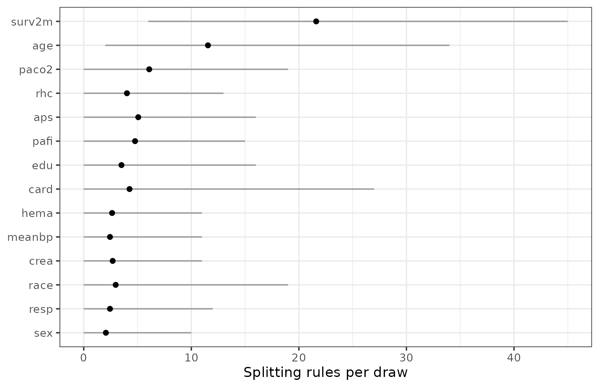

# Which Variables Matter

## Introduction

A fitted forest spends its splitting rules on some predictors and not
others, and counting how it spends them is the usual measure of variable
importance for BART.
[`variable_importance()`](https://ngreifer.github.io/bartisan/reference/variable_importance.md)
reports the count.

This vignette covers what that number means, how to tell whether a
difference in it is real, and three things it is not. The last part
matters more than the first: variable importance is the most over-read
output in machine learning, and the failure modes are specific and
checkable.

In this guide we will first read the three statistics
[`variable_importance()`](https://ngreifer.github.io/bartisan/reference/variable_importance.md)
returns, and then calibrate them by adding predictors we know to be pure
noise. Next we’ll look at the two situations that most affect how the
table should be read: a strong signal, where the separation between
signal and noise is sharp, and correlated predictors, where the ranking
is confidently wrong. Finally we’ll cover what importance does not
measure and what to make of the advice to reduce the number of trees
when using BART to select variables.

``` r

library(bartisan)

data("rhc")

model <- death ~ rhc + age + sex + race + edu + aps + meanbp + resp +
  hema + pafi + paco2 + crea + surv2m + card
```

## Split Counts and Usage Proportions (`variable_importance()`)

``` r

set.seed(2026)

fit <- bartisan(model, data = rhc, family = binomial(), chains = 4)

imp <- variable_importance(fit)

imp
#> Variable importance
#> 
#>  variable prop_used prop_splits splits
#>    surv2m     1.000       0.284   21.6
#>       age     1.000       0.152   11.5
#>     paco2     0.968       0.080    6.1
#>       rhc     0.935       0.053    4.0
#>       aps     0.891       0.067    5.1
#>      pafi     0.889       0.063    4.8
#>       edu     0.749       0.046    3.5
#>      card     0.715       0.056    4.3
#>      hema     0.640       0.035    2.6
#>    meanbp     0.632       0.032    2.4
#>      crea     0.630       0.035    2.7
#>      race     0.582       0.039    3.0
#>      resp     0.562       0.032    2.4
#>       sex     0.521       0.027    2.1
#> 
#> ℹ splits_lower and splits_upper hold the 95% interval, not shown above.
```

The output has six columns, of which
[`print()`](https://rdrr.io/r/base/print.html) shows four, and the three
read first answer different questions.

`prop_used` is the proportion of draws in which the predictor received
at least one rule, and it is the column to read first: under the default
prior it behaves like a posterior probability that the predictor belongs
in the model, which makes it the one to use when the question is which
variables to keep.

`prop_splits` is the predictor’s share of all the splitting rules in the
forest. It is the column to use when two fits are being compared, for
the reason the section on `num_trees` below gives.

`splits` is the average number of splitting rules the forest gives a
predictor in one posterior draw; it says how much of the fitted
structure the predictor accounts for. Its interval is in the returned
data frame as `splits_lower` and `splits_upper`, and the
[`print()`](https://rdrr.io/r/base/print.html) method leaves it out of
the displayed table to keep the ranking readable.

The reason it behaves that way is the prior. By default (i.e., with
`sparsity = TRUE`) the variable a rule splits on is drawn from a
Dirichlet-distributed set of probabilities ([Linero
2018](#ref-linero2018sparse)), which lets the forest concentrate on a
few predictors and drop the rest entirely. A predictor that contributes
nothing can fall to `prop_used` near zero, which is not possible under
classic BART, where every predictor keeps a fixed share of the splitting
probability.

The prognostic score and the illness measures sit at the top, which is
what we would expect; at the other end, several predictors are used in
only about half the draws.

For a ranking this long the picture is easier to read than the table,
and [`plot()`](https://rdrr.io/r/graphics/plot.default.html) draws it:

``` r

plot(imp)
```



For a model wider than this one, subsetting first is what keeps the
picture readable: `plot(head(imp, 10))` shows the top ten.
[`variable_importance()`](https://ngreifer.github.io/bartisan/reference/variable_importance.md)
also takes `plot = TRUE`, which is the same drawing reached in one call.

And when the question is not one the summary answers, `draws = TRUE`
returns the counts themselves, one row per posterior draw, so any
comparison can be made directly. The posterior probability that the
forest spends more rules on `aps` than on `meanbp`, for instance, is a
proportion of draws:

``` r

counts <- variable_importance(fit, draws = TRUE)

mean(counts[, "aps"] > counts[, "meanbp"])
#> [1] 0.67
```

That is worth doing before reading much into a difference in the table:
two predictors adjacent in the ranking are usually not distinguishable,
and this is how to find out.

## Calibrating With Noise Predictors

Is a middling `prop_used` low? The table cannot say. Before reading
anything into the bottom of it, we should check what a predictor that
certainly does not matter looks like on these data, which means adding a
few.

``` r

set.seed(11)
rhc_noise <- rhc
for (j in 1:3) rhc_noise[[paste0("noise", j)]] <- rnorm(nrow(rhc_noise))

set.seed(2026)
fit_noise <- bartisan(update(model, . ~ . + noise1 + noise2 + noise3),
                      data = rhc_noise, family = binomial(), chains = 4)

variable_importance(fit_noise)
#> Variable importance
#> 
#>  variable prop_used prop_splits splits
#>    surv2m     1.000       0.199   15.2
#>       age     1.000       0.132   10.1
#>     paco2     0.966       0.083    6.3
#>      pafi     0.957       0.065    5.0
#>       aps     0.928       0.082    6.3
#>       rhc     0.924       0.055    4.2
#>      card     0.788       0.036    2.7
#>    noise1     0.777       0.049    3.7
#>       edu     0.776       0.042    3.2
#>    meanbp     0.730       0.040    3.0
#>      hema     0.719       0.036    2.8
#>      crea     0.712       0.046    3.5
#>    noise2     0.673       0.028    2.1
#>    noise3     0.666       0.032    2.5
#>      race     0.590       0.026    2.0
#>       sex     0.569       0.021    1.6
#>      resp     0.568       0.028    2.1
#> 
#> ℹ splits_lower and splits_upper hold the 95% interval, not shown above.
```

The noise variables do not sort to the bottom. They land in the middle
of the table, above several of the real predictors, and that is the
answer to the question: the lower half of this table carries no
information, because a predictor ranked below a variable that is
literally random cannot be said to matter less than it.

Read the gap rather than the ranking. The predictors at the top sit well
clear of the noise controls and can be said to matter, while everything
from about the middle down is indistinguishable from random numbers on
this sample, which is a more useful conclusion than an ordering and one
the table alone would not have given us.

This technique costs three lines and settles the question; we recommend
it whenever an importance table is going to be interpreted.

## Separation With a Stronger Signal

The failure above is a property of these data rather than of the method:
with more data and a stronger signal, the separation is sharp. Below we
use the Friedman function, in which `x1` through `x5` enter the outcome
and `x6` through `x10` are noise, at 500 observations.

``` r

friedman <- function(n) {
  x <- as.data.frame(matrix(runif(n * 10), n, 10))
  names(x) <- paste0("x", 1:10)
  x$y <- 10 * sin(pi * x$x1 * x$x2) + 20 * (x$x3 - 0.5)^2 +
    10 * x$x4 + 5 * x$x5 + rnorm(n)
  x
}

set.seed(7)
fit_fr <- bartisan(y ~ ., data = friedman(500), family = gaussian())

variable_importance(fit_fr)
#> Variable importance
#> 
#>  variable prop_used prop_splits splits
#>        x2     1.000       0.418   34.1
#>        x1     1.000       0.219   17.8
#>        x3     1.000       0.186   15.2
#>        x4     1.000       0.123   10.1
#>        x5     1.000       0.051    4.2
#>        x8     0.056       0.001    0.1
#>        x7     0.055       0.001    0.1
#>       x10     0.045       0.001    0.0
#>        x6     0.040       0.001    0.0
#>        x9     0.021       0.000    0.0
#> 
#> ℹ splits_lower and splits_upper hold the 95% interval, not shown above.
```

The five real predictors sit at 1.00 and four of the five noise
predictors near zero. The fifth sits above the other noise variables and
still well below the real ones, which is a useful reminder that even a
clean separation has a straggler: a noise variable will occasionally be
picked up, and a single moderate value is not evidence of anything. The
gap that matters runs from the top of the noise to 1.00, and it is wide.

There is no threshold that is correct in general, so we look for the
gap, cut inside it, and check that the conclusion does not depend on
exactly where.

## Correlated Predictors

This is the failure mode most likely to mislead, because it produces a
confident and wrong answer rather than an uninformative one.

``` r

set.seed(5)
n <- 400
cd <- data.frame(x1 = runif(n))
cd$x1_copy <- cd$x1 + rnorm(n, sd = 0.01)   # almost the same variable
cd$x2 <- runif(n)
cd$x3 <- runif(n)
cd$y <- 3 * cd$x1 + rnorm(n, sd = 0.3)      # only x1 is in the truth

fit_corr <- bartisan(y ~ ., data = cd, family = gaussian())

variable_importance(fit_corr)
#> Variable importance
#> 
#>  variable prop_used prop_splits splits
#>   x1_copy     1.000       0.660   50.3
#>        x1     0.797       0.317   24.3
#>        x3     0.445       0.017    1.3
#>        x2     0.152       0.006    0.4
#> 
#> ℹ splits_lower and splits_upper hold the 95% interval, not shown above.
```

The outcome depends on `x1`. The forest spent most of its splitting
rules on `x1_copy` and most of the rest on `x1`, so read as a ranking,
this table puts the variable that is not in the truth above the one that
is.

Nothing has gone wrong with the fit: the two variables carry the same
information, so a tree that splits on either fits equally well, and the
forest divided the rules unevenly. Predictions are unaffected; what is
affected is any statement about which variable matters.

The same thing happens to the effects:

``` r

library(marginaleffects)

avg_comparisons(fit_corr, variables = c("x1", "x1_copy"))
#> 
#>     Term Estimate   2.5 % 97.5 %
#>  x1         0.382 -0.0409   1.28
#>  x1_copy    0.998  0.1900   1.53
#> 
#> Type: response
#> Comparison: +1
```

The copy takes most of the association; the original’s interval covers
zero. Moving both together, which is what a change in the underlying
quantity would mean, recovers the truth:

``` r

lo <- transform(cd, x1 = 0.25, x1_copy = 0.25)
hi <- transform(cd, x1 = 0.75, x1_copy = 0.75)

drawn <- rowMeans(predict(fit_corr, newdata = hi, draws = TRUE) -
                    predict(fit_corr, newdata = lo, draws = TRUE))

round(c(estimate = mean(drawn), quantile(drawn, c(0.025, 0.975))), 3)
#> estimate     2.5%    97.5% 
#>     1.59     1.46     1.73
```

The true difference over that range is 1.5, so the model knows the
relationship; it just cannot say which of two identical columns it
belongs to.

The practical rule is to treat a set of correlated predictors as one
unit: we decide in advance which variables measure the same underlying
thing, and then report and move them together.

## The Limits of a Usage Ranking

**It is not an effect size.** How often a predictor is split on and how
much it moves the outcome are different quantities, and they can
disagree in both directions; a predictor with a small effect over a
range that gets split repeatedly will show high usage. When the question
is how much the outcome changes,
[`partial_dependence()`](https://ngreifer.github.io/bartisan/reference/partial_dependence.md)
shows how the prediction moves with the predictor and
[`avg_comparisons()`](https://rdrr.io/pkg/marginaleffects/man/comparisons.html)
answers it as a contrast, both with an interval. See
[`vignette("effects")`](https://ngreifer.github.io/bartisan/articles/effects.md).

**It is not a test.** `prop_used` is a posterior probability under a
particular prior (i.e., the Dirichlet sparsity prior). It has no error
rate attached, and the choice of cutoff is left to the analyst. The
noise-control technique above is the closest thing to a calibration of
that cutoff, and it is informal.

**It is not causal.** A ranking of predictors describes this fitted
function on this sample. It says nothing about what would happen if any
of them were changed, and a variable can rank highly because it is a
consequence of the outcome, a proxy for a confounder, or correlated with
something that matters. See
[`vignette("causal")`](https://ngreifer.github.io/bartisan/articles/causal.md).

## The Number of Trees (`num_trees`)

A recommendation that circulates is to reduce the number of trees when
using BART for variable selection. It comes from Chipman et al.
([2010](#ref-chipman2010)), who observe that counting splits works
poorly with many trees because “the redundancy offered by so many trees
tends to mix many irrelevant predictors in with the relevant ones”, and
that predictors compete for splits when the forest is small.

The advice is correct for classic BART and largely unnecessary here.
Measured on the Friedman function at 500 observations over three
replicates, the mean `prop_used` for the five noise predictors was:

| Trees | sparsity = FALSE | sparsity = TRUE (default) |
|------:|-----------------:|--------------------------:|
|    10 |             0.28 |                      0.09 |
|    20 |             0.50 |                      0.08 |
|    50 |             0.95 |                      0.09 |
|   100 |             1.00 |                      0.14 |

Without the sparsity prior the advice is essential: at 50 trees the
noise predictors are used in 95% of draws and cannot be told apart from
the real ones. With the prior, which is on by default
(`sparsity = TRUE`), they stay near zero at every tree count. The
recommendation addresses the same problem the prior addresses, and there
is little left for it to do; a smaller forest also mixes worse, so it is
not free.

To check on a given dataset, we can fit at the default and again at 20
trees and see whether the conclusion changes. It usually will not.

`prop_splits` is the column to compare when we do, because `splits`
cannot be: it counts rules, so a forest of 50 trees reports several
times the count of a forest of 20 without being several times as
informative. The share is computed within each draw, so it adds to one
at any forest size. It is not invariant, since the number of trees also
changes how the rules get allocated, but the ranking carries over and
that is what the comparison is about.

## Further Reading

[`vignette("effects")`](https://ngreifer.github.io/bartisan/articles/effects.md)
covers how much predictors move the outcome, which is the question
importance is usually a proxy for.
[`vignette("comparison")`](https://ngreifer.github.io/bartisan/articles/comparison.md)
covers choosing between models that include different variables, which
is the other way to ask whether a variable earns its place.

## References

Chipman, Hugh A., Edward I. George, and Robert E. McCulloch. 2010.
“BART: Bayesian Additive Regression Trees.” *The Annals of Applied
Statistics* 4 (1): 266–98. <https://doi.org/10.1214/09-AOAS285>.

Linero, Antonio R. 2018. “Bayesian Regression Trees for High-Dimensional
Prediction and Variable Selection.” *Journal of the American Statistical
Association* 113 (522): 626–36.
<https://doi.org/10.1080/01621459.2016.1264957>.
