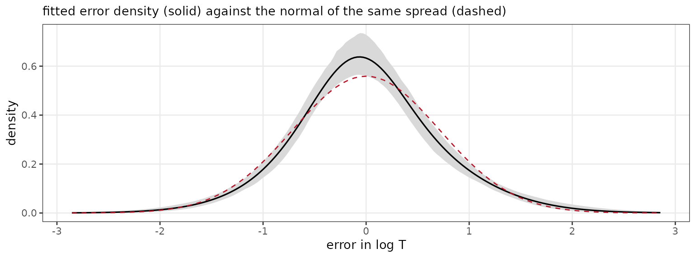
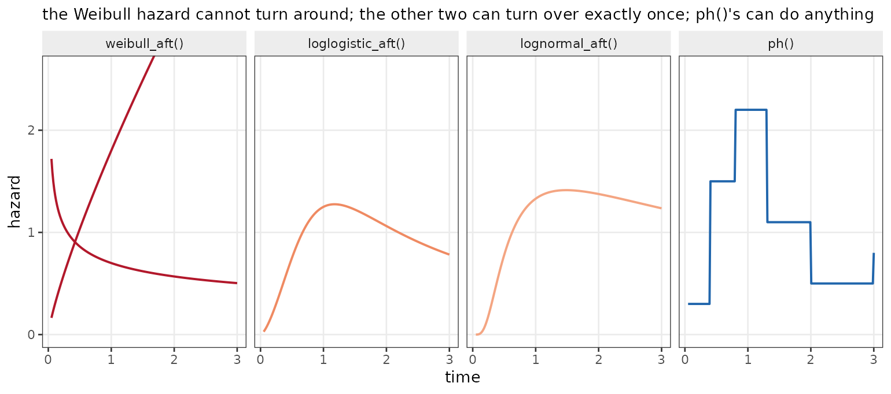
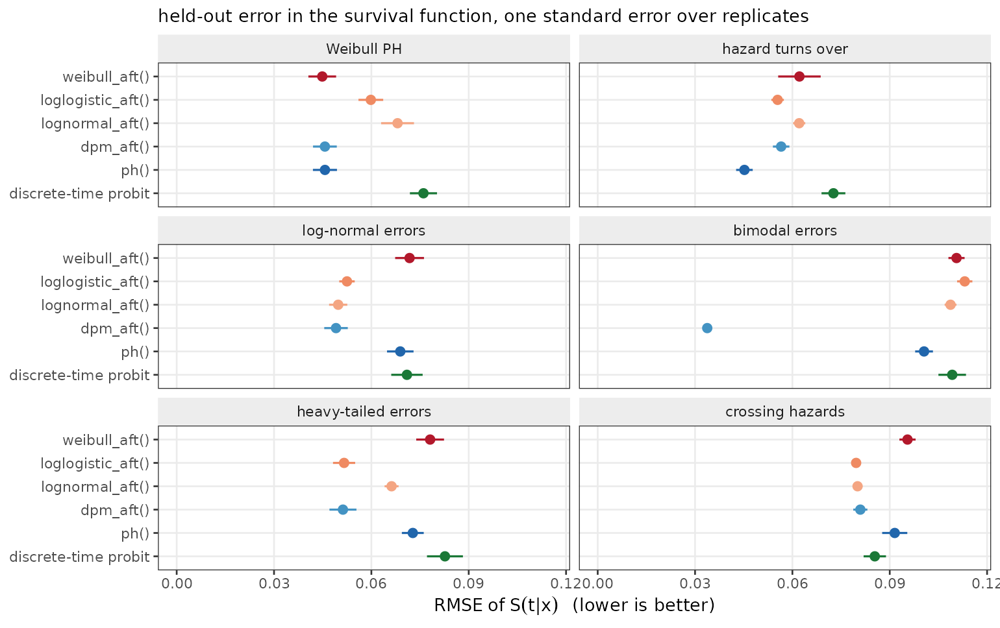
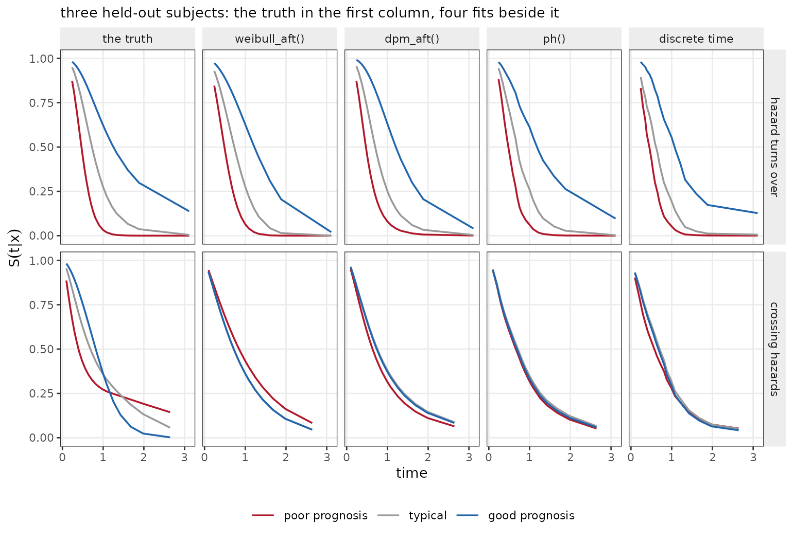
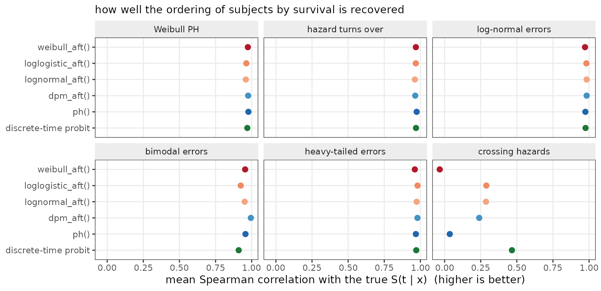
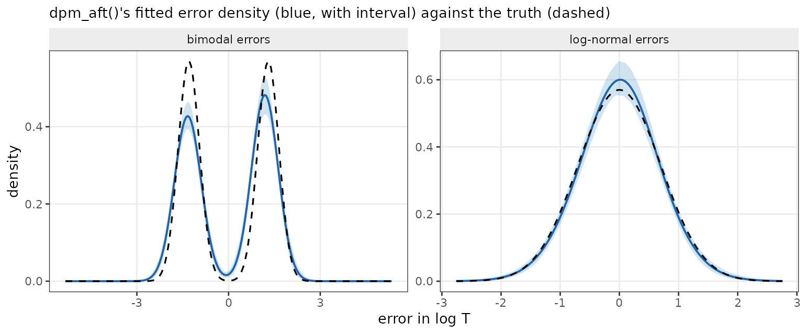
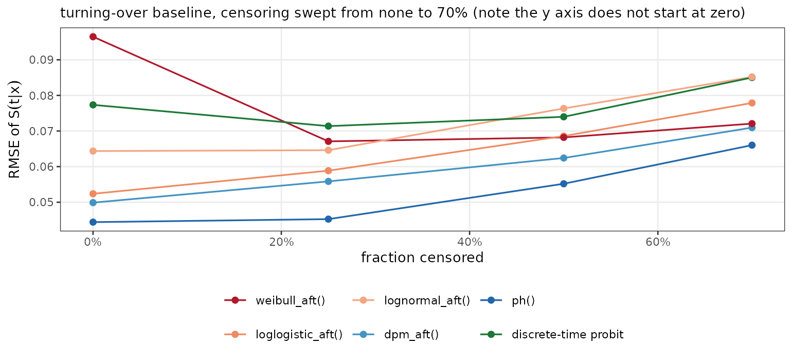
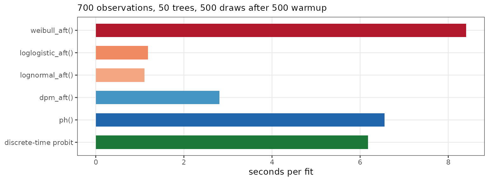

# Survival analysis in bartisan

``` r

library(bartisan)
library(survival)

set.seed(2026)

# Small chains in the live examples, so that this vignette builds quickly. The
# defaults are 50 trees and 500 draws after 500 warmup iterations, which is
# what the simulations reported below use.
ctrl <- bartisan_control(num_trees = 10, num_burn = 150, num_draws = 150)
```

This vignette is about right-censored time-to-event data. It covers the
five families that take a censored response, what each one is
estimating, which shapes of hazard each can and cannot represent, how
they behave under misspecification and under heavy censoring, and the
route to take when the proportional hazards assumption fails.
[`vignette("families")`](https://ngreifer.github.io/bartisan/articles/families.md)
gives the short version; this is the long one.

The recurring theme is that these models disagree about *what the
predictor means*, and that the disagreement mostly stops mattering once
you ask for the quantity you actually wanted — survival at a horizon —
rather than reading coefficients.

## The response

Every family here takes a
[`survival::Surv()`](https://rdrr.io/pkg/survival/man/Surv.html) object,
or equivalently a two-column numeric matrix of non-negative times and
0/1 event indicators. A 1 means the event was observed at that time; a 0
means the subject was still event-free when last seen, so the true time
is somewhere above it.

``` r

n <- 400
d <- data.frame(x1 = runif(n), x2 = runif(n), x3 = runif(n),
                trt = rbinom(n, 1, 0.5))

# A log-normal accelerated failure time truth, censored at about 30%. The
# treatment multiplies survival time by exp(0.5).
m <- 1 + 1.5 * sin(3 * d$x1) - 0.8 * d$x2 + 0.5 * d$trt
latent <- exp(m + 0.7 * rnorm(n))
cens <- rexp(n, 0.05)

d$time <- pmin(latent, cens)
d$status <- as.numeric(latent <= cens)

mean(d$status)
#> [1] 0.7
```

Only right censoring is supported: `Surv(time, status)` and nothing
else. Left-truncated, interval-censored and competing-risks data need a
different likelihood, and
[`custom_family()`](https://ngreifer.github.io/bartisan/reference/bartisan-families.md)
is the place to write one.

Censoring is assumed **independent** of the event time given the
covariates, as it is in every model in this vignette and in
[`survival::coxph()`](https://rdrr.io/pkg/survival/man/coxph.html). That
is an assumption about the data, not about the family, so no choice
below relaxes it.

## The five families

| Family | Model | The forest gives | Drawn nuisance |
|:---|:---|:---|:---|
| [`weibull_aft()`](https://ngreifer.github.io/bartisan/reference/bartisan-families.md) | \\\log T = \eta + \sigma\epsilon\\, \\\epsilon\\ standard Gumbel | a log time ratio | \\\sigma\\ |
| [`loglogistic_aft()`](https://ngreifer.github.io/bartisan/reference/bartisan-families.md) | the same with \\\epsilon\\ standard logistic | a log time ratio | \\\sigma\\ |
| [`lognormal_aft()`](https://ngreifer.github.io/bartisan/reference/bartisan-families.md) | the same with \\\epsilon\\ standard normal | a log time ratio | \\\sigma\\ |
| [`ph()`](https://ngreifer.github.io/bartisan/reference/bartisan-families.md) | \\\lambda(t \mid x) = \lambda_0(t)\\e^{r(x)}\\ | a log hazard ratio | \\\lambda_0\\ on a grid |
| [`dpm_aft()`](https://ngreifer.github.io/bartisan/reference/bartisan-families.md) | \\\log T = m(x) + W\\, \\W\\ a mixture of normals | \\E\[\log T \mid x\]\\ | the error density |

All five put a BART forest on a single additive predictor and leave
something else free. What differs is which part is parametric.

### The three accelerated failure time families

These model the log event time directly,

\\\log T = \eta(x) + \sigma\epsilon,\\

with \\\epsilon\\ of a fixed shape and \\\sigma\\ drawn and reported in
`fit$aux`. Multiplying survival time by a constant adds a constant to
\\\eta\\, which is what “accelerated failure time” means: covariates
stretch or compress the time axis without changing the shape of the
survival curve.

``` r

fit_w <- bartisan(Surv(time, status) ~ x1 + x2 + x3 + trt, data = d,
                  family = weibull_aft(), control = ctrl)
fit_ln <- bartisan(Surv(time, status) ~ x1 + x2 + x3 + trt, data = d,
                   family = lognormal_aft(), control = ctrl)

c(weibull = mean(fit_w$aux[, "sigma"]), lognormal = mean(fit_ln$aux[, "sigma"]))
#>   weibull lognormal 
#>     0.654     0.711
```

They differ only in the error’s shape, and therefore in the shape of the
hazard:

- **[`weibull_aft()`](https://ngreifer.github.io/bartisan/reference/bartisan-families.md)**
  has a **monotone** hazard — increasing, decreasing or flat, but never
  turning around. It is the only family in the package that is
  simultaneously an accelerated failure time and a proportional hazards
  model, so it is the one parametric choice that supports a hazard-ratio
  reading. It is about seven times slower than the other two — see
  [Speed](#speed).
- **[`loglogistic_aft()`](https://ngreifer.github.io/bartisan/reference/bartisan-families.md)**
  allows a hazard that rises and then falls, and has the heaviest tails
  of the three, so a handful of very long survivors move it least.
- **[`lognormal_aft()`](https://ngreifer.github.io/bartisan/reference/bartisan-families.md)**
  also allows a non-monotone hazard, with thinner tails than the
  log-logistic.

In practice the log-logistic and log-normal are hard to tell apart from
data and the Weibull is distinguishable from both, so the informative
comparison is Weibull against either of the other two, by
[`loo()`](https://mc-stan.org/loo/reference/loo.html).

### `ph()`: a free baseline hazard

[`ph()`](https://ngreifer.github.io/bartisan/reference/bartisan-families.md)
gives up on a parametric time distribution and models the hazard instead
([Basak et al. 2024](#ref-basak2024)):

\\\lambda(t \mid x) = \lambda_0(t)\exp\\r(x)\\,\\

with \\\lambda_0\\ constant within each of `num_bins` pieces whose edges
sit at evenly spaced quantiles of the observed times. This is the
piecewise-exponential proportional hazards model with a forest on the
log hazard ratio. The baseline can take any shape at all, including one
that turns over, which none of the three parametric families can do.

``` r

fit_ph <- bartisan(Surv(time, status) ~ x1 + x2 + x3 + trt, data = d,
                   family = ph(), control = ctrl)

head(round(colMeans(fit_ph$aux), 3))
#> lambda1 lambda2 lambda3 lambda4 lambda5 lambda6 
#>   0.013   0.043   0.079   0.070   0.082   0.078
```

The bin hazards come back as `lambda1`, `lambda2`, … alongside
`lambda_rate`, the drawn rate of their own Gamma prior — the hazards are
shrunk towards each other through it, which is what keeps a fine grid
from overfitting.

One point of interpretation matters here. The predictor and the baseline
are identified only *jointly*: multiplying \\\lambda_0\\ by a constant
and subtracting its log from \\r(x)\\ leaves the likelihood unchanged.
The fit resolves this by letting the baseline carry the level and
reporting \\r(x)\\ centered, so **`fit_ph`’s predictor is a contrast,
not a level**. Differences between two values of \\r\\ are meaningful; a
single value is not.

### `dpm_aft()`: the error distribution estimated rather than assumed

[`dpm_aft()`](https://ngreifer.github.io/bartisan/reference/bartisan-families.md)
is an accelerated failure time model with the shape of the error left
free ([Henderson et al. 2020](#ref-henderson2020)), and is the family
used when a `Surv` response is given and no `family` is named:

\\\log T = m(x) + W, \qquad W \sim \text{a Dirichlet process mixture of
normals},\\

with the mixture constrained to mean zero, so \\m(x)\\ is the
conditional mean of \\\log T\\. It is
[`dpm()`](https://ngreifer.github.io/bartisan/reference/bartisan-families.md)’s
error model with censoring added: each sweep, a right-censored log-time
is imputed from the mixture component it currently sits in, truncated
below at its censoring time.

``` r

fit_dpm <- bartisan(Surv(time, status) ~ x1 + x2 + x3 + trt, data = d,
                    family = dpm_aft(), control = ctrl)

round(colMeans(fit_dpm$aux), 3)
#>    alpha clusters   center error_sd 
#>    1.069    6.040    0.048    0.714
```

[`error_density()`](https://ngreifer.github.io/bartisan/reference/error_density.md)
reports what the error distribution came out looking like, which is the
diagnostic the model exists to provide:

``` r

ed <- error_density(fit_dpm)

# The normal a lognormal_aft() fit would have assumed, given the same spread.
sd_fitted <- mean(fit_dpm$aux[, "error_sd"])

ggplot(ed, aes(at, mean)) +
  geom_ribbon(aes(ymin = lower, ymax = upper), fill = "grey85") +
  geom_line(linewidth = 0.5) +
  stat_function(fun = dnorm, args = list(sd = sd_fitted),
                linetype = 2, colour = "#B2182B") +
  labs(x = "error in log T", y = "density",
       subtitle = "fitted error density (solid) against the normal of the same spread (dashed)")
```



Because the mixture can collapse to a single component, it costs almost
nothing when a single normal was the right answer — the property that
makes it a reasonable default rather than a specialist tool. Nor does it
cost much time: conditional on which component each observation sits in,
the model is Gaussian, so it takes the same fast path
[`lognormal_aft()`](https://ngreifer.github.io/bartisan/reference/bartisan-families.md)
does and the mixture update on top is cheap. It runs at about twice
[`lognormal_aft()`](https://ngreifer.github.io/bartisan/reference/bartisan-families.md)’s
cost and a third of
[`weibull_aft()`](https://ngreifer.github.io/bartisan/reference/bartisan-families.md)’s.

## What the predictor means: three estimands, not one

The five families report three genuinely different quantities, and they
are not rescalings of each other.

| Family | A one-unit increase in the predictor means |
|:---|:---|
| the three `*_aft()` | survival time multiplied by \\e\\, at every quantile of the curve |
| [`ph()`](https://ngreifer.github.io/bartisan/reference/bartisan-families.md) | the hazard multiplied by \\e\\, at every time |
| [`dpm_aft()`](https://ngreifer.github.io/bartisan/reference/bartisan-families.md) | the mean of \\\log T\\ raised by one |

A time ratio and a hazard ratio move in opposite directions — a
covariate that raises the hazard shortens survival — and their
magnitudes are related only through the shape of the baseline. Under a
Weibull with shape \\k\\ the two coincide up to a factor: a log hazard
ratio of \\\beta\\ is a log time ratio of \\-\beta/k\\. Away from the
Weibull there is no such correspondence at all.

[`dpm_aft()`](https://ngreifer.github.io/bartisan/reference/bartisan-families.md)’s
predictor is a third thing. It is the mean of \\\log T\\, not the median
and not a quantile, so it is only a time ratio to the extent that the
error density is symmetric — which is exactly what
[`dpm_aft()`](https://ngreifer.github.io/bartisan/reference/bartisan-families.md)
declines to assume.

### The estimand you usually want

None of the three is normally the question. The question is usually
about survival at a horizon: the difference in one-year survival between
treated and untreated, say. That is a contrast in \\S(t \mid x)\\ at a
fixed \\t\\, and it is on the same scale — a probability — no matter
which family produced it.

``` r

head(predict(fit_ph, type = "survival", times = c(1, 2, 5)), 3)
#>          1     2     5
#> [1,] 0.991 0.973 0.851
#> [2,] 0.983 0.949 0.732
#> [3,] 0.921 0.774 0.225
```

and inside the estimand machinery:

``` r

library(marginaleffects)

# The average difference in survival at t = 5 that the treatment is worth.
avg_comparisons(fit_ph, variables = "trt", type = "survival", times = 5)
#> 
#>  Estimate 2.5 % 97.5 %
#>     0.176 0.111  0.234
#> 
#> Term: trt
#> Type: survival
#> Comparison: 1 - 0
```

One time per call. **marginaleffects** warns that it does not recognize
`times`, because it checks the dots against a whitelist hardcoded per
model class and offers no hook for registering an argument; it passes
the argument through regardless and the result is correct. The warning
is suppressed here.

This works identically for all five families. It is the reason
`type = "survival"` exists rather than leaving the curve to be assembled
by hand from the draws, and it is the recommended way to report a
survival model from this package: it sidesteps the estimand mismatch
above, it comes with a posterior interval, and it is comparable across
families in a way that the predictors are not.

`type = "response"` is the median survival time for all five, which is
the other scale-free summary and is often easier to communicate than a
curve.

## Which hazard shapes each family can represent

Most of the differences in what follows come down to one picture. The
parametric families constrain the hazard’s shape;
[`ph()`](https://ngreifer.github.io/bartisan/reference/bartisan-families.md)
does not.



[`dpm_aft()`](https://ngreifer.github.io/bartisan/reference/bartisan-families.md)
is not in the figure because its hazard shape is whatever the fitted
error mixture implies, which can be multi-modal — a hazard with more
than one peak, which none of the other four can produce.

## A comparison across six truths

The script is `_dev/survival-sim.R` in the package sources.

Every truth uses the same nonlinear function of five covariates, so the
families differ only in how well they cope with the *shape* of the time
distribution built around it. The six truths are:

| Truth | What it is | Exactly right for |
|:---|:---|:---|
| Weibull PH | proportional hazards with a Weibull baseline | [`weibull_aft()`](https://ngreifer.github.io/bartisan/reference/bartisan-families.md) and [`ph()`](https://ngreifer.github.io/bartisan/reference/bartisan-families.md) both |
| hazard turns over | proportional hazards, baseline hazard rises then falls | [`ph()`](https://ngreifer.github.io/bartisan/reference/bartisan-families.md) |
| log-normal errors | accelerated failure time, normal errors | [`lognormal_aft()`](https://ngreifer.github.io/bartisan/reference/bartisan-families.md) |
| bimodal errors | accelerated failure time, two-component error | [`dpm_aft()`](https://ngreifer.github.io/bartisan/reference/bartisan-families.md) |
| heavy-tailed errors | accelerated failure time, \\t_3\\ errors | none; [`dpm_aft()`](https://ngreifer.github.io/bartisan/reference/bartisan-families.md) and [`loglogistic_aft()`](https://ngreifer.github.io/bartisan/reference/bartisan-families.md) nearest |
| crossing hazards | the covariate effect reverses sign over time | none of the five, nor the discrete-time route exactly |

The primary metric is the RMSE of the fitted survival function \\S(t
\mid x)\\ against the true one, on held-out subjects and over twenty
times spanning the 5th to 95th percentile of the event-time
distribution. It is used because it is on the same scale for every
family, which the predictors are not.



| Truth | weibull_aft() | loglogistic_aft() | lognormal_aft() | dpm_aft() | ph() | discrete-time probit |
|:---|---:|---:|---:|---:|---:|---:|
| Weibull PH | 0.045 | 0.060 | 0.068 | 0.046 | 0.046 | 0.076 |
| hazard turns over | 0.062 | 0.055 | 0.062 | 0.057 | 0.045 | 0.073 |
| log-normal errors | 0.072 | 0.052 | 0.050 | 0.049 | 0.069 | 0.071 |
| bimodal errors | 0.111 | 0.113 | 0.109 | 0.034 | 0.101 | 0.109 |
| heavy-tailed errors | 0.078 | 0.052 | 0.066 | 0.051 | 0.073 | 0.083 |
| crossing hazards | 0.095 | 0.080 | 0.080 | 0.081 | 0.092 | 0.085 |

RMSE of S(t \| x) on held-out data. Lower is better. {.table}

Five things to read off it.

**Being exactly right is worth surprisingly little.** On the Weibull
truth, which
[`weibull_aft()`](https://ngreifer.github.io/bartisan/reference/bartisan-families.md)
and
[`ph()`](https://ngreifer.github.io/bartisan/reference/bartisan-families.md)
both describe exactly,
[`weibull_aft()`](https://ngreifer.github.io/bartisan/reference/bartisan-families.md)
leads at 0.045 — and
[`ph()`](https://ngreifer.github.io/bartisan/reference/bartisan-families.md)
and
[`dpm_aft()`](https://ngreifer.github.io/bartisan/reference/bartisan-families.md),
neither of which is given the shape, are level with it at 0.046. Being
*wrong* costs far more than being right gains:
[`lognormal_aft()`](https://ngreifer.github.io/bartisan/reference/bartisan-families.md)
pays 0.068 on the same data. So the question worth asking of a family is
not how much it wins when its assumption holds, but how much it loses
when it does not.

**[`ph()`](https://ngreifer.github.io/bartisan/reference/bartisan-families.md)
wins where the baseline turns over, and only there.** At 0.045 against
0.055 for the best parametric alternative, it is clearly ahead on the
case the three parametric families structurally cannot fit. But this is
the one truth in the table where it leads. On the two accelerated
failure time truths it is among the worst — 0.069 on log-normal errors
against 0.049 — because proportional hazards is an assumption too, and
it is the wrong one there.

**When the error is badly shaped,
[`dpm_aft()`](https://ngreifer.github.io/bartisan/reference/bartisan-families.md)
wins by a wide margin.** On the two-component error it is three times
more accurate than anything else and 300 log points ahead, because no
other family in the set can represent a bimodal time distribution at any
value of its parameters. The heavy-tailed case is milder, and there
[`loglogistic_aft()`](https://ngreifer.github.io/bartisan/reference/bartisan-families.md)
matches it — which is what the log-logistic’s heavy tails are for.

**[`dpm_aft()`](https://ngreifer.github.io/bartisan/reference/bartisan-families.md)
costs nothing when it is not needed, and it is the most consistent
family in the table.** On log-normal errors it sits at 0.0491 against
the correctly specified
[`lognormal_aft()`](https://ngreifer.github.io/bartisan/reference/bartisan-families.md)’s
0.0498; on the Weibull truth, 0.0457 against
[`weibull_aft()`](https://ngreifer.github.io/bartisan/reference/bartisan-families.md)’s
0.0449. It is best or tied-best on four of the six truths and never
worse than third on any. That asymmetry — large gains when the
assumption is wrong, no measurable loss when it is right — is what makes
it a sensible default for anyone without a view about the error’s shape.

**When hazards cross, the RMSE column understates the damage.** Every
family lands between 0.080 and 0.096, which looks like a mild penalty.
It is not: the [ranking column](#ordering) shows that the models have
absorbed a reversing covariate effect into almost no covariate effect at
all. See [the discrete-time route](#nonprop) below.

### The same picture as fitted curves

The aggregate numbers hide *how* the misspecified fits are wrong. Here
are the fitted survival curves for three held-out subjects under the two
truths where the families disagree most, against the truth in black.



In the top row every fit recovers the separation between the three
subjects; they differ in the level.
[`weibull_aft()`](https://ngreifer.github.io/bartisan/reference/bartisan-families.md)
sends the good-prognosis curve to zero well before the truth does,
because a monotone hazard cannot flatten out the way this baseline does;
[`ph()`](https://ngreifer.github.io/bartisan/reference/bartisan-families.md)
and
[`dpm_aft()`](https://ngreifer.github.io/bartisan/reference/bartisan-families.md)
track it, and the discrete-time fit is visibly steppy at this grid
resolution.

The bottom row is the one to look at. The true curves separate widely
and then **reverse** — the subject with the best prognosis at the middle
of the grid has the worst survival by the end of it, and the three
curves cross. No fit reproduces that, which is the structural limitation
stated as a picture. But the symptom is not a distorted covariate
effect; it is a missing one.
[`ph()`](https://ngreifer.github.io/bartisan/reference/bartisan-families.md)
and the discrete-time fit put all three subjects on essentially the same
curve.
[`weibull_aft()`](https://ngreifer.github.io/bartisan/reference/bartisan-families.md)
and
[`dpm_aft()`](https://ngreifer.github.io/bartisan/reference/bartisan-families.md)
keep a little separation, in one fixed order, which is right over part
of the range and wrong over the rest. A model that must apply the same
covariate effect at every time, given an effect that is positive early
and negative late, averages it to approximately nothing.

Two cautions on reading this panel. It shows three subjects, not the
sample: the discrete-time route scores much better than
[`ph()`](https://ngreifer.github.io/bartisan/reference/bartisan-families.md)
on the ranking measured over all 700, and that advantage is not what
this figure is showing. And the survival RMSE for this row was an
unremarkable 0.08 to 0.10 — the failure is severe and the headline
metric does not say so.

### Recovering the ordering of risk

A weaker question than the curve itself is whether the model gets the
*ordering* of subjects right at each time. Misspecification costs much
less here.



On all five truths where the covariate effect is constant in time, every
family recovers the ordering at a correlation between 0.92 and 0.99,
whether or not it has the shape right. The spread across families is a
few hundredths where the spread in the survival curve was a factor of
three.

The crossing truth is the exception, and there the column collapses: the
discrete-time model reaches 0.47, the accelerated failure time families
0.24 to 0.29, and
[`ph()`](https://ngreifer.github.io/bartisan/reference/bartisan-families.md)
and
[`weibull_aft()`](https://ngreifer.github.io/bartisan/reference/bartisan-families.md)
essentially zero — 0.04 and \\-0.03\\, which is to say no information
about who is at risk at a given time. This is the same erasure the
curves showed, measured.

The practical reading: **if all you need is who is at higher risk, and
the covariate effect does not move with time, the choice of family
barely matters.** It matters when you need the curve, an absolute
probability, or the shape of the hazard — and it matters enormously when
the effect does move with time, which is the one case where the ordering
is not recoverable at all.

### The error density, recovered

On the bimodal truth
[`dpm_aft()`](https://ngreifer.github.io/bartisan/reference/bartisan-families.md)’s
advantage is not a tuning gain; it is that it can see the shape the
other families are assuming away.



It finds both components when they are there and collapses to something
close to a single normal when they are not. That is the whole argument
for the family.

### Held-out log scores

The log score is the other natural metric, and it can be made comparable
across all five families — but only after a correction, which is the
subject of [a trap below](#measure). With the correction applied:

| Truth | weibull_aft() | loglogistic_aft() | lognormal_aft() | dpm_aft() | ph() |
|:---|---:|---:|---:|---:|---:|
| Weibull PH | -191 | -212 | -226 | -193 | -200 |
| hazard turns over | -301 | -289 | -305 | -289 | -292 |
| log-normal errors | -856 | -822 | -815 | -815 | -864 |
| bimodal errors | -1062 | -1058 | -1027 | -711 | -1017 |
| heavy-tailed errors | -912 | -866 | -915 | -859 | -899 |
| crossing hazards | -474 | -468 | -476 | -468 | -474 |

Held-out log predictive score on the density of T, summed over the 700
held-out observations. Higher is better. {.table}

The two metrics agree on which family to prefer on five of the six
truths. The exception is the turning-over baseline, where
[`ph()`](https://ngreifer.github.io/bartisan/reference/bartisan-families.md)
leads on the survival curve but sits third on the log score — behind
[`dpm_aft()`](https://ngreifer.github.io/bartisan/reference/bartisan-families.md)
and
[`loglogistic_aft()`](https://ngreifer.github.io/bartisan/reference/bartisan-families.md),
and by three log points, which is inside the noise. The reason is that
the log score is evaluated at each subject’s own observed time, which is
by construction where the data are dense, while the survival RMSE is
averaged over a grid that reaches into the tail. Families differ less in
the middle than at the edges.

Where the shape of the density is genuinely wrong the log score is the
harsher of the two: on the bimodal truth
[`dpm_aft()`](https://ngreifer.github.io/bartisan/reference/bartisan-families.md)
is ahead by more than 300 log points, a much larger gap than the
threefold one in the RMSE table.

That the correction works at all is worth one check. On the Weibull
truth, where
[`weibull_aft()`](https://ngreifer.github.io/bartisan/reference/bartisan-families.md)
and
[`ph()`](https://ngreifer.github.io/bartisan/reference/bartisan-families.md)
fit the same model by different parameterizations, they score \\-191\\
and \\-200\\. Without the Jacobian they would be several hundred apart,
which is the size of \\\sum \delta_i \log t_i\\ on this data and has
nothing to do with either fit.

## Censoring

More censoring means less information, so every family gets worse. The
question is whether it changes which family to prefer.



**[`ph()`](https://ngreifer.github.io/bartisan/reference/bartisan-families.md)
is best at every level**, from no censoring to 70%, and no parametric
family overtakes it at any point on this truth. So the recommendation is
stable in the amount of censoring, which is the question that mattered.

The degradation is gentle up to about half the observations censored —
[`ph()`](https://ngreifer.github.io/bartisan/reference/bartisan-families.md)
goes from 0.044 to 0.055 — which is the usual reassurance about
likelihood-based survival analysis: a censored observation is not a
missing one, it contributes \\S(t)\\ and that is real information.
Beyond half, the curves steepen.

**One line does not behave**, and it is worth understanding rather than
passing over.
[`weibull_aft()`](https://ngreifer.github.io/bartisan/reference/bartisan-families.md)
is the *worst* family in the panel with no censoring at all, at 0.097,
and it gets **better** as censoring increases, reaching 0.072 at 70%.
Everything else degrades monotonically. The likely reason is that this
truth has a heavy, polynomial tail, which a Gumbel error in log time
cannot represent; with no censoring the fit is dragged by observed times
far out in that tail, and censoring truncates exactly the observations
it cannot accommodate. Censoring is protecting a misspecified model from
the part of the distribution it gets wrong. That is a caution about
reading a fit’s apparent quality off a heavily censored sample, not a
reason to want censoring.

One expectation the sweep did not bear out:
[`dpm_aft()`](https://ngreifer.github.io/bartisan/reference/bartisan-families.md)
might have been expected to suffer most under heavy censoring, since it
estimates a whole density from log-times that are increasingly imputed
rather than observed. It does not. Over the sweep its error grows by a
factor of 1.4, against 1.5 for both
[`ph()`](https://ngreifer.github.io/bartisan/reference/bartisan-families.md)
and
[`loglogistic_aft()`](https://ngreifer.github.io/bartisan/reference/bartisan-families.md).
Its advantage is not fragile in the way the extra machinery suggests.

## When hazards are not proportional

Every family above assumes that covariates act the same way at every
time — the accelerated failure time families by stretching the time
axis,
[`ph()`](https://ngreifer.github.io/bartisan/reference/bartisan-families.md)
by scaling the hazard. When that fails, and in particular when survival
curves cross, none of them can fit the data, and the failure is
structural rather than a matter of flexibility.

The model to reach for is a **discrete-time hazard**, and it needs no
new family. Expand the data to one row per subject per time point up to
their own, then fit `binomial("probit")` with **time as a covariate**.
This is the nonparametric survival BART of Sparapani et al.
([2016](#ref-sparapani2016)); because the hazard becomes an arbitrary
function of \\(t, x)\\, nothing is assumed about proportionality at all.

``` r

# The grid: quantiles of the observed event times.
edges <- quantile(d$time[d$status == 1], seq(0.05, 0.95, length.out = 15))

expand_dt <- function(d, edges, xnames) {
  reached <- pmin(pmax(findInterval(d$time, edges, rightmost.closed = TRUE), 1L),
                  length(edges))
  long <- d[rep(seq_len(nrow(d)), reached), xnames, drop = FALSE]
  long$tbin <- unlist(lapply(reached, seq_len))
  long$ev <- 0
  long$ev[cumsum(reached)] <- d$status    # the event lands on the last row
  long
}

long <- expand_dt(d, edges, c("x1", "x2", "x3", "trt"))
c(subjects = nrow(d), rows = nrow(long))
#> subjects     rows 
#>      400     2929

fit_dt <- bartisan(ev ~ ., data = long, family = binomial("probit"),
                   control = ctrl)
```

The survival function is the running product of one minus the fitted
hazards:

``` r

grid_dat <- d[rep(1:3, each = length(edges)), c("x1", "x2", "x3", "trt")]
grid_dat$tbin <- rep(seq_along(edges), 3)

h <- matrix(predict(fit_dt, newdata = grid_dat, type = "response"),
            nrow = length(edges))
round(t(apply(1 - h, 2, cumprod))[, c(1, 8, 15)], 3)
#>       [,1]  [,2]  [,3]
#> [1,] 0.995 0.935 0.233
#> [2,] 0.979 0.768 0.045
#> [3,] 0.852 0.189 0.002
```

`binomial("probit")` is the fastest family in the package, so the cost
is the expansion rather than the sampler: the number of rows is the sum
of how many grid points each subject reaches. Fifteen to twenty grid
points is usually plenty; a finer grid multiplies the rows without
adding much.

**How it compares.** From the same simulation, on the two truths that
separate it from
[`ph()`](https://ngreifer.github.io/bartisan/reference/bartisan-families.md):

| Truth             | Family               | S RMSE | worst t | ranking |
|:------------------|:---------------------|-------:|--------:|--------:|
| hazard turns over | ph()                 |  0.045 |   0.057 |   0.974 |
| hazard turns over | dpm_aft()            |  0.057 |   0.068 |   0.964 |
| hazard turns over | weibull_aft()        |  0.062 |   0.083 |   0.969 |
| hazard turns over | discrete-time probit |  0.073 |   0.091 |   0.970 |
| crossing hazards  | dpm_aft()            |  0.081 |   0.106 |   0.240 |
| crossing hazards  | discrete-time probit |  0.085 |   0.111 |   0.466 |
| crossing hazards  | ph()                 |  0.092 |   0.130 |   0.036 |
| crossing hazards  | weibull_aft()        |  0.095 |   0.133 |  -0.034 |

The trade is sharper than one might hope, in both directions.

**Under proportional hazards it is the worst model in the whole
comparison**, not a close second — 0.073 against
[`ph()`](https://ngreifer.github.io/bartisan/reference/bartisan-families.md)’s
0.045 on the turning-over baseline, and 0.076 against 0.046 on the
Weibull. It nests proportional hazards, so this is not bias; it is the
cost of making the forest learn the baseline through splits on time
while it is also learning the covariate effect, where
[`ph()`](https://ngreifer.github.io/bartisan/reference/bartisan-families.md)
draws the baseline in closed form and spends the whole forest on \\x\\.
Freedom is not free, and here it is expensive.

**Under crossing hazards it does not win on the survival curve either**
— 0.085, behind the accelerated failure time families at 0.080. What it
wins is the thing that matters: the ranking, at 0.47 against 0.29 and
below for everything else. It is the only model in the set that recovers
*any* of the reordering, and recovering some of a reversing effect while
getting the level slightly worse is the better failure of the two.

Three further costs. The expansion inflates the data, so a large study
with a fine grid gets slow. The grid is a real choice, unlike
[`ph()`](https://ngreifer.github.io/bartisan/reference/bartisan-families.md)’s
bins, because it sets the resolution of the hazard in \\t\\ *and* the
resolution at which non-proportionality can be detected at all. And
there is no `sigma`, no baseline and no error density to report — the
model is a hazard surface, summarized through `type = "response"` and
the curve, and `type = "survival"` does not apply to it because as far
as the package is concerned it is a binomial fit.

**When to use it.** When you have a substantive reason to expect the
covariate effect to move with time — a treatment whose benefit accrues
or wears off, a risk factor that matters only early. Not as a hedge:
under proportional hazards it is the most expensive option in the
comparison, so reaching for it “just in case” costs about as much as
being wrong about the error distribution. If the question is whether
hazards are proportional, fitting it alongside
[`ph()`](https://ngreifer.github.io/bartisan/reference/bartisan-families.md)
and comparing the fitted curves is a reasonable diagnostic; adopting it
by default is not.

## Three traps

### The log score does not use the same measure for every family

`predict(type = "density")` returns, for each observation, its
contribution to the likelihood — a density for an event and \\S(t)\\ for
a censored observation. **The density is not on the same scale for every
family.** The accelerated failure time families,
[`dpm_aft()`](https://ngreifer.github.io/bartisan/reference/bartisan-families.md)
included, report the density of \\\log T\\;
[`ph()`](https://ngreifer.github.io/bartisan/reference/bartisan-families.md)
reports the density of \\T\\. Censored contributions are survival
probabilities and carry no measure at all.

So the two differ by a Jacobian, on events only:

``` r

# Put an accelerated failure time family's log score on the density of T,
# so that it is comparable with ph()'s.
log_score_T <- function(fit, newdata) {
  ld <- sum(predict(fit, newdata = newdata, type = "density", log = TRUE))
  if (identical(fit$family$family, "ph")) ld
  else ld - sum(newdata$status * log(newdata$time))
}

c(lognormal = log_score_T(fit_ln, d), ph = log_score_T(fit_ph, d))
#> lognormal        ph 
#>      -777      -787
```

Without the correction the comparison is meaningless: on one of the
simulations above the uncorrected gap between
[`ph()`](https://ngreifer.github.io/bartisan/reference/bartisan-families.md)
and the accelerated failure time families exceeded a thousand log points
and reversed which family looked better.
[`loo()`](https://mc-stan.org/loo/reference/loo.html) and
[`waic()`](https://mc-stan.org/loo/reference/waic.html) inherit the same
issue, since they are built on the same pointwise densities — they are
valid for comparing two accelerated failure time families, or two
[`ph()`](https://ngreifer.github.io/bartisan/reference/bartisan-families.md)
fits, and invalid across the two groups.

If you would rather not think about it, compare on \\S(t \mid x)\\ from
`predict(type = "survival")`, which is a probability for every family
and needs no correction.

### `ph()`’s predictor is a contrast, not a level

Because the baseline absorbs the level, a single fitted value of
[`ph()`](https://ngreifer.github.io/bartisan/reference/bartisan-families.md)’s
predictor has no interpretation on its own; only differences do.
`predict(type = "link")` is centered accordingly. If you want a level,
ask for a quantity that has one: `type = "survival"`, or
`type = "response"` for the median time.

### `num_bins` is not a tuning parameter

[`ph()`](https://ngreifer.github.io/bartisan/reference/bartisan-families.md)
exposes `num_bins`, and it is fair to ask whether you are being made to
make a choice. Sweeping it over a sixty-fold range on the same two
proportional-hazards truths, at 700 observations where the default is 9:

| Bins | S(t \| x) RMSE | r(x) RMSE     | effective parameters | Pareto k above 0.7 |
|-----:|:---------------|:--------------|:---------------------|:-------------------|
|    4 | 0.052 / 0.044  | 0.199 / 0.176 | 27 / 23              | 0.0% / 0.0%        |
|    9 | 0.051 / 0.042  | 0.194 / 0.166 | 31 / 28              | 0.0% / 0.0%        |
|   20 | 0.051 / 0.044  | 0.191 / 0.176 | 41 / 39              | 0.0% / 0.0%        |
|   50 | 0.054 / 0.044  | 0.200 / 0.178 | 69 / 66              | 0.1% / 0.0%        |
|  100 | 0.055 / 0.043  | 0.200 / 0.176 | 108 / 106            | 0.0% / 0.0%        |
|  250 | 0.063 / 0.050  | 0.222 / 0.206 | 203 / 201            | 1.3% / 1.0%        |

Each cell is the turning-over baseline first, the Weibull baseline
second. {.table}

**From 4 bins to 100 the estimates are flat** — a twenty-five-fold
range, no trend in either error column, and every difference inside the
replicate-to-replicate spread, which is about 0.009 and 0.005
respectively. The default sits near the bottom of that plateau, and
moving anywhere inside it changes nothing you would notice.

At 250 bins something does happen, consistently in both truths and both
error columns: the error rises by about 20% and the Pareto-\\k\\
diagnostics start to be troubled. This is over-parameterization becoming
visible — 250 bins on 700 observations gives about 200 effective
parameters, and the shrinkage through `lambda_rate` is no longer enough
to absorb it. Push further, to one piece per event time, and each
observation’s density is inflated by a parameter only that observation
informs: measured that way the effective parameter count exceeded the
sample size and more than half the Pareto-\\k\\ values went above 0.7,
at which point [`loo()`](https://mc-stan.org/loo/reference/loo.html) and
[`waic()`](https://mc-stan.org/loo/reference/waic.html) stop being
usable at all.

So the shape of the thing is a wide flat plateau with a cliff a long way
past the default, not a peak you have to find. `num_bins` is exposed for
confirming that on your own data rather than for tuning: fit at the
default and again at two or three times it, and if the answers agree —
they will — stop thinking about it.

This is also the answer to a question that comes up: why not fit Cox’s
*partial* likelihood, which needs no grid at all? Because it couples
observations through risk sets, so it does not decompose into a sum over
the observations reaching a leaf, which is what this sampler requires.
[`ph()`](https://ngreifer.github.io/bartisan/reference/bartisan-families.md)
fits the full likelihood of the piecewise-exponential model instead,
which does decompose, and which approaches the partial likelihood as the
bins shrink. A grid-free version was built and measured against this one
([Linero et al. 2022](#ref-linero2022)); it was no more accurate, and it
broke [`loo()`](https://mc-stan.org/loo/reference/loo.html), for the
reason above.

## Speed



The spread is about eightfold, and it does not follow the families’
flexibility at all.

[`lognormal_aft()`](https://ngreifer.github.io/bartisan/reference/bartisan-families.md)
and
[`loglogistic_aft()`](https://ngreifer.github.io/bartisan/reference/bartisan-families.md)
are the fastest, at about 1.2 seconds, because both reach the sampler’s
quadratic fast path through data augmentation — the augmented target is
exactly quadratic in the predictor, so the leaf draw is a closed form
rather than a Laplace approximation.
[`dpm_aft()`](https://ngreifer.github.io/bartisan/reference/bartisan-families.md)
comes next at about 2.8 seconds, because conditional on which mixture
component each observation currently sits in it is *also* exactly
Gaussian, and so takes the same fast path; the Dirichlet process update
on top of that is cheap.
[`ph()`](https://ngreifer.github.io/bartisan/reference/bartisan-families.md)
and the discrete-time route sit at about six seconds. The slowest family
is
[`weibull_aft()`](https://ngreifer.github.io/bartisan/reference/bartisan-families.md),
at about 8.4 seconds, because its likelihood takes the exponential path
rather than the quadratic one. None of these is slow enough at this
sample size to drive the choice. Fit the one that matches the question;
speed is a reason to prefer
[`lognormal_aft()`](https://ngreifer.github.io/bartisan/reference/bartisan-families.md)
only when you are fitting many models rather than one.

## Choosing

| If | Use |
|:---|:---|
| you have no view about the shape of anything | [`dpm_aft()`](https://ngreifer.github.io/bartisan/reference/bartisan-families.md) |
| you want the same, but the fit has to be quick | [`lognormal_aft()`](https://ngreifer.github.io/bartisan/reference/bartisan-families.md) or [`loglogistic_aft()`](https://ngreifer.github.io/bartisan/reference/bartisan-families.md) |
| the shape of the baseline hazard is the point | [`ph()`](https://ngreifer.github.io/bartisan/reference/bartisan-families.md) |
| you want a hazard ratio from a parametric fit | [`weibull_aft()`](https://ngreifer.github.io/bartisan/reference/bartisan-families.md) |
| you only need to know who is at higher risk | any of them, if the effect is constant in time |
| the covariate effect may move with time | the discrete-time route, not a family |
| you want to report a treatment effect | any of them, through `type = "survival"` |

[`dpm_aft()`](https://ngreifer.github.io/bartisan/reference/bartisan-families.md)
heads the table, and is the default for an unnamed `Surv` response, on
the evidence above rather than on principle: it was best or tied-best on
four of the six truths and never worse than third, and on the two truths
where a parametric family was exactly right it matched that family to
the third decimal. It is also, contrary to what its flexibility
suggests, one of the cheaper families to fit — about twice
[`lognormal_aft()`](https://ngreifer.github.io/bartisan/reference/bartisan-families.md)
and a third of
[`weibull_aft()`](https://ngreifer.github.io/bartisan/reference/bartisan-families.md).
The second row is for fitting many models rather than one.

Two closing points that the numbers above support and that are easy to
lose sight of.

The families disagree far more about the *density* than about the
*ordering*. If your question is comparative — who is at higher risk,
which arm does better — you have a lot of freedom in the choice and
should spend your effort elsewhere. If your question is an absolute
probability at a horizon, the choice matters and the comparison above is
worth taking seriously.

And the failure that costs most is non-proportionality, not the shape of
the error. Getting the error wrong cost a factor of three at worst, and
[`dpm_aft()`](https://ngreifer.github.io/bartisan/reference/bartisan-families.md)
insures against it for nothing. A covariate effect that reverses over
time cost every family in the table the entire covariate signal — an
effect estimated at approximately zero, with a survival RMSE that looked
unremarkable while it happened.
[`ph()`](https://ngreifer.github.io/bartisan/reference/bartisan-families.md)
and
[`dpm_aft()`](https://ngreifer.github.io/bartisan/reference/bartisan-families.md)
each relax one thing while holding proportionality or acceleration
fixed; the discrete-time route is the only option here that relaxes
*that*, and it is worth its cost exactly when the substance suggests an
effect that moves with time.

## References

Basak, Piyali, Antonio R. Linero, Camille Maringe, and F. Javier Rubio.
2024. “Relative Survival Analysis Using Bayesian Decision Tree
Ensembles.” *arXiv Preprint*, ahead of print.
<https://doi.org/10.48550/arXiv.2411.01435>.

Henderson, Nicholas C., Thomas A. Louis, Gary L. Rosner, and Ravi
Varadhan. 2020. “Individualized Treatment Effects with Censored Data via
Fully Nonparametric Bayesian Accelerated Failure Time Models.”
*Biostatistics* 21 (1): 50–68.
<https://doi.org/10.1093/biostatistics/kxy028>.

Linero, Antonio R., Piyali Basak, Yinpu Li, and Debajyoti Sinha. 2022.
“Bayesian Survival Tree Ensembles with Submodel Shrinkage.” *Bayesian
Analysis* 17 (3): 997–1020. <https://doi.org/10.1214/21-BA1285>.

Sparapani, Rodney A., Brent R. Logan, Robert E. McCulloch, and
Purushottam W. Laud. 2016. “Nonparametric Survival Analysis Using
Bayesian Additive Regression Trees (BART).” *Statistics in Medicine* 35
(16): 2741–53. <https://doi.org/10.1002/sim.6893>.
