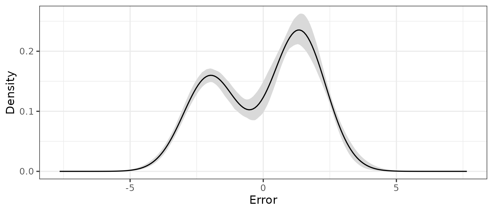
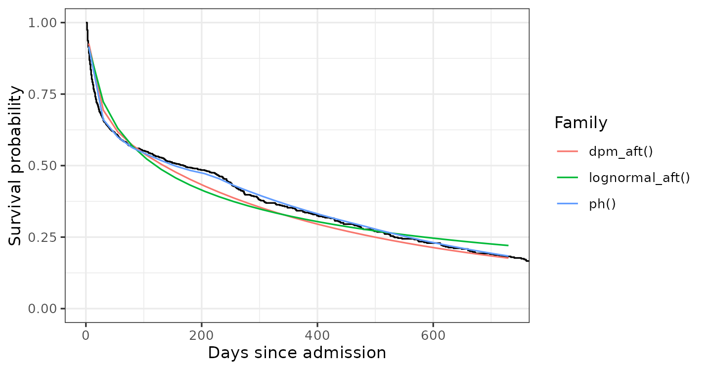
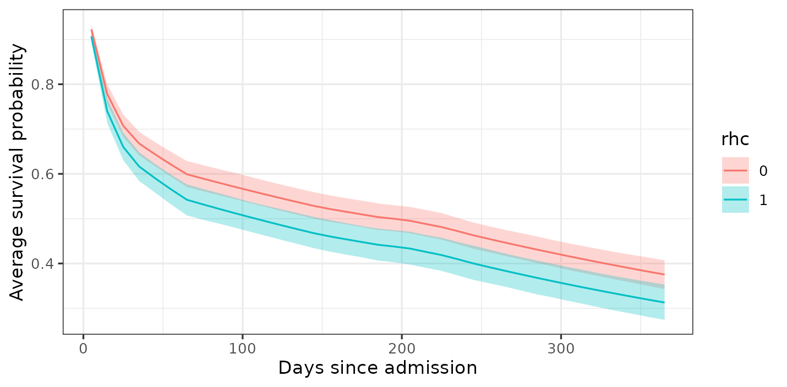

# Survival Analysis in bartisan

## Introduction

A survival outcome is the time until an event, such as death, relapse,
or the failure of a machine part, observed for some units and
right-censored for the rest, whose event had not happened by the time
they were last seen. *bartisan* fits BART models to survival outcomes
with five families. They differ in which part of the model the forest
describes and which part is given a parametric form, and so in what the
forest’s output means, but each of them yields the quantities a survival
analysis usually reports: the probability of surviving past a given
time, the median survival time, and contrasts of either between groups.

In this guide, we will analyze the survival of critically ill patients
in the `rhc` data. First we’ll describe the five families and fit one of
them. Next we’ll cover how to choose among them, by checking each fit
against the observed survival and by comparing their predictive
performance. Finally we’ll cover how to read a fit, from what its
predictor means to the survival probabilities, median survival times,
and treatment contrasts that are usually the quantities to report, and
close with a few less common needs.

``` r

library(bartisan)
library(survival)

data("rhc")
```

The `rhc` data come from the SUPPORT study of right heart
catheterization in critically ill patients ([Connors et al.
1996](#ref-connors1996)); see
[`help("rhc", package = "bartisan")`](https://ngreifer.github.io/bartisan/reference/rhc.md)
for details. The variable `days` is the number of days from admission to
death, or to last contact for a patient who did not die, and `death`
records which of the two it is. About a third of the patients (35%) are
censored, and most of them were last contacted about 210 days after
admission, so the data carry much more information about survival in the
first six months than after. The Kaplan-Meier estimate gives the
observed survival at a few times:

``` r

km <- survfit(Surv(days, death) ~ 1, data = rhc)

summary(km, times = c(30, 180, 365))
#> Call: survfit(formula = Surv(days, death) ~ 1, data = rhc)
#> 
#>  time n.risk n.event survival std.err lower 95% CI upper 95% CI
#>    30    995     513    0.658  0.0123        0.634        0.682
#>   180    705     245    0.493  0.0129        0.468        0.519
#>   365    163      91    0.342  0.0166        0.311        0.376
```

About two thirds of the patients survived 30 days and about half
survived 180, and only 163 of the 1500 were still under observation a
year after admission.

## The Survival Families

The five families that take a survival outcome are listed below. In the
table, \\T\\ is the survival time and \\\eta(x)\\ is the forest’s
output, a sum of trees in the predictors \\x\\.

| Family | Model | A difference \\\Delta\eta\\ in the predictor is | Nuisance parameters |
|----|----|----|----|
| [`dpm_aft()`](https://ngreifer.github.io/bartisan/reference/bartisan-families.md) | \\\log T = \eta(x) + W\\, with \\W\\ a Dirichlet process mixture of normals | a log time ratio | the error distribution |
| [`lognormal_aft()`](https://ngreifer.github.io/bartisan/reference/bartisan-families.md) | \\\log T = \eta(x) + \sigma\epsilon\\, with \\\epsilon\\ standard normal | a log time ratio | \\\sigma\\ |
| [`loglogistic_aft()`](https://ngreifer.github.io/bartisan/reference/bartisan-families.md) | the same, with \\\epsilon\\ standard logistic | a log time ratio | \\\sigma\\ |
| [`weibull_aft()`](https://ngreifer.github.io/bartisan/reference/bartisan-families.md) | the same, with \\\epsilon\\ standard smallest extreme value | a log time ratio, and \\-\Delta\eta/\sigma\\ is a log hazard ratio | \\\sigma\\ |
| [`ph()`](https://ngreifer.github.io/bartisan/reference/bartisan-families.md) | \\\lambda(t \mid x) = \lambda_0(t)\exp\\\eta(x)\\\\, with \\\lambda_0\\ piecewise constant | a log hazard ratio | \\\lambda_0\\, one value per bin |

The first four are accelerated failure time models, which describe the
log of the survival time. A difference in the predictor stretches or
compresses the time axis: if two patients’ predictors differ by
\\\Delta\eta\\, every quantile of the second patient’s survival time is
\\e^{\Delta\eta}\\ times the first’s, which is the time ratio. The last
is a proportional hazards model, which describes the hazard (i.e., the
rate at which the event occurs among those who have survived so far) as
a baseline hazard \\\lambda_0(t)\\ shared by all patients, multiplied by
\\e^{\eta(x)}\\. A difference of \\\Delta\eta\\ there multiplies the
hazard by \\e^{\Delta\eta}\\ at every time, which is the hazard ratio.
So a larger predictor means longer survival in the first four families
and shorter survival in the last.

In both structures the forest lets the effect of each predictor depend
on the values of the others, so, unlike in
[`survival::survreg()`](https://rdrr.io/pkg/survival/man/survreg.html)
or [`survival::coxph()`](https://rdrr.io/pkg/survival/man/coxph.html)
with a linear predictor, nothing has to be specified about interactions
or the shape of each relationship. What each structure still assumes is
the form in which the predictors act on survival: as a stretch of the
time axis, or as a multiple of the hazard that is the same at every
time.

The families also differ in the shapes the hazard can take over time.
[`weibull_aft()`](https://ngreifer.github.io/bartisan/reference/bartisan-families.md)
has a monotone hazard, which can rise, fall, or stay flat but cannot
change direction, and it is the one family that is both an accelerated
failure time model and a proportional hazards model.
[`lognormal_aft()`](https://ngreifer.github.io/bartisan/reference/bartisan-families.md)
and
[`loglogistic_aft()`](https://ngreifer.github.io/bartisan/reference/bartisan-families.md)
allow a hazard that rises and then falls, the log-logistic with the
heavier tails of the two.
[`dpm_aft()`](https://ngreifer.github.io/bartisan/reference/bartisan-families.md)
estimates the distribution of the error rather than assuming one
([Henderson et al. 2020](#ref-henderson2020)), so its hazard can take
shapes that none of the three parametric families can, including those
of a survival time with more than one mode.
[`ph()`](https://ngreifer.github.io/bartisan/reference/bartisan-families.md)
is a proportional hazards model like the Cox model, but with the
baseline hazard estimated as a step function rather than left
unspecified ([Basak et al. 2024](#ref-basak2024)), so the baseline can
take any shape.

[`lognormal_aft()`](https://ngreifer.github.io/bartisan/reference/bartisan-families.md)
and
[`loglogistic_aft()`](https://ngreifer.github.io/bartisan/reference/bartisan-families.md)
are the fastest to fit,
[`dpm_aft()`](https://ngreifer.github.io/bartisan/reference/bartisan-families.md)
is close behind, and
[`weibull_aft()`](https://ngreifer.github.io/bartisan/reference/bartisan-families.md)
and
[`ph()`](https://ngreifer.github.io/bartisan/reference/bartisan-families.md)
take several times longer, though none is slow enough at sample sizes
like this one for the cost to decide the choice.

## Fitting a Model

The response is given as `Surv(time, status)` using
[`survival::Surv()`](https://rdrr.io/pkg/survival/man/Surv.html), with
the observed times, which must be positive, as its first argument, and
as its second an indicator that is 1 for an event and 0 for a censored
observation; a two-column matrix of the same (e.g.,
`cbind(days, death)`) can be supplied instead. Only right censoring is
supported. As in
[`survival::coxph()`](https://rdrr.io/pkg/survival/man/coxph.html) and
other standard survival models, censoring is assumed to be independent
of the event time given the predictors.

Below, we fit a model for the time to death with catheterization (`rhc`)
and the covariates as predictors.
[`dpm_aft()`](https://ngreifer.github.io/bartisan/reference/bartisan-families.md)
is the family used when a `Surv` response is given and the `family`
argument is omitted; naming it, as we do here, silences the message that
reports the choice.

``` r

set.seed(2026)

# Fit a BART accelerated failure time model whose error
# distribution is a Dirichlet process mixture of normals
fit_dpm <- bartisan(Surv(days, death) ~ rhc + age + sex + race + edu + aps +
                      meanbp + resp + hema + pafi + paco2 + crea + surv2m +
                      card,
                    data = rhc, family = dpm_aft())

fit_dpm
#> Generalized BART
#> 
#> Call:
#> bartisan(formula = Surv(days, death) ~ rhc + age + sex + race + 
#>     edu + aps + meanbp + resp + hema + pafi + paco2 + crea + 
#>     surv2m + card, data = rhc, family = dpm_aft())
#> 
#> Family: "dpm_aft" with the "identity" link
#> Observations: 1500
#> Structure: 1 forest of 50 trees, soft decision rules
#> Draws: 800 kept after 200 warmup
#> 
#> Posterior means: alpha = 0.764, clusters = 5.2, center = 0.464, error_sd = 1.91
```

The last line of the output reports the posterior means of the
parameters of the error distribution, such as the number of mixture
components in use (`clusters`);
[`error_density()`](https://ngreifer.github.io/bartisan/reference/error_density.md),
below, shows the distribution itself. Prior weights (e.g., sampling
weights) can be supplied through the `weights` argument for every
survival family except
[`dpm_aft()`](https://ngreifer.github.io/bartisan/reference/bartisan-families.md),
which does not accept them.

The fits in this vignette use the default single chain for brevity.
Normally, we would run several chains, possibly change the number of
burn-in and retained draws, and examine convergence diagnostics to make
sure the model was fit correctly; see
[`vignette("diagnostics")`](https://ngreifer.github.io/bartisan/articles/diagnostics.md)
for how to set these fit controls and check them.

## Choosing a Family

The choice of family is a choice of assumptions, and substantive
knowledge about how the predictors act on survival, or about the shape
of the hazard, is worth using where it exists. The quantity to be
reported can also narrow the choice: a hazard ratio can be read only
from
[`ph()`](https://ngreifer.github.io/bartisan/reference/bartisan-families.md)
and
[`weibull_aft()`](https://ngreifer.github.io/bartisan/reference/bartisan-families.md),
and a time ratio only from the accelerated failure time families.
Survival probabilities and median survival times are available from
every family, and when they are the quantities of interest, the families
can be compared on how well each one describes the data.

Without a reason to prefer one, we recommend fitting both
[`dpm_aft()`](https://ngreifer.github.io/bartisan/reference/bartisan-families.md)
and
[`ph()`](https://ngreifer.github.io/bartisan/reference/bartisan-families.md),
the most flexible family within each of the two structures, and
comparing them. In simulations we ran across a range of data-generating
processes,
[`dpm_aft()`](https://ngreifer.github.io/bartisan/reference/bartisan-families.md)
came close to the correctly specified family whenever one was among the
alternatives and was far more accurate than all of the others when the
error distribution was bimodal, which is why it is the default.
[`ph()`](https://ngreifer.github.io/bartisan/reference/bartisan-families.md)
was the most accurate family when the truth was a proportional hazards
model whose baseline hazard rose and then fell, which no accelerated
failure time model can represent, but
[`dpm_aft()`](https://ngreifer.github.io/bartisan/reference/bartisan-families.md)
beat it whenever the truth was an accelerated failure time model with a
non-Weibull error. In the same simulations, the families disagreed much
more about survival probabilities than about how patients were ranked by
risk, so when only the ranking matters (e.g., to identify the patients
at highest risk), the choice of family matters much less.

Below, we fit
[`ph()`](https://ngreifer.github.io/bartisan/reference/bartisan-families.md)
to the same data, and
[`lognormal_aft()`](https://ngreifer.github.io/bartisan/reference/bartisan-families.md)
for reference, by updating the original call with a new family:

``` r

set.seed(2026)
fit_ph <- update(fit_dpm, family = ph())

set.seed(2026)
fit_ln <- update(fit_dpm, family = lognormal_aft())
```

### The Error Distribution (`error_density()`)

A
[`dpm_aft()`](https://ngreifer.github.io/bartisan/reference/bartisan-families.md)
fit estimates the distribution of its error \\W\\, and
[`error_density()`](https://ngreifer.github.io/bartisan/reference/error_density.md)
returns the posterior of that density on a grid of values, which its
[`plot()`](https://rdrr.io/r/graphics/plot.default.html) method draws
with a pointwise 95% credible interval:

``` r

plot(error_density(fit_dpm))
```



The density has two well separated modes: patients with the same
covariates tend either to die within weeks of admission or to survive
for many months, with fewer in between. No normal distribution, which
[`lognormal_aft()`](https://ngreifer.github.io/bartisan/reference/bartisan-families.md)
assumes for the error, can take that shape, and neither can the logistic
or smallest extreme value distributions of the other two parametric
families.

### Predicted and Observed Survival

A useful check of a survival model is whether it reproduces the observed
survival curve. [`predict()`](https://rdrr.io/r/stats/predict.html) with
`type = "survival"` returns each patient’s predicted probability of
surviving past each of the times given in `times`, and averaging these
over the patients gives the survival curve the model implies for the
sample, which can be compared with the Kaplan-Meier estimate computed
above[^1]. Below, we compute that average curve for each of the three
fits and plot them over the Kaplan-Meier estimate, which is in black:

``` r

library(ggplot2)

times <- seq(5, 730, by = 25)

# A fit's predicted survival curve, averaged over the patients
avg_curve <- function(fit, family) {
  data.frame(family = family, time = times,
             surv = colMeans(predict(fit, type = "survival",
                                     times = times)))
}

curves <- rbind(avg_curve(fit_dpm, "dpm_aft()"),
                avg_curve(fit_ln, "lognormal_aft()"),
                avg_curve(fit_ph, "ph()"))

ggplot(curves, aes(x = time, y = surv)) +
  geom_step(data = data.frame(time = c(0, km$time), surv = c(1, km$surv))) +
  geom_line(aes(color = family)) +
  coord_cartesian(xlim = c(0, 730), ylim = c(0, 1)) +
  labs(x = "Days since admission", y = "Survival probability",
       color = "Family")
```



The
[`ph()`](https://ngreifer.github.io/bartisan/reference/bartisan-families.md)
curve follows the Kaplan-Meier estimate closely over the whole two
years. Both accelerated failure time fits predict too few deaths in the
first two months and too many between about three months and a year, and
[`dpm_aft()`](https://ngreifer.github.io/bartisan/reference/bartisan-families.md),
with its estimated error, is the closer of the two.

### Leave-One-Out Cross-Validation (`loo()`)

Leave-one-out cross-validation compares models on how well each one
predicts every patient’s outcome from a fit that did not see it, as
described in
[`vignette("comparison")`](https://ngreifer.github.io/bartisan/articles/comparison.md).
The accelerated failure time families report the density of the log time
and
[`ph()`](https://ngreifer.github.io/bartisan/reference/bartisan-families.md)
reports the density of the time itself, so a comparison across the two
kinds needs `scale = "time"` in every call to
[`loo()`](https://mc-stan.org/loo/reference/loo.html), which puts each
model on the scale of the time:

``` r

library(loo)

loo_fits <- loo_compare(list(dpm_aft   = loo(fit_dpm, scale = "time"),
                             lognormal = loo(fit_ln,  scale = "time"),
                             ph        = loo(fit_ph,  scale = "time")))

loo_fits
#>      model elpd_diff se_diff p_worse diag_diff       diag_elpd
#>         ph       0.0     0.0      NA           1 k_psis > 0.66
#>    dpm_aft     -36.9    13.1    1.00                          
#>  lognormal     -82.5    15.0    1.00
```

[`ph()`](https://ngreifer.github.io/bartisan/reference/bartisan-families.md)
predicts best, ahead of
[`dpm_aft()`](https://ngreifer.github.io/bartisan/reference/bartisan-families.md)
by 37 points with a standard error of 13, and
[`dpm_aft()`](https://ngreifer.github.io/bartisan/reference/bartisan-families.md)
is in turn well ahead of
[`lognormal_aft()`](https://ngreifer.github.io/bartisan/reference/bartisan-families.md).
Any flags in the last column mark patients whose leave-one-out estimates
are unreliable (see
[`vignette("comparison")`](https://ngreifer.github.io/bartisan/articles/comparison.md)),
and an unreliable estimate for one or two patients does not change a
difference of 2.8 standard errors. The two checks agree: the
proportional hazards structure describes these data better than the
accelerated failure time structure, even with the error distribution
estimated, so we use
[`ph()`](https://ngreifer.github.io/bartisan/reference/bartisan-families.md)
for the rest of this vignette.

## Interpreting a Fit

Every family supports the same predictions, which
[`predict()`](https://rdrr.io/r/stats/predict.html) returns through its
`type` argument and [*marginaleffects*](https://marginaleffects.com/)
averages and contrasts. We use the
[`ph()`](https://ngreifer.github.io/bartisan/reference/bartisan-families.md)
fit below and point out where another family would differ.

### The Additive Predictor (`type = "link"`)

[`predict()`](https://rdrr.io/r/stats/predict.html) with `type = "link"`
returns the additive predictor \\\eta(x)\\, and as described above, a
difference between two patients’ predictors is a log time ratio in the
accelerated failure time families and a log hazard ratio in
[`ph()`](https://ngreifer.github.io/bartisan/reference/bartisan-families.md).
The same holds for one patient whose covariates are changed: the
difference between the predictor at a patient’s covariates and at the
same covariates with one variable changed is the log hazard ratio (or
log time ratio) for that change at that patient’s covariates. Because
the forest lets the effect of each variable depend on the others, that
ratio can differ from one patient to another, unlike in
[`survival::coxph()`](https://rdrr.io/pkg/survival/man/coxph.html) or
[`survival::survreg()`](https://rdrr.io/pkg/survival/man/survreg.html)
with a linear predictor; the section on time ratios and hazard ratios
below computes one per patient.

A single value of the predictor is harder to read. In
[`ph()`](https://ngreifer.github.io/bartisan/reference/bartisan-families.md),
multiplying the baseline hazard by a constant and subtracting the log of
that constant from the predictor leaves the model unchanged, so the data
determine only differences between predictors. The fit therefore reports
the predictor centered, with mean zero over the patients in every draw:
a single value is a log hazard ratio against a patient whose predictor
is at that average, and the baseline hazards in `fit$aux` are that
patient’s. In the accelerated failure time families, \\e^{\eta}\\ is a
summary of the patient’s survival time, but a different summary in each
family, because each fixes the location of its error differently:

| Family | \\e^{\eta}\\ is |
|----|----|
| [`lognormal_aft()`](https://ngreifer.github.io/bartisan/reference/bartisan-families.md), [`loglogistic_aft()`](https://ngreifer.github.io/bartisan/reference/bartisan-families.md) | the median survival time |
| [`dpm_aft()`](https://ngreifer.github.io/bartisan/reference/bartisan-families.md) | the geometric mean survival time, \\\exp(E\[\log T \mid x\])\\ |
| [`weibull_aft()`](https://ngreifer.github.io/bartisan/reference/bartisan-families.md) | the Weibull scale, the time by which the probability of the event has reached \\1 - e^{-1} \approx .632\\ |

For these reasons, we recommend reading a fit through the quantities
below, which mean the same thing for every family.

### Survival Probabilities (`type = "survival"`)

[`predict()`](https://rdrr.io/r/stats/predict.html) with
`type = "survival"` returns each patient’s posterior mean probability of
surviving past each time in `times`, one column per time. Below, we
request the probabilities of surviving 30 and 180 days:

``` r

surv_pred <- predict(fit_ph, type = "survival", times = c(30, 180))

head(surv_pred)
#>          30    180
#> [1,] 0.5838 0.3679
#> [2,] 0.5849 0.3693
#> [3,] 0.8783 0.7853
#> [4,] 0.7847 0.6366
#> [5,] 0.8143 0.6832
#> [6,] 0.7920 0.6481
```

The first patient, for example, has a predicted 58% chance of surviving
30 days and a 37% chance of surviving 180 days. Setting `draws = TRUE`
returns the posterior draws instead, as an array of draws by patients by
times, from which a credible interval can be computed for these
probabilities or for any other summary of the survival curve (e.g., the
restricted mean survival time, which is the area under the curve up to a
horizon).

The `times` argument has no default, because the horizon is part of the
question rather than a property of the fit. A horizon well inside the
follow-up is the safer choice, since survival beyond the follow-up of
most patients is estimated from few of them.

### Median Survival Times (`type = "response"`)

[`predict()`](https://rdrr.io/r/stats/predict.html) with
`type = "response"`, the default, returns each patient’s median survival
time, the time at which their predicted survival probability falls to
one half:

``` r

med <- predict(fit_ph, type = "response")

summary(med)
#>    Min. 1st Qu.  Median    Mean 3rd Qu.    Max. 
#>     9.2    55.9   206.9   240.7   390.0   860.0
```

The predicted medians run from about 9 days for the patients with the
worst prognosis to about 860 for those with the best. A median longer
than a year, which 29% of patients have, rests on the 163 patients still
under observation at a year and on the model’s extrapolation beyond
them, so for those patients a survival probability at a horizon within
the follow-up is the more reliable summary.

### Averages and Contrasts

Averages of these predictions over the patients, and contrasts of those
averages between treatment levels or other groups, are computed with
*marginaleffects* ([Arel-Bundock et al. 2024](#ref-arelbundock2024)), as
described in
[`vignette("effects")`](https://ngreifer.github.io/bartisan/articles/effects.md).
The estimates are computed from the posterior draws, so the intervals
are credible intervals. *marginaleffects* summarizes a posterior by its
median by default, and we set it to use the mean instead, which is the
summary [`predict()`](https://rdrr.io/r/stats/predict.html) and
[`estimate_effect()`](https://ngreifer.github.io/bartisan/reference/estimate_effect.md)
report:

``` r

library(marginaleffects)

options(marginaleffects_posterior_center = mean)
```

Supplying `variables = "rhc"` to
[`avg_predictions()`](https://rdrr.io/pkg/marginaleffects/man/predictions.html)
computes the prediction for every patient twice, once with `rhc` set to
0 and once with it set to 1, and averages each set over the patients.
With `type = "survival"` and `times = 180`, these are the average
probabilities of surviving 180 days without and with catheterization:

``` r

po_180 <- avg_predictions(fit_ph, variables = "rhc", type = "survival",
                          times = 180)

po_180
#> 
#>  rhc Estimate 2.5 % 97.5 %
#>    0    0.507 0.478  0.537
#>    1    0.445 0.410  0.481
#> 
#> Type: survival
```

The model predicts that 50.7% of the patients would survive 180 days if
none were catheterized, against 44.5% if all of them were.
[`avg_comparisons()`](https://rdrr.io/pkg/marginaleffects/man/comparisons.html)
computes the difference between the two:

``` r

eff_180 <- avg_comparisons(fit_ph, variables = "rhc", type = "survival",
                           times = 180)

eff_180
#> 
#>  Estimate  2.5 %  97.5 %
#>   -0.0617 -0.107 -0.0155
#> 
#> Term: rhc
#> Type: survival
#> Comparison: 1 - 0
```

Catheterizing every patient rather than none would lower the probability
of surviving 180 days by 6.2 percentage points, with a 95% credible
interval running from 1.6 to 10.7 points. Under the assumptions
described in
[`vignette("causal")`](https://ngreifer.github.io/bartisan/articles/causal.md),
this is the average effect of catheterization on 180-day survival;
without them, it is a description of what the model predicts.

*marginaleffects* warns that it does not recognize the `times` argument;
the warning is expected (it is suppressed in this vignette), and the
argument is used. Several times can be given at once, each getting its
own `group` in the output, and the other arguments of *marginaleffects*
work as they do for any model (e.g., `comparison = "ratio"` for a ratio
of survival probabilities, or `by` for the contrast within subgroups).

We recommend a contrast of survival probabilities like this one as the
main summary of a survival model. It means the same thing whichever
family produced it, so it can be compared across families, and it
contrasts averages over the sample, unlike the ratios on the scale of
the predictor described below.

With `type` left at its default,
[`avg_comparisons()`](https://rdrr.io/pkg/marginaleffects/man/comparisons.html)
contrasts median survival times, and so does
[`estimate_effect()`](https://ngreifer.github.io/bartisan/reference/estimate_effect.md),
which also prints the two average potential outcomes beneath the
contrast:

``` r

eff_med <- estimate_effect(fit_ph, treat = "rhc")

eff_med
#> Average treatment effect (difference)
#> 
#> Treatment: `rhc`
#> Averaged over 1500 units
#> 
#>     contrast estimate lower upper    n
#>  Y[1] - Y[0]    -71.5  -123 -15.2 1500
#> 
#> Average potential outcomes
#> 
#>  quantity estimate lower upper
#>      Y[0]      265   228   305
#>      Y[1]      194   153   240
#> 
#> ℹ estimate is the posterior mean; lower and upper bound the 95% equal-tailed
#>   credible interval.
#> ℹ Y[a] is the average response with `rhc` set to "a".
```

Catheterization lowers the average of the patients’ median survival
times by about 72 days. Note that `Y[0]` and `Y[1]` are averages of the
patients’ own medians, not the median survival time of the sample under
each treatment, which is the time at which the average survival curve
falls to one half. The patients with the best prognoses have long
medians that pull the average up, so the medians of the sample, which we
read from the survival curves below, are much shorter.

### Survival Curves

The average survival curve under each treatment level is the same
average taken at many times, which one call to
[`avg_predictions()`](https://rdrr.io/pkg/marginaleffects/man/predictions.html)
can do. The times are returned in the `group` column as text, so they
are converted to numbers before plotting:

``` r

curves_rhc <- avg_predictions(fit_ph, variables = "rhc", type = "survival",
                              times = seq(5, 365, by = 10))

curves_rhc$time <- as.numeric(curves_rhc$group)

ggplot(curves_rhc, aes(x = time, y = estimate, ymin = conf.low,
                       ymax = conf.high, color = factor(rhc),
                       fill = factor(rhc))) +
  geom_ribbon(alpha = .3, color = NA) +
  geom_line() +
  labs(x = "Days since admission", y = "Average survival probability",
       color = "rhc", fill = "rhc")
```



The two curves separate within the first weeks after admission and stay
apart for the rest of the year, and the gap between them at 180 days is
the contrast estimated above. Each curve falls to one half at the median
survival time of the sample under that treatment, about 190 days without
catheterization and 110 days with it, well short of the averages of the
patients’ medians that
[`estimate_effect()`](https://ngreifer.github.io/bartisan/reference/estimate_effect.md)
reported.

### Time Ratios and Hazard Ratios

Contrasts on the scale of the predictor give the comparative quantities
familiar from parametric survival models: a log hazard ratio for
[`ph()`](https://ngreifer.github.io/bartisan/reference/bartisan-families.md)
and a log time ratio for the accelerated failure time families. Because
the forest lets the effect of catheterization differ across patients,
there is one such contrast per patient, which
[`comparisons()`](https://rdrr.io/pkg/marginaleffects/man/comparisons.html)
computes when `type = "link"` is set; adding `transform = exp` reports
each as a ratio. Below, we compute the hazard ratio for catheterization
at each patient’s covariates and summarize them:

``` r

hr_unit <- comparisons(fit_ph, variables = "rhc", type = "link",
                       transform = exp)

summary(hr_unit$estimate)
#>    Min. 1st Qu.  Median    Mean 3rd Qu.    Max. 
#>    1.10    1.20    1.22    1.22    1.25    1.31
```

Each value is the factor by which catheterization multiplies that
patient’s hazard of death, at every time, with the patient’s other
covariates held where they are. Their posterior means run from about
1.10 to 1.31, and 83% of the patients’ 95% credible intervals include 1,
which is the usual picture: the effect at one patient’s covariates is
estimated from far less information than an average over all of them.
Setting `type = "link"` in
[`avg_comparisons()`](https://rdrr.io/pkg/marginaleffects/man/comparisons.html)
averages the log hazard ratios over the patients instead, and adding
`transform = exp` reports the average as a ratio:

``` r

hr <- avg_comparisons(fit_ph, variables = "rhc", type = "link",
                      transform = exp)

hr
#> 
#>  Estimate 2.5 % 97.5 %
#>      1.22  1.05   1.41
#> 
#> Term: rhc
#> Type: link
#> Comparison: 1 - 0
```

Averaged over the patients on the log scale, catheterization multiplies
a patient’s hazard of death by about 1.22. The same call on the
[`dpm_aft()`](https://ngreifer.github.io/bartisan/reference/bartisan-families.md)
fit gives a time ratio, the factor by which catheterization multiplies a
patient’s survival time:

``` r

tr <- avg_comparisons(fit_dpm, variables = "rhc", type = "link",
                      transform = exp)

tr
#> 
#>  Estimate 2.5 % 97.5 %
#>      0.82 0.676  0.999
#> 
#> Term: rhc
#> Type: link
#> Comparison: 1 - 0
```

Under that model, catheterization multiplies survival times by about
0.82, shortening them by about 18%. Both are summaries of conditional
contrasts, each computed at a patient’s own covariate values, and
neither is the ratio that would compare the two average survival curves.
For a hazard ratio the two differ even when the effect is the same for
every patient, because the hazard ratio is noncollapsible. A contrast of
survival probabilities has neither difficulty, which is the reason we
recommend it above.

## Additional Topics

### The Baseline Hazard Grid (`num_bins`)

[`ph()`](https://ngreifer.github.io/bartisan/reference/bartisan-families.md)
represents the baseline hazard as a step function whose steps begin at
evenly spaced quantiles of the observed times, with a hazard drawn for
each step and reported in `fit$aux` as `lambda1`, `lambda2`, and so on.
The number of steps is set by the `num_bins` argument, and by default it
is about the cube root of the sample size, which is 12 here. The
estimates are not sensitive to it: in our simulations, the accuracy of
the fitted survival curves was essentially unchanged from 4 bins to 100,
and only well beyond that did the extra parameters begin to cost
accuracy. So the default is best left alone, and the `num_bins` argument
is there for confirming that on one’s own data (e.g., by refitting with
two or three times as many bins and checking that the estimates agree)
rather than for tuning.

### Covariate Effects That Change Over Time

Every family above assumes that the predictors act on survival the same
way at every time, by stretching the time axis or by multiplying the
hazard by a constant, so none of them can produce survival curves that
cross (e.g., for a treatment that raises the risk of death early on but
lowers it later). When an effect like that is plausible, a discrete-time
model can be used instead ([Sparapani et al. 2016](#ref-sparapani2016)).
The data are expanded to one row per patient per interval of a time
grid, up to the interval in which the patient’s time falls, and a binary
model for whether the event occurred in each interval is fit with the
interval as one of the predictors. Because the forest can then make the
effect of any predictor depend on the interval, nothing is assumed about
how the effect changes over time. Below are the expansion, with
intervals beginning at quantiles of the death times, and the fit:

``` r

# Interval edges at quantiles of the observed death times
edges <- quantile(rhc$days[rhc$death == 1], seq(.05, .95, length.out = 15))

# How many intervals each patient's time reaches
reached <- pmax(findInterval(rhc$days, edges), 1)

# One row per patient per interval reached, with the event, if
# there was one, in the last of them
long <- rhc[rep(seq_len(nrow(rhc)), reached), ]
long$interval <- sequence(reached)
long$event <- 0
long$event[cumsum(reached)] <- rhc$death

fit_dt <- bartisan(event ~ interval + rhc + age + sex + race + edu + aps +
                     meanbp + resp + hema + pafi + paco2 + crea + surv2m +
                     card,
                   data = long, family = binomial("probit"))
```

The probability of surviving to the end of an interval is the running
product of one minus the fitted probability of the event in that
interval and in every interval before it, which
[`predict()`](https://rdrr.io/r/stats/predict.html) gives on rows of a
patient’s data with `interval` set to each value.

The route has its costs. The expanded data are about nine times as large
as the original here, so the fit is slower; the grid sets how finely the
hazard can change over time; and because *bartisan* treats the model as
an ordinary binary one, the survival predictions above do not apply to
it. In our simulations, it was also less accurate than
[`ph()`](https://ngreifer.github.io/bartisan/reference/bartisan-families.md)
when the hazards were in fact proportional, since the forest has to
learn the baseline hazard from splits on the interval. So it is worth
using when there is a substantive reason to expect an effect that
changes over time, rather than as a precaution.

### Treatment Effects (`bcf()`)

[`bcf()`](https://ngreifer.github.io/bartisan/reference/bcf.md) accepts
the survival families as well, fitting the Bayesian causal forest
described in
[`vignette("causal")`](https://ngreifer.github.io/bartisan/articles/causal.md),
in which the effect of the treatment on the scale of the predictor
(e.g., the log hazard ratio for
[`ph()`](https://ngreifer.github.io/bartisan/reference/bartisan-families.md))
gets a forest of its own. The quantities above are computed from such a
fit the same way:
[`estimate_effect()`](https://ngreifer.github.io/bartisan/reference/estimate_effect.md)
contrasts median survival times, and
[`avg_comparisons()`](https://rdrr.io/pkg/marginaleffects/man/comparisons.html)
with `type = "survival"` contrasts survival probabilities at a horizon.

## Further Reading

[`?predict.bartisan_fit`](https://ngreifer.github.io/bartisan/reference/predict.bartisan_fit.md)
documents every prediction scale, and
[`help("bartisan-marginaleffects")`](https://ngreifer.github.io/bartisan/reference/bartisan-marginaleffects.md)
the estimands computed from them.
[`vignette("comparison")`](https://ngreifer.github.io/bartisan/articles/comparison.md)
covers leave-one-out cross-validation in more depth, including its
diagnostics and the K-fold alternative, and
[`vignette("causal")`](https://ngreifer.github.io/bartisan/articles/causal.md)
covers the assumptions under which a contrast like the effect of
catheterization above can be read as causal.
[`vignette("families")`](https://ngreifer.github.io/bartisan/articles/families.md)
covers the families for every other kind of response.

## References

Arel-Bundock, Vincent, Noah Greifer, and Andrew Heiss. 2024. “How to
Interpret Statistical Models Using marginaleffects for R and Python.”
*Journal of Statistical Software* 111 (9): 1–32.
<https://doi.org/10.18637/jss.v111.i09>.

Basak, Piyali, Antonio R. Linero, Camille Maringe, and F. Javier Rubio.
2024. “Relative Survival Analysis Using Bayesian Decision Tree
Ensembles.” *arXiv Preprint*, ahead of print.
<https://doi.org/10.48550/arXiv.2411.01435>.

Connors, Alfred F., Theodore Speroff, Neal V. Dawson, et al. 1996. “The
Effectiveness of Right Heart Catheterization in the Initial Care of
Critically Ill Patients.” *JAMA* 276 (11): 889–97.
<https://doi.org/10.1001/jama.1996.03540110043030>.

Henderson, Nicholas C., Thomas A. Louis, Gary L. Rosner, and Ravi
Varadhan. 2020. “Individualized Treatment Effects with Censored Data via
Fully Nonparametric Bayesian Accelerated Failure Time Models.”
*Biostatistics* 21 (1): 50–68.
<https://doi.org/10.1093/biostatistics/kxy028>.

Sparapani, Rodney A., Brent R. Logan, Robert E. McCulloch, and
Purushottam W. Laud. 2016. “Nonparametric Survival Analysis Using
Bayesian Additive Regression Trees (BART).” *Statistics in Medicine* 35
(16): 2741–53. <https://doi.org/10.1002/sim.6893>.

[^1]: The Kaplan-Meier estimate requires censoring to be independent of
    the survival time without conditioning on the covariates, which is a
    stronger assumption than the one the models make, so it is a
    reference to check them against rather than a truth they must match.
