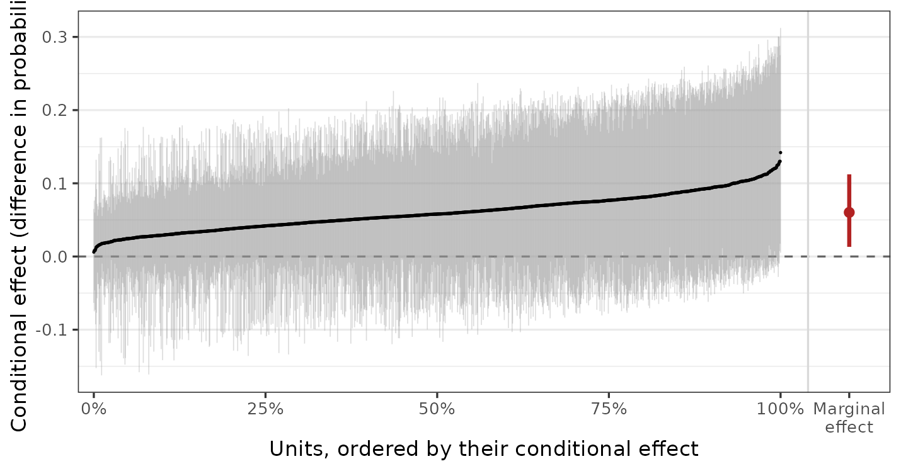
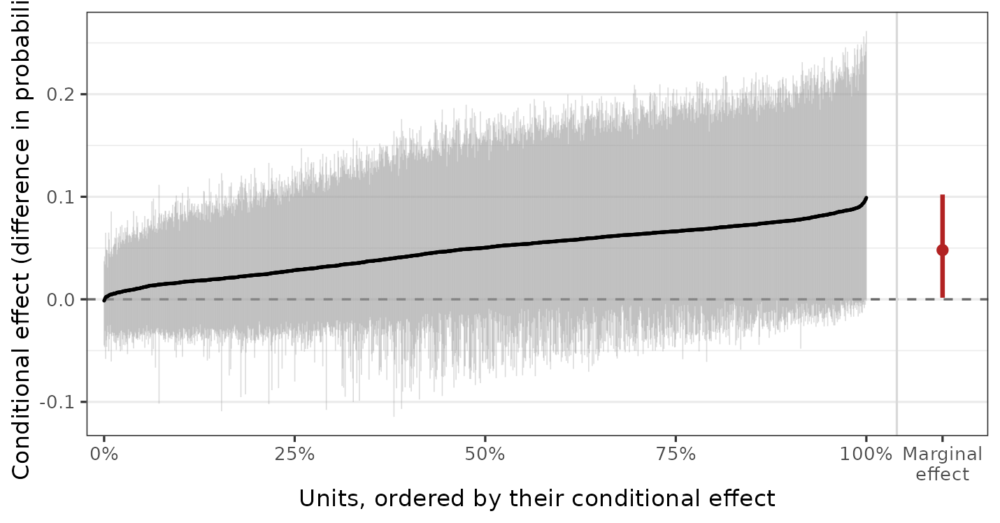

# Varying Coefficients and Random Intercepts

## Introduction

A BART model is a sum of trees, and a sum of trees has no coefficients.
It predicts, and an effect is read off it as a contrast between two
predictions, which is what
[`estimate_effect()`](https://ngreifer.github.io/bartisan/reference/estimate_effect.md)
and the *marginaleffects* functions in
[`vignette("effects")`](https://ngreifer.github.io/bartisan/articles/effects.md)
do. That is the right reading for most predictors. For some, though, we
want the effect to *be* a parameter: something with a prior of its own,
a posterior of its own, and a value we can report as a coefficient
rather than reconstruct as a difference. The treatment in a causal
analysis is the usual case, and so is any predictor whose effect is the
whole point of the model.

[`vc()`](https://ngreifer.github.io/bartisan/reference/vc.md) is how a
predictor is given a coefficient in *bartisan*, and the coefficient it
gets is a function rather than a number: a forest of its own that says
how the effect moves with the other predictors. This is the
varying-coefficient model of Deshpande et al.
([2026](#ref-deshpande2026)), of which the Bayesian causal forest of
Hahn et al. ([2020](#ref-hahn2020)) is the case of one binary covariate
and Woody et al. ([2020](#ref-woody2020)) the case of one continuous
one. [`bcf()`](https://ngreifer.github.io/bartisan/reference/bcf.md)
fits that special case with the settings the causal problem wants, and
this guide is where the general model is described.

In this guide we will write the model down and say what each of its
parts is, then declare a varying coefficient with
[`vc()`](https://ngreifer.github.io/bartisan/reference/vc.md) and work
through its three arguments: which predictors the coefficient varies
with, where the control function is read, and what happens when the
coefficient is not allowed to vary at all, which is how a linear term is
written into an otherwise nonparametric model. Next we’ll read the fit,
both as coefficients and as effects, and see how the settings of a fit
are keyed by forest once there is more than one. Then we’ll show how
[`bcf()`](https://ngreifer.github.io/bartisan/reference/bcf.md) writes
its model in these terms. Finally, because they are declared in the same
formula and explained nowhere else, we’ll cover random intercepts.

Throughout we use the `rhc` dataset (see
[`vignette("bartisan")`](https://ngreifer.github.io/bartisan/articles/bartisan.md)
or
[`help("rhc", package = "bartisan")`](https://ngreifer.github.io/bartisan/reference/rhc.md)),
predicting `death` from the covariates and from `rhc`, whether the
patient received right heart catheterization. The fits use the default
single chain;
[`vignette("diagnostics")`](https://ngreifer.github.io/bartisan/articles/diagnostics.md)
covers checking convergence, which we skip here for brevity.

``` r

library(bartisan)

data("rhc")
```

## The Model

A model with varying coefficients is

\\g(\mu_i) = f_0(Z_i) + \sum_j (X\_{ij} - c_j)\\ f_j(Z_i)\\

where \\g\\ is the link, \\Z_i\\ is the vector of predictors, and each
\\X\_{ij}\\ is a predictor that has been given a coefficient. \\f_0\\ is
a forest we will call the **control function**, following Hahn et al.
([2020](#ref-hahn2020)): the surface for the outcome when every \\X_j\\
is at its centering value \\c_j\\. Each \\f_j\\ is a forest of its own,
and it is the coefficient on \\X_j\\: how much the linear predictor
moves per unit of \\X_j\\, as a function of whatever \\f_j\\ is allowed
to split on. With a single binary \\X\\, \\f_1\\ is the conditional
treatment effect on the link scale, one value per covariate profile.

All of the forests are fitted at once. That is what buys a prior on the
coefficient itself. Were \\X_j\\ simply one predictor among many in a
single forest, its effect would be whatever difference that forest
happened to produce, regularized by the same prior that regularizes
everything else, and Hahn et al. ([2020](#ref-hahn2020)) show that
shrinking the prognostic surface then shrinks the effect along with it.
With \\f_j\\ separate, it can have a prior of its own, and in particular
a tighter one, since the ways an effect varies are usually simpler than
the surface it sits on.

## Declaring a Varying Coefficient (`vc()`)

[`vc()`](https://ngreifer.github.io/bartisan/reference/vc.md) is a
marker written inside the formula. It is never evaluated as a function
(calling it directly is an error) but is read out of the formula by
[`bartisan()`](https://ngreifer.github.io/bartisan/reference/bartisan.md),
which builds the forests it asks for.

``` r

set.seed(2026)

fit_vc <- bartisan(death ~ age + sex + race + edu + aps +
                     meanbp + resp + hema + pafi +
                     paco2 + crea + surv2m + card +
                     vc(rhc),
                   data = rhc, family = binomial())

fit_vc
#> Generalized BART
#> 
#> Call:
#> bartisan(formula = death ~ age + sex + race + edu + aps + meanbp + 
#>     resp + hema + pafi + paco2 + crea + surv2m + card + vc(rhc), 
#>     data = rhc, family = binomial())
#> 
#> Family: "binomial" with the "logit" link
#> Observations: 1500
#> Structure: 2 forests of 50 trees, soft decision rules
#> Draws: 800 kept after 200 warmup
```

The print shows two forests where a fit without
[`vc()`](https://ngreifer.github.io/bartisan/reference/vc.md) would show
one. These forests are the control function, named `(Intercept)`, and
the coefficient, named for its covariate. Both are fitted with the same
number of trees here, which is the default and is taken up below.

A predictor that has been given a coefficient should be kept out of the
control function. Were `rhc` among \\f_0\\’s predictors as well as
multiplying \\f_1\\, the two would not be separately identified, since
any function of `rhc` can move from one to the other without changing a
single prediction.

We can examine the structure of the forest for the `rhc` coefficient
using [`summary()`](https://rdrr.io/r/base/summary.html), which includes
a table for each forest in the model:

``` r

summary(fit_vc)
#> Generalized BART
#> 
#> Call:
#> bartisan(formula = death ~ age + sex + race + edu + aps + meanbp + 
#>     resp + hema + pafi + paco2 + crea + surv2m + card + vc(rhc), 
#>     data = rhc, family = binomial())
#> 
#> Family: "binomial" with the "logit" link
#> Observations: 1500
#> Structure: 2 forests of 50 trees, soft decision rules
#> Draws: 800
#> 
#> Predictor usage
#> Splitting rules per draw, and how often used at all.
#> 
#> Predictor "(Intercept)":
#>          mean    sd lower  upper prop_used
#> age     9.807 5.448     2 23.025     1.000
#> paco2   8.586 4.770     2 21.000     1.000
#> surv2m 19.680 7.587     7 36.000     1.000
#> aps     6.207 4.572     0 18.000     0.932
#> pafi    4.781 3.338     0 13.000     0.911
#> hema    5.468 4.189     0 16.000     0.907
#> card    4.411 3.431     0 13.000     0.895
#> race    3.421 2.636     0  9.000     0.855
#> edu     2.791 2.812     0  9.000     0.739
#> meanbp  2.920 3.443     0 13.000     0.730
#> sex     2.901 2.916     0 10.000     0.725
#> crea    2.996 3.068     0 10.000     0.689
#> resp    2.118 2.478     0  8.025     0.639
#> 
#> Predictor "rhc":
#>          mean     sd lower upper prop_used
#> hema    9.485  8.290     1 34.00     0.984
#> aps    13.332 14.347     0 51.02     0.961
#> paco2   4.935  3.961     0 15.00     0.884
#> card    7.888  6.355     0 26.02     0.881
#> crea    5.249  5.043     0 19.00     0.880
#> surv2m  4.880  4.291     0 15.03     0.804
#> sex     5.505  5.161     0 18.00     0.801
#> edu     4.211  4.053     0 15.03     0.769
#> resp    3.825  3.625     0 12.00     0.755
#> pafi    3.859  3.090     0 10.00     0.754
#> meanbp  5.155  6.639     0 26.00     0.733
#> age     3.639  3.873     0 14.00     0.684
#> race    2.609  2.855     0  9.00     0.655
```

We can see that `age`, `paco2`, and `surv2m` were used in every tree in
the control function (`(Intercept)`) forest, but `hema` was the most
frequently used predictor in the varying coefficient (`rhc`) forest.

### Effect Modifiers (`modifiers`)

By default, a coefficient is allowed to vary with every predictor in the
model except the covariate itself. Supplying an argument to `modifiers`,
the second argument to
[`vc()`](https://ngreifer.github.io/bartisan/reference/vc.md) taking a
one-sided formula, allows one to control which predictors enter the
coefficient forest.

``` r

set.seed(2026)

fit_aps <- bartisan(death ~ age + sex + race + edu + aps +
                      meanbp + resp + hema + pafi +
                      paco2 + crea + surv2m + card +
                      vc(rhc, ~ aps + age),
                    data = rhc, family = binomial())
```

Now the effect of catheterization may differ by severity of illness
(`aps`), `age`, and nothing else, which is a statement about the model
and not a restriction the data can undo. Restricting the modifiers is
worth doing when there is reason to think the effect depends only on a
few specific predictors, since a forest asked to search fourteen
predictors for heterogeneity that lives in two will spend some of its
prior on the other twelve.

Calling [`summary()`](https://rdrr.io/r/base/summary.html) on `fit_aps`,
we can see that the only variables used in the varying coefficient
forest are indeed `aps` and `age`, as requested:

``` r

summary(fit_aps)
#> Generalized BART
#> 
#> Call:
#> bartisan(formula = death ~ age + sex + race + edu + aps + meanbp + 
#>     resp + hema + pafi + paco2 + crea + surv2m + card + vc(rhc, 
#>     ~aps + age), data = rhc, family = binomial())
#> 
#> Family: "binomial" with the "logit" link
#> Observations: 1500
#> Structure: 2 forests of 50 trees, soft decision rules
#> Draws: 800
#> 
#> Predictor usage
#> Splitting rules per draw, and how often used at all.
#> 
#> Predictor "(Intercept)":
#>          mean     sd lower upper prop_used
#> age    10.666  6.365     3    28     1.000
#> pafi    7.726  5.283     1    21     1.000
#> surv2m 21.008 12.399     7    52     1.000
#> paco2   6.676  4.327     1    17     0.986
#> aps     6.971  6.712     0    27     0.930
#> crea    6.746  5.745     0    22     0.889
#> meanbp  3.087  3.506     0    14     0.740
#> race    3.476  3.649     0    12     0.729
#> hema    2.631  2.916     0     9     0.620
#> card    1.866  2.427     0     8     0.603
#> edu     1.866  2.164     0     7     0.588
#> sex     1.826  2.329     0     8     0.552
#> resp    1.484  2.077     0     7     0.498
#> 
#> Predictor "rhc":
#>         mean    sd lower upper prop_used
#> age    55.78 17.51 18.98    85     1.000
#> aps    19.67 16.93  0.00    54     0.796
#> sex     0.00  0.00  0.00     0     0.000
#> race    0.00  0.00  0.00     0     0.000
#> edu     0.00  0.00  0.00     0     0.000
#> meanbp  0.00  0.00  0.00     0     0.000
#> resp    0.00  0.00  0.00     0     0.000
#> hema    0.00  0.00  0.00     0     0.000
#> pafi    0.00  0.00  0.00     0     0.000
#> paco2   0.00  0.00  0.00     0     0.000
#> crea    0.00  0.00  0.00     0     0.000
#> surv2m  0.00  0.00  0.00     0     0.000
#> card    0.00  0.00  0.00     0     0.000
```

When the modified variable is continuous, `modifiers` decides whether
the effect is linear in the covariate. As written, the model is \\z\\
f_1(Z)\\, which for a binary \\z\\ is no assumption at all, there being
only two values, and for a continuous one says the effect is
conditionally linear. That is a real restriction, and a numeric
covariate is allowed to modify its own coefficient to remove it:

``` r

# The effect of `aps` may itself change across `aps`, so the dose response is
# a curve rather than a line through the origin
bartisan(death ~ age + sex + vc(aps, ~ . + aps),
         data = rhc, family = binomial())
```

This fits \\\text{aps} \cdot f_1(\text{aps},\\ \text{age},\\
\text{sex})\\, so the slope moves across the range of `aps`, and it is
worth reaching for whenever the effect of a continuous predictor might
not be proportional to it. A categorical covariate is removed from its
own forests instead: a level’s indicator is nonzero only on the rows
where that level holds, and the variable is constant on exactly those
rows, so a split on it would separate rows that contribute from rows
that contribute nothing.

### Centering the Covariate (`center`)

The \\c_j\\ in the model are the values at which the control function is
read, and `center` chooses them. This is a reparameterization of \\f_0\\
alone: every coefficient and every estimand is identical under any
choice, and what changes is what the control function means and how well
the two forests mix. The default, `"auto"`, picks by the covariate. A
`0`/`1` covariate is left at zero, so \\f_0\\ is the surface among the
binary predictor’s reference level, which is a quantity with a meaning
of its own. Any other numeric covariate is centered at its mean, because
zero may be nowhere near the data and a control function read there
would be an extrapolation. `"zero"`, `"mean"`, `"mid"` (the midpoint of
the range), or a specific number override that.

A factor is handled differently. It is always fitted mean-centered and
gets one forest per level, coded symmetrically rather than as contrasts
against whichever level happened to sort first, and
[`coef()`](https://rdrr.io/r/stats/coef.html) recenters the coefficients
to sum to zero across the levels. That coding leaves the reference level
a reporting choice: `center` names the level to report against, and no
refit is needed to change it.

`center = "estimate"` is different in kind. Rather than subtract a
number from the covariate, it gives each of the covariate’s values a
coefficient of its own and *draws* it, so that every contrast carries
the same prior whatever the number of values and no value is a
reference. At two values it restricts nothing, and it is what
[`bcf()`](https://ngreifer.github.io/bartisan/reference/bcf.md) uses for
a binary treatment: what it buys is that the answer stops depending on
which arm was written as 1. Above two values every contrast becomes one
shared shape times a scalar, where the symmetric coding gives each level
its own, so it is the parsimonious model against a general one, and the
one to reach for when the levels plausibly differ in degree rather than
in kind. It needs a covariate with between two and twenty distinct
values, and a family whose leaf target is quadratic in the predictor it
feeds, which is why
[`bcf()`](https://ngreifer.github.io/bartisan/reference/bcf.md) falls
back to the fixed coding for a family that is not.

### A Constant Coefficient (`vc(z, ~ 1)`)

Naming no modifier at all leaves the coefficient’s forest nothing to
split on. Every tree in it is then a stump, the coefficient is a single
drawn number, and the covariate enters the model as a linear term while
everything else stays nonparametric. That is the semiparametric case of
the General BART model of Tan and Roy ([2019](#ref-tan2019)), a forest
and a parametric part taking disjoint sets of predictors, and it is the
shape *stan4bart* and *flexBART* fit[^1].

Comparing the constant coefficient against the varying one is a question
neither variable importance nor a dropped predictor answers: not whether
`rhc` matters, but whether what it does depends on anything else.
[`loo_compare()`](https://mc-stan.org/loo/reference/loo_compare.html)
from *loo* answers it;
[`vignette("comparison")`](https://ngreifer.github.io/bartisan/articles/comparison.md)
covers what it is doing.

``` r

set.seed(2026)

constant <- bartisan(death ~ age + sex + race + edu + aps +
                       meanbp + resp + hema + pafi +
                       paco2 + crea + surv2m + card +
                       vc(rhc, ~ 1),
                     data = rhc, family = binomial())

constant
#> Generalized BART
#> 
#> Call:
#> bartisan(formula = death ~ age + sex + race + edu + aps + meanbp + 
#>     resp + hema + pafi + paco2 + crea + surv2m + card + vc(rhc, 
#>     ~1), data = rhc, family = binomial())
#> 
#> Family: "binomial" with the "logit" link
#> Observations: 1500
#> Structure: 2 forests of 50 trees, soft decision rules
#> Draws: 800 kept after 200 warmup

library(loo)
loo_compare(list(constant = loo(constant), varying = loo(fit_vc)))
#>     model elpd_diff se_diff p_worse       diag_diff diag_elpd
#>  constant       0.0     0.0      NA                          
#>   varying      -1.4     1.3    0.85 |elpd_diff| < 4
```

The constant coefficient is not beaten, so there is no evidence here
that the effect of catheterization on the log odds of death varies with
the other covariates. That buys an interpretation the varying fit cannot
offer, because one number describes the whole sample:

``` r

b <- coef(constant, draws = TRUE)[["rhc"]][, 1]

c(log_OR = mean(b),
  OR = exp(mean(b)),
  lower = quantile(exp(b), .025, names = FALSE),
  upper = quantile(exp(b), .975, names = FALSE)) |>
  round(3)
#> log_OR     OR  lower  upper 
#>  0.356  1.428  1.115  1.859
```

An odds ratio of about 1.4, conditional on the predictors in the forest.
A constant conditional odds ratio is a much more clinically meaningful
effect summary than a marginal effect measure because it describes the
estimated effect for each patient profile as determined by the included
covariates, as opposed to an average effect across a whole population.
This is the same interpretation a coefficient in a logistic regression
would have, but fit with BART, we can be reasonably confident that any
nonlinearities and interactions among covariates are adjusted for,
whereas a logistic regression must impose the model structure a
researcher believes to be there.

It is important to remember that the coefficient is drawn under the leaf
prior of its own forest and not under a prior written for a regression
coefficient, so it is shrunk toward zero and is a regularized log odds
ratio rather than a maximum likelihood one; because the leaf scale is
divided by \\\sqrt{m}\\ for a forest of \\m\\ trees, that prior does not
change with the number of trees. Also, the comparison between a fixed
and a varying coefficient is far better powered on some outcomes than
others. On a Gaussian outcome with a coefficient truly ranging from 0.3
to 2.5, the varying coefficient was easily preferred at \\n = 1000\\; on
a binary outcome with the same coefficients, both models were equally
preferred. A null result on a binary outcome at a few hundred
observations says little, and should not be read as evidence that an
effect is constant.

## Reading a Fit

### The Coefficients (`coef()`)

[`coef()`](https://rdrr.io/r/stats/coef.html) returns the varying
coefficients and nothing else. The control function is a prediction
rather than a coefficient, and
[`predict()`](https://rdrr.io/r/stats/predict.html) reports it.

``` r

head(coef(fit_vc))
#>         rhc
#> [1,] 0.5112
#> [2,] 0.2193
#> [3,] 0.2502
#> [4,] 0.3295
#> [5,] 0.3445
#> [6,] 0.3514
```

[`coef()`](https://rdrr.io/r/stats/coef.html) returns one row per
observation and one column per coefficient, which is what a coefficient
becomes when it is allowed to vary: for the first patient, or more
precisely for a patient with the first patient’s covariate profile, the
log odds of death move by 0.511 under catheterization. The values are on
the link scale, so for a binary outcome they are differences in log odds
rather than in probability. Supplying `newdata` evaluates the
coefficients at other covariate profiles, and setting `draws = TRUE`
returns every posterior draw rather than the mean, as a list with one
draws-by-observations matrix per coefficient, which is what an interval
on any one patient’s coefficient needs.

``` r

draws <- coef(fit_vc, draws = TRUE)[["rhc"]]

# A 95% interval on the coefficient for the first three patients
t(apply(draws[, 1:3], 2L, quantile, c(.025, .975)))
#>          2.5%  97.5%
#> [1,] -0.01713 1.1921
#> [2,] -0.31305 0.7657
#> [3,] -0.36013 0.8276
```

[`summary()`](https://rdrr.io/r/base/summary.html) on the fit reports
the forests as it does for any fit, and `prior_summary()` writes out the
prior each one was drawn under, including the leaf scale of the
coefficient forest, which is where the regularization that separates the
effect from the surface lives.

### Effects From the Coefficients (`estimate_effect()`)

A coefficient on the link scale is one step from an effect on the
response scale, and
[`estimate_effect()`](https://ngreifer.github.io/bartisan/reference/estimate_effect.md)
makes it easier to report meaningful contrasts. With `treat` naming the
covariate, it predicts outcomes under each of the predictor’s values and
contrasts them. Setting `estimand = "CATE"` returns one effect per unit,
here on the risk difference scale, and
[`plot()`](https://rdrr.io/r/graphics/plot.default.html) on that draws
them ordered by their estimate with the marginal effect as a separate
interval past the right edge.

``` r

cate <- estimate_effect(fit_vc, treat = "rhc", estimand = "CATE")

plot(cate)
```



The marginal effect, effects by subgroup, or the effect as a ratio are
all the same call with different arguments. For example, setting
`comparison = "or"` displays the effects on the conditional odds ratio
scale.
[`?estimate_effect`](https://ngreifer.github.io/bartisan/reference/estimate_effect.md)
documents these arguments, and
[`vignette("causal")`](https://ngreifer.github.io/bartisan/articles/causal.md)
is where the assumptions live that turn any of them into a causal
effect.

## Settings That Vary by Forest

Every forest has its own prior, and every setting in
[`bartisan_control()`](https://ngreifer.github.io/bartisan/reference/bartisan_control.md)
that could mean something different for one forest than for another may
be given once, to apply to all, or once per forest. Given per forest,
the values are either positional in the order the forests are listed in
the fit’s print, or keyed by the forest names. Both of these ask for
fifty trees in the control function and twenty-five in the coefficient:

``` r

bartisan(death ~ age + sex + race + edu + aps +
           meanbp + resp + hema + pafi +
           paco2 + crea + surv2m + card +
           vc(rhc),
         data = rhc, family = binomial(), num_trees = c(50L, 25L))

bartisan(death ~ age + sex + race + edu + aps +
           meanbp + resp + hema + pafi +
           paco2 + crea + surv2m + card +
           vc(rhc),
         data = rhc, family = binomial(),
         num_trees = c("(Intercept)" = 50L, rhc = 25L))
```

A forest a named argument does not mention keeps that argument’s own
default rather than borrowing another forest’s value. The settings this
covers are `num_trees`, `k`, `sigma_mu`, `sparsity`, `split_prior`,
`bandwidth`, `gamma`, `beta`, the four `alpha` arguments, and the three
`update_` flags;
[`?bartisan_control`](https://ngreifer.github.io/bartisan/reference/bartisan_control.md)
lists them.

Fewer trees for a coefficient than for the control function is the
setting worth knowing about, and it is the one
[`bcf()`](https://ngreifer.github.io/bartisan/reference/bcf.md) makes by
default. A coefficient forest describes how an effect varies, and that
is usually a simpler surface than the outcome’s, so it needs less
capacity; and with less capacity it competes less with the control
function for the same variation, which is what keeps the two well
separated in the posterior. When a fit with a varying coefficient mixes
badly, a coefficient forest that is too large is the first thing to try.

`sparsity` is the other setting that reads differently on a coefficient
forest. On the control function it selects among the predictors the way
it does in any BART fit. On a coefficient forest what it selects among
is the *modifiers*, and dropping all of them leaves an effect that does
not vary rather than an effect that is zero, since nothing can drop the
covariate the forest multiplies. That is the shrinkage a heterogeneity
model wants, and it is why
[`bcf()`](https://ngreifer.github.io/bartisan/reference/bcf.md) leaves
`sparsity` on where a single-forest treatment model turns it off;
[`vignette("effects")`](https://ngreifer.github.io/bartisan/articles/effects.md)
covers the single-forest case.

### Families With Several Additive Predictors

[`gaussian_ls()`](https://ngreifer.github.io/bartisan/reference/bartisan-families.md),
[`zi_poisson()`](https://ngreifer.github.io/bartisan/reference/bartisan-families.md)
and the other families with more than one additive predictor fit one
control function per parameter, and each parameter’s formula carries its
own [`vc()`](https://ngreifer.github.io/bartisan/reference/vc.md) terms.
The forests are then two-dimensional, a control function and its
coefficients for each parameter, and are named accordingly:

``` r

# Forests: mean, mean:z, log_sd
bartisan(list(mean = y ~ x1 + x2 + vc(z),
              log_sd = ~ x1 + x2),
         data = d,
         family = gaussian_ls())

# Forests: mean, mean:z, log_sd, log_sd:z. One formula reaches every parameter,
# which is the rule every per-forest argument follows too
bartisan(y ~ x1 + x2 + vc(z), data = d, family = gaussian_ls())

# Each coefficient with modifiers of its own
bartisan(list(mean = y ~ x1 + x2 + vc(z, ~ x2),
              log_sd = ~ x1 + x2 + vc(z, ~ x1)),
         data = d, family = gaussian_ls())
```

So the same covariate may have a coefficient on more than one parameter.
`z` shifting the mean and `z` widening the spread are different
questions, and both are answered at once, and
[`coef()`](https://rdrr.io/r/stats/coef.html) returns one column per
coefficient, named `mean:z` and `log_sd:z` for the forests they come
from.

Those names are also how the per-forest settings are keyed, and every
forest can be set at once. With four forests, a control function and a
coefficient for each parameter, `num_trees` takes four values, either
positionally in the order the forests are listed in the fit’s print or
by name:

``` r

# The mean's control function and coefficient, then the log standard
# deviation's, in the order the print lists them
bartisan(y ~ x1 + x2 + vc(z), data = d, family = gaussian_ls(),
         num_trees = c(50L, 20L, 15L, 10L))

# The same, by name; the order then does not matter
bartisan(y ~ x1 + x2 + vc(z), data = d, family = gaussian_ls(),
         num_trees = c("mean"   = 50L, "mean:z"   = 20L,
                       "log_sd" = 15L, "log_sd:z" = 10L))
```

A forest a named vector leaves out keeps the argument’s own default
rather than taking its parameter’s value:
`num_trees = c(mean = 50L, log_sd = 15L)` gives both coefficient forests
the default of 50, not 50 and 15. Name the coefficient forests too when
they are meant to differ.

## Bayesian Causal Forests (`bcf()`)

The Bayesian causal forest of Hahn et al. ([2020](#ref-hahn2020)) is a
varying coefficient model with one binary covariate, the treatment, and
a handful of choices made for the causal problem.
[`bcf()`](https://ngreifer.github.io/bartisan/reference/bcf.md)
implements this model with these modifications to support treatment
effect estimation. Given a formula for the covariates and the treatment
named in `treat`, it writes a
[`bartisan()`](https://ngreifer.github.io/bartisan/reference/bartisan.md)
call that could have been written directly:

``` r

set.seed(2026)

fit_bcf <- bcf(death ~ age + sex + race + edu + aps +
                 meanbp + resp + hema + pafi +
                 paco2 + crea + surv2m + card,
               treat = ~ rhc, data = rhc, family = binomial())

fit_bcf
#> Generalized BART
#> 
#> Call:
#> bcf(formula = death ~ age + sex + race + edu + aps + meanbp + 
#>     resp + hema + pafi + paco2 + crea + surv2m + card, treat = ~rhc, 
#>     data = rhc, family = binomial())
#> 
#> Family: "binomial" with the "logit" link
#> Observations: 1500
#> Structure: 2 forests of 50 and 25 trees, soft decision rules
#> Draws: 800 kept after 200 warmup
#> 
#> Posterior means: b.rhc.0 = -0.0532, b.rhc.1 = -0.523
#> 
#> Treatment: "rhc"
#> Effect moderators: "age", "sex", "race", "edu", "aps", "meanbp", "resp", "hema", "pafi", "paco2", "crea", "surv2m", and "card"
#> ℹ `estimate_effect()` reports the treatment effect, with the average potential
#>   outcomes beside it; `plot()` draws the conditional ones.
```

[`bcf()`](https://ngreifer.github.io/bartisan/reference/bcf.md) makes
the following modifications to a standard
[`bartisan()`](https://ngreifer.github.io/bartisan/reference/bartisan.md)
call:

1.  The treatment gets a
    [`vc()`](https://ngreifer.github.io/bartisan/reference/vc.md) term,
    so its effect is a forest with a prior of its own, which is
    everything above. 2. The estimated propensity score, fitted by a
    logistic BART model on the same covariates, goes into the control
    function as a predictor named `.propensity` and not into the effect
    forest, so that the control function absorbs the selection into
    treatment while the effect stays free of it; that is the remedy Hahn
    et al. ([2020](#ref-hahn2020)) propose for what they call
    regularization-induced confounding.
2.  The effect forest gets fewer trees than the control function, 25
    against 50, for the reason given in the section above.
3.  A binary treatment’s coding is drawn rather than fixed, which is
    `center = "estimate"`, so the answer is the same whichever arm was
    written as 1.
4.  `sparsity` is left on, since the treatment is the coefficient rather
    than a predictor a splitting proportion could drop (note this is in
    line with the
    [`bartisan()`](https://ngreifer.github.io/bartisan/reference/bartisan.md)
    default, but not what is otherwise recommend for treatment effect
    estimation without a varying coefficient model).

`moderators` is
[`vc()`](https://ngreifer.github.io/bartisan/reference/vc.md)’s
`modifiers` under the name the causal literature uses, and the
propensity model is
[`bartisan()`](https://ngreifer.github.io/bartisan/reference/bartisan.md)
with `propensity_args` for its settings.

Written out by hand, and leaving aside that the propensity score would
have to be fitted and added to the data first, the model is

``` r

bartisan(death ~ age + sex + race + edu + aps +
           meanbp + resp + hema + pafi +
           paco2 + crea + surv2m + card + .propensity +
           vc(rhc, center = "estimate"),
         data = rhc, family = binomial(), num_trees = c(50L, 25L))
```

and every method that works on a
[`bartisan()`](https://ngreifer.github.io/bartisan/reference/bartisan.md)
fit works on a
[`bcf()`](https://ngreifer.github.io/bartisan/reference/bcf.md) fit
unchanged, since the second is the first with the treatment recorded.
What the record adds is that
[`estimate_effect()`](https://ngreifer.github.io/bartisan/reference/estimate_effect.md)
needs no `treat`, [`print()`](https://rdrr.io/r/base/print.html) names
the treatment and its moderators, and
[`plot()`](https://rdrr.io/r/graphics/plot.default.html) on the fit is
`plot(estimate_effect(fit, estimand = "CATE"))`:

``` r

plot(fit_bcf)
```



The reasons to write the model by hand rather than through
[`bcf()`](https://ngreifer.github.io/bartisan/reference/bcf.md) are the
ones this guide is about: a coefficient on something other than a
treatment, more than one of them, a continuous covariate whose effect
should not be linear in it, or a family with several additive
predictors.
[`vignette("causal")`](https://ngreifer.github.io/bartisan/articles/causal.md)
covers what has to be true of the design for any of these effects to be
read causally, which no model supplies.

## Random Intercepts (`(1 | group)`)

A `(1 | group)` term in the formula adds an intercept per level of
`group`, drawn from a common mean-zero normal whose standard deviation
is itself drawn, under the same half-Cauchy prior the leaf scale uses
([Gelman 2006](#ref-gelman2006); [Polson and Scott
2012](#ref-polson2012)). Several grouping factors are allowed, and
`(1 | a/b)` expands to nesting as it does in *lme4*.

The `rhc` data has no grouping structure, so we simulate one: forty
groups of about fifteen observations each, a nonlinear effect of one
covariate, and a group effect with a standard deviation of one half.

``` r

set.seed(2026)

n_groups <- 40L
d <- data.frame(g = factor(sample(n_groups, 600L, replace = TRUE)),
                x = runif(600L))
u <- rnorm(n_groups, 0, 0.5)
d$y <- sin(2 * pi * d$x) + u[d$g] + rnorm(600L, 0, 0.5)

fit_re <- bartisan(y ~ x + (1 | g), data = d)

fit_re
#> Generalized BART
#> 
#> Call:
#> bartisan(formula = y ~ x + (1 | g), data = d)
#> 
#> Family: "dpm" with the "identity" link
#> Observations: 600
#> Structure: 1 forest of 50 trees, soft decision rules
#> Draws: 800 kept after 200 warmup
#> Random intercepts: g (40 levels)
#> 
#> Posterior means: alpha = 3.37, clusters = 15.7, center = -0.0182, error_sd = 0.521
```

The intercepts are in `fit_re$ranef` and the standard deviation they
were drawn under in `fit_re$tau`, one matrix of draws per additive
predictor with a column per grouping factor, and
[`summary()`](https://rdrr.io/r/base/summary.html) reports that scale
beside the leaf scale. `ranef()` is the generic from *nlme*, which
*lme4* re-exports, so either qualification reaches the method;
`draws = TRUE` gives the draws, which is what an interval on a group
needs.

``` r

# How much of the variation is between groups: the posterior of the group scale
quantile(fit_re$tau[[1L]][, "g"], c(.025, .5, .975))
#>   2.5%    50%  97.5% 
#> 0.4220 0.5221 0.6656

# The intercepts, as posterior means, against the values they were drawn from
re <- nlme::ranef(fit_re)$g
cor(re[, "(Intercept)"], u)
#> [1] 0.9613

# With intervals, for the first four groups
apply(nlme::ranef(fit_re, draws = TRUE)$g[["(Intercept)"]][, 1:4], 2L,
      quantile, c(.025, .975))
#>            1       2       3       4
#> 2.5%  0.3092 0.09548 -0.5970 -0.7757
#> 97.5% 0.8688 0.72409  0.0372 -0.2062
```

A posterior mean is the wrong summary for a level with few observations,
which is the case a group intercept exists for, and a level whose
interval covers zero is one the data had little to say about. The
intercepts are shrunk toward zero by their prior and are deviations from
the additive predictor, so they come out approximately centered without
being constrained to sum to zero exactly; nothing is lost by that, since
the level of the fitted function is the additive predictor’s.

There are a few details about this term worth knowing. Only intercepts
are supported, and a random slope is refused rather than ignored. A
random intercept is a scalar entering the predictor with weight one for
the observations in its level, which is exactly what a leaf is once its
gate is removed, so the sampler’s leaf machinery handles it, closed
forms included; a slope is a scalar multiplying a covariate, which is a
different shape of parameter. A variable whose effect varies by group
belongs in the fixed part of the formula, where a tree can split on the
group and on the variable together and get an interaction of any shape.
A grouping factor can also go in the fixed part, where a tree splits on
it like anything else, and with few large groups that is the better
choice: the group means are well determined without pooling, and a split
can interact the group with the covariates. The random intercept wins
where there are many small groups, which is where partial pooling earns
its keep. A level not seen at fitting time is given the prior mean of
zero when predicting, with a warning.

A family with several additive predictors gets a separate set of
intercepts for each, independent of one another, so a zero-inflated
count model has a group effect on the count part and another on the
inflation part, and the columns of `ranef()` are named for the
predictors rather than `(Intercept)`. A group intercept reaches every
control function and no coefficient, since a group-varying coefficient
would be a random slope. `prior_summary()` reports the prior the scale
was drawn under.

## Further Reading

[`?vc`](https://ngreifer.github.io/bartisan/reference/vc.md) is the
reference for the arguments used here, and
[`?bcf`](https://ngreifer.github.io/bartisan/reference/bcf.md) for what
it writes into a
[`bartisan()`](https://ngreifer.github.io/bartisan/reference/bartisan.md)
call and how it handles a categorical or continuous treatment.
[`vignette("causal")`](https://ngreifer.github.io/bartisan/articles/causal.md)
covers the assumptions under which a coefficient on a treatment is a
causal effect, and
[`vignette("effects")`](https://ngreifer.github.io/bartisan/articles/effects.md)
the contrasts and curves that read an effect off a fit without a
coefficient.
[`vignette("comparison")`](https://ngreifer.github.io/bartisan/articles/comparison.md)
covers
[`loo_compare()`](https://mc-stan.org/loo/reference/loo_compare.html),
which is what the constant-against-varying comparison above rests on.
[`?bartisan`](https://ngreifer.github.io/bartisan/reference/bartisan.md)
documents the `(1 | group)` syntax, and
[`?ranef.bartisan_fit`](https://ngreifer.github.io/bartisan/reference/ranef.bartisan_fit.md)
what comes back.

## References

Deshpande, Sameer K., Ray Bai, Cecilia Balocchi, Jennifer E. Starling,
and Jordan Weiss. 2026. “VCBART: Bayesian Trees for Varying
Coefficients.” *Bayesian Analysis* 21 (1): 281–308.
<https://doi.org/10.1214/24-BA1470>.

Gelman, Andrew. 2006. “Prior Distributions for Variance Parameters in
Hierarchical Models.” *Bayesian Analysis* 1 (3): 515–34.
<https://doi.org/10.1214/06-BA117A>.

Hahn, P. Richard, Jared S. Murray, and Carlos M. Carvalho. 2020.
“Bayesian Regression Tree Models for Causal Inference: Regularization,
Confounding, and Heterogeneous Effects (with Discussion).” *Bayesian
Analysis* 15 (3): 965–1056. <https://doi.org/10.1214/19-BA1195>.

Polson, Nicholas G., and James G. Scott. 2012. “On the Half-Cauchy Prior
for a Global Scale Parameter.” *Bayesian Analysis* 7 (4): 887–902.
<https://doi.org/10.1214/12-BA730>.

Tan, Yaoyuan Vincent, and Jason Roy. 2019. “Bayesian Additive Regression
Trees and the General BART Model.” *Statistics in Medicine* 38 (25):
5048–69. <https://doi.org/10.1002/sim.8347>.

Woody, Spencer, Carlos M. Carvalho, P. Richard Hahn, and Jared S.
Murray. 2020. *Estimating Heterogeneous Effects of Continuous Exposures
Using Bayesian Tree Ensembles: Revisiting the Impact of Abortion Rates
on Crime*. <https://arxiv.org/abs/2007.09845>.

[^1]: Both packages’ formula interfaces write it as
    `y ~ bart(x1 + x2) + x3`, with `x3` linear
